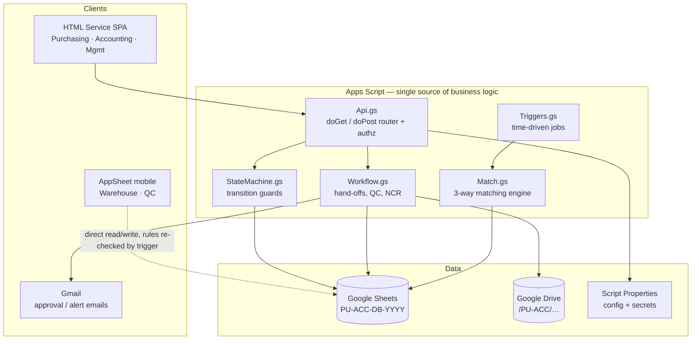

# PU-ACC — Procure-to-Pay ERP on Google Workspace

Lightweight internal ERP connecting **Purchasing → Warehouse (GR) → Quality Control → Accounting**,
with Google Sheets as the database and Google Drive as the document repository.

---

## 1. Executive summary

| Item | Decision |
|---|---|
| Scope | Procure-to-Pay: PR → PO → Goods Receipt → QC → 3-way match → AP invoice → Payment |
| Database | One Google Spreadsheet per fiscal year (`PU-ACC-DB-2026`), ~40 tabs, script-mediated writes only |
| Backend | Google Apps Script (V8) deployed as a Web App API + time-driven jobs |
| Front-end (office) | Apps Script HTML Service SPA (Purchasing, Accounting, Management dashboards) |
| Front-end (floor) | AppSheet mobile app over the same Sheets (Warehouse receiving, QC inspection, photo capture) |
| Files | Google Drive, folder-per-PO, every file registered in a `Documents` table |
| Identity | Google Workspace SSO (`Session.getActiveUser()`), roles in a `Users` table, enforced server-side |
| Control | Append-only `Status_History` audit, `LockService` on all writes, no direct Sheet access for end users |

### Why a hybrid front-end

Do **not** pick one tool for everything:

- **Warehouse and QC work on their feet**, in a cold room or on a loading bay, with gloves and a phone. They
  need offline capture, barcode scan, and camera-to-Drive in one tap. That is AppSheet's strong suit and would
  cost weeks to rebuild in HTML Service.
- **Purchasing and Accounting work at a desk**, need multi-line grids, keyboard entry, and 3-way-match
  exception screens. AppSheet is poor at dense multi-line editing; an HTML SPA is better and free.
- Both talk to the **same Apps Script API layer**, so business rules exist in exactly one place.

Retool is a fine substitute for the desk-side SPA if you already pay for it, but it adds a per-user licence
and cannot enforce rules the mobile app must also obey — keep the rules in Apps Script either way.

---

## 2. Architecture

> **AppSheet caveat:** AppSheet writes to Sheets directly, bypassing `Api.gs`. Treat every AppSheet write as
> *untrusted input*: an installable `onChange` trigger re-validates it against the state machine and reverts
> or flags illegal transitions. Never let AppSheet be the only thing standing between a user and a posted
> accounting record.

---

## 3. Documents in this blueprint

| # | Document | Covers |
|---|---|---|
| 01 | [Process Flow & State Machine](docs/01-process-flow-and-state-machine.md) | End-to-end flow, all document states, transition table with triggers and guards, 18 edge cases including QC rejection, SLA / bottleneck definition |
| 02 | [Data Model — Google Sheets & Drive](docs/02-data-model-google-sheets.md) | Every tab, exact columns, primary/foreign keys, ERD, Drive folder tree, file naming, document control |
| 03 | [Role-Based UI](docs/03-role-based-ui.md) | Per-department dashboards, work queues, inputs vs read-only, field-level edit matrix, permission matrix |
| 04 | [Automation & Apps Script Strategy](docs/04-automation-and-apps-script.md) | 24 named automations, trigger plan, PDF generation, notification engine, quotas, performance patterns, security, deployment |
| A | [Appendix A — Lookups, Numbering, Tolerances](docs/appendix-a-reference-data.md) | Enumerations, document numbering, tolerance and SLA defaults, KPI formulas |
| B | [Appendix B — Limits, Scaling, Migration](docs/appendix-b-limits-and-scaling.md) | Sheets/Drive/Apps Script quotas, sizing model, archiving, exit path to a real DB |

Implementation scaffold: [`apps-script/`](apps-script/) — schema definition, repository layer, state machine,
matching engine, Drive/PDF service, notification queue, API router, and a one-click `setupWorkspace()`
bootstrap that creates every tab, header, validation rule, and Drive folder described in doc 02.

---

## 4. Delivery roadmap

| Phase | Weeks | Scope | Exit criteria |
|---|---|---|---|
| 0 — Foundation | 1–2 | Spreadsheet + Drive tree via `setupWorkspace()`, master data load (Vendors, Items, Users, Approval Matrix), numbering, audit log | Master data signed off by each dept head |
| 1 — Purchasing | 3–5 | PR → PO, revisions, approval matrix, PO PDF, email to vendor | A real PO issued end-to-end without a spreadsheet edit |
| 2 — Warehouse | 6–7 | GRN against PO lines, tolerance checks, delivery-note + photo capture (AppSheet), auto hand-off to QC | 20 receipts booked by warehouse staff unaided |
| 3 — QC | 8–9 | QC record auto-creation, spec-driven parameter results, pass/fail/conditional, NCR, RTV | A rejected batch flows to NCR + Purchasing + AP hold correctly |
| 4 — Accounting | 10–12 | Invoice register, 3-way match engine, exception queue, payment run, WHT | Month-end closed with match report; no manual PO/GRN lookups |
| 5 — Insight | 13–14 | Bottleneck dashboard, cycle-time KPIs, vendor scorecard, nightly backup + integrity checks | Management reviews bottlenecks from the app, not from email |

**Do not build Phase 4 before Phase 3 is trusted.** Three-way matching is only as good as the accepted-quantity
figure QC produces; a rushed QC module turns AP into a manual reconciliation desk.

---

## 5. Known constraints (read before committing budget)

1. **Sheets is not transactional.** A crash mid-write can leave a GRN posted with PO lines un-updated. Mitigated
   by `LockService`, idempotency keys, and a nightly integrity job — not eliminated.
2. **Cell ceiling: 10,000,000 per spreadsheet.** At ~120 columns per transaction row this is roughly
   80k transaction rows per file. One spreadsheet per fiscal year plus archiving keeps you well clear
   (sizing model in Appendix B).
3. **Concurrency.** Comfortable to ~25–30 active users. Beyond that, write contention on `LockService`
   becomes visible as multi-second saves.
4. **No field-level security in Sheets.** Security comes from users *never* having the Sheet URL. If someone
   needs raw Sheet access, they can edit posted accounting records and only the audit tab will know.
5. **Segregation of duties is policy, not platform.** The approval matrix must prevent the same person
   raising a PO, receiving it, and approving its invoice. Configure it deliberately — see doc 03 §7.
6. **Apps Script quotas** (90 min/day runtime, 1,500 emails/day on Workspace) are ample at the modelled volume
   but will bite if you loop row-by-row. Follow the batching patterns in doc 04 §6.

Migration path when you outgrow it: the Apps Script API layer is the seam. Swap the repository layer
(`01_Repo.gs`) for BigQuery or Cloud SQL and both front-ends keep working — see Appendix B §5.
