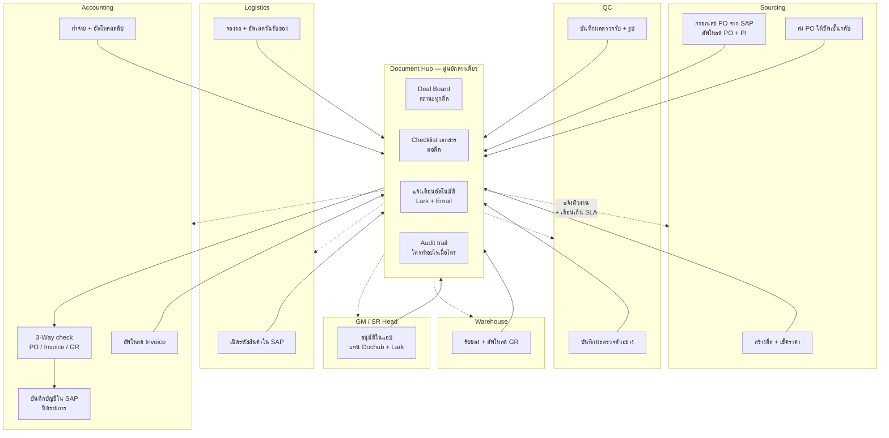

# 01 — Flow ปัจจุบัน (AS-IS) เทียบ Flow ใหม่ (TO-BE)

**เอกสารหลักสำหรับใช้คุยในที่ประชุม** · อ้างอิงจาก `Flowchart for Domestic Purchasing to Accounting Process (MGS)`
effective 30/07/2026, ผู้จัดทำ: Purchase department, อนุมัติโดย SR & QC Head / LS & WH Head / AC Head

ตัวย่อ: **SR** = Sourcing · **QC** = Quality Control · **LS** = Logistics · **WH** = Warehouse ·
**AC** = Accounting · **Sup** = Supplier · **GM** = General Manager

---

## 1. Flow ปัจจุบัน (AS-IS)

```mermaid
flowchart TD
    A["SR รับคำขอเช็คราคา"] --> B{"ดูตัวอย่าง<br/>ก่อนซื้อได้?"}
    B -->|ได้| C["SR + QC ดูสินค้าก่อนซื้อ"]
    C --> D["QC รายงานผลตรวจ"]
    D -->|ไม่ผ่าน| X1["SR แจ้งผลซัพ<br/>ปฏิเสธการสั่งซื้อ"]
    D -->|ผ่าน| G["SR ดำเนินการสั่งซื้อ"]
    B -->|ไม่ได้| E{"GM ตัดสินใจ<br/>ตรวจ / ไม่ตรวจ"}
    E -->|ตรวจ| C
    E -->|ไม่ตรวจ| F{"ซื้อ / ไม่ซื้อ"}
    F -->|ไม่ซื้อ| X2["SR แจ้งผลซัพ<br/>ปฏิเสธการสั่งซื้อ"]
    F -->|ซื้อ| G

    G --> H["SR คอนเฟิร์มออเดอร์กับซัพ<br/>ผ่าน LINE / Email"]
    H --> I["Sup ส่ง PI<br/>ผ่าน LINE / Email"]
    I --> J{"มี code สินค้า<br/>ใน SAP?"}
    J -->|NO| K["SR ทำใบขออนุมัติเพิ่มรหัสสินค้า"]
    K --> L["ส่งเอกสารให้ SR Head เซ็นอนุมัติ"]
    L --> M["ส่งเอกสารให้ LS เพื่อเพิ่มรหัส"]
    M --> N["LS open new code product on SAP"]
    N --> O["SR เปิด PO ใน SAP"]
    J -->|YES| O

    O --> P["SR ส่งลิงก์ Dochub ให้ SR Team<br/>เช็คและเซ็น ผ่านกลุ่ม<br/>Lark-Internal Sourcing Team"]
    P --> Q["ส่งกลุ่ม Lark-Approval Request<br/>เพื่อให้ GM เซ็น"]
    Q --> R["PO และ PI เซ็นครบทุกตำแหน่ง"]
    R --> S["SR ส่ง PO ทางเมล/LINE ให้ Sup เซ็นกลับ<br/>แนบ PI + Pattern label ถ้ามี"]
    S --> T["Sup เซ็น PO กลับ"]
    T --> U["SR บันทึกไฟล์ลงไดรฟ์ M:<br/>2026 - PO Food"]

    U --> V["SR กำหนดวันรับสินค้า แจ้ง LS"]
    V --> W["LS จองรถล่วงหน้า 1 วัน"]
    W --> Y["รถรับสินค้าที่ห้องเย็นต้นทาง"]
    Y --> Z["QC ตรวจสินค้าที่ห้องเย็นต้นทาง / RC<br/>แจ้งผลในกลุ่ม Lark-QC FOOD"]
    Z --> AA{"สินค้าผ่าน?"}
    AA -->|NO| AB["SR แจ้งซัพเพื่อเคลมสินค้า"]
    AB --> AC["Sup จัดทำใบลดหนี้<br/>+ ใบแจ้งหนี้ ให้ SR"]
    AA -->|YES| AD["SR แจ้ง WH รับสินค้า"]
    AC --> AD
    AD --> AE["WH รับเข้าคลัง + ทำ GR ใน SAP"]

    AE --> AF["SR ติดตามใบแจ้งหนี้จาก Sup<br/>ตาม payment condition ใน PO"]
    AF --> AG["Sup ส่งใบแจ้งหนี้ให้ SR"]
    AG --> AH["SR ส่งเอกสารตัวจริง + เมล PO & PI<br/>ให้ AC และแจ้ง Effective date"]
    AH --> AI["AC ทำจ่าย + ส่งสลิปให้ SR"]
    AI --> AJ["SR ได้รับสลิป ส่งต่อให้ซัพ"]
    AJ --> AK["Sup ได้รับ Swift<br/>ส่งใบเสร็จตัวจริงทางไปรษณีย์"]
    AK --> AL["SR ได้รับใบเสร็จตัวจริง<br/>ส่งต่อให้บัญชี"]
    AL --> AM["AC ได้รับใบเสร็จตัวจริง"]
    AM --> AN(["สิ้นสุดขั้นตอน<br/>การสั่งซื้อสินค้าในประเทศ"])
```

### สิ่งที่เห็นจากการนับ

| ตัวชี้วัด | ค่า | ความหมาย |
|---|---|---|
| ขั้นตอนที่ **SR** เป็นผู้ลงมือ | **13 จาก 27 ขั้น** | SR แบกครึ่งหนึ่งของกระบวนการ |
| ขั้นตอนที่ SR ทำหน้าที่ **ส่งต่อเอกสารเท่านั้น** | **5 ขั้น** (AH, AJ, AL, M, S) | ไม่ได้เพิ่มมูลค่า แต่เป็นจุดที่งานค้างได้ |
| เครื่องมือที่ใช้ | **5 ระบบ** | Dochub, Lark (3 กลุ่ม), LINE, Email, ไดรฟ์ M: |
| จุดที่ต้องรอคนภายนอก | **4 จุด** | PI, PO เซ็นกลับ, ใบแจ้งหนี้, ใบเสร็จตัวจริง |
| จุดที่ไม่มีใครเห็นสถานะ | **ทุกจุด** | สถานะอยู่ในหัวคนและในแชท |

### จุดที่งานค้างบ่อย (bottleneck)

| ขั้นตอน | ปัญหา |
|---|---|
| P → Q → R (เซ็น 3 ทอด) | ต้องไล่เตือนในกลุ่ม Lark เอง ไม่มีใครรู้ว่าค้างที่ใคร |
| AF (SR ติดตามใบแจ้งหนี้) | ต้องจำ payment condition ของแต่ละ PO เอง |
| AH (ส่งเอกสารตัวจริงให้ AC) | เอกสารเดินทางกายภาพ + ต้องแจ้ง Effective date แยก |
| AJ → AK → AL (สลิป/ใบเสร็จ วน 3 ทอดผ่าน SR) | SR เป็นตัวกลางทั้งสองทิศทาง งานค้างที่ SR ทั้งหมด |
| AM (บัญชีรอเอกสารครบ) | ไม่รู้ว่าขาดใบไหน ต้องไล่ขอเอง |

---

## 2. Flow ใหม่ (TO-BE)

หลักคิด 3 ข้อ:

1. **แต่ละแผนกเป็นเจ้าของเอกสารของตัวเอง และอัพโหลดเอง** — ตามที่ทีมร่างไว้ในบล็อก
   "การจัดการเอกสารรวม" ของ flowchart เดิม
2. **ระบบเป็นคนแจ้งเตือน ไม่ใช่ SR** — ตัดขั้น "ส่งต่อเอกสาร" 5 ขั้นออกทั้งหมด
3. **SAP ไม่เปลี่ยน** — PO, รหัสสินค้า, GR, บันทึกบัญชี ยังทำใน SAP เหมือนเดิม

### เปรียบเทียบจุดที่เปลี่ยนจริง

| เรื่อง | เดิม | ใหม่ |
|---|---|---|
| เซ็นอนุมัติ | Dochub + Lark 2 กลุ่ม + ไล่เตือนเอง | กดในแอปที่เดียว ระบบเตือนเอง |
| แจ้ง QC ให้ไปตรวจ | SR แจ้งในกลุ่ม | QC เห็นคิวตัวเองล่วงหน้าพร้อมวันนัด |
| แจ้งผลตรวจ | โพสต์กลุ่ม Lark-QC FOOD | บันทึกในดีล + ระบบแจ้งทุกฝ่ายที่เกี่ยว |
| แจ้ง WH รับของ | SR แจ้ง | WH เห็นล่วงหน้าจากวันจองรถของ LS |
| GR | WH ทำใน SAP แล้วจบ | ทำใน SAP **แล้วอัพโหลดเข้า Hub** |
| ตามใบแจ้งหนี้ | SR จำ payment condition เอง | ระบบเตือนตาม condition ที่บันทึกไว้ |
| ส่งเอกสารให้ AC | SR ส่งตัวจริง + เมล | **ไม่ต้องส่ง** — AC เปิดดูใน Hub ได้เลย |
| สลิป | AC → SR → ซัพ | **AC อัพโหลด → ระบบแจ้งซัพ** (ตัด SR ออก) |
| ใบเสร็จตัวจริง | ซัพ → ไปรษณีย์ → SR → AC | ซัพ → AC โดยตรง + บันทึกเลข tracking ใน Hub |
| รู้ว่าขาดเอกสารอะไร | AC ไล่ถาม | checklist บอก + ระบบเตือนเจ้าของเอกสาร |
| เก็บไฟล์ | ไดรฟ์ M: (คนเดียวเข้าถึง) | Drive กลาง โฟลเดอร์ต่อดีล ทุกแผนกเห็น |

---

## 3. ตาราง 17 Stage — `DOMESTIC_FOOD`

ตารางนี้จะกลายเป็นข้อมูลใน `Stage_Templates` โดยตรง (ดู [เอกสาร 02](02-data-model.md))

| # | Stage | เจ้าของ | เอกสารที่ต้องมี | SLA เสนอ | ข้ามได้เมื่อ |
|---|---|---|---|---|---|
| 1 | `PRICE_REQUEST` | SR | — | 1 วัน | — |
| 2 | `SAMPLE_CHECK` | QC | ผลตรวจตัวอย่าง | 2 วัน | ดูตัวอย่างไม่ได้ / GM สั่งไม่ตรวจ |
| 3 | `GM_DECISION` | GM | — | 1 วัน | มีผลตรวจผ่านแล้ว |
| 4 | `ORDER_CONFIRM` | SR | — | 1 วัน | — |
| 5 | `PI_RECEIVED` | SR | **PI** | 2 วัน | — |
| 6 | `ITEM_CODE` | LS | ใบขออนุมัติเพิ่มรหัส | 1 วัน | มี code ใน SAP แล้ว |
| 7 | `PO_CREATED` | SR | **PO (SAP)** | 1 วัน | — |
| 8 | `INTERNAL_APPROVAL` | SR Team → GM | PO + PI | 1 วัน | — |
| 9 | `SUPPLIER_SIGN` | SR | **PO ที่ซัพเซ็นกลับ**, Pattern label | 3 วัน | — |
| 10 | `DELIVERY_BOOKING` | LS | — | 1 วัน (ก่อนรับของ) | — |
| 11 | `QC_INCOMING` | QC | **ผลตรวจรับ / RC** | 1 วัน | — |
| 12 | `GR` | WH | **GR (SAP)** | 1 วัน | — |
| 13 | `INVOICE_RECEIVED` | SR → AC | **Invoice** | ตาม payment condition | — |
| 14 | `DOC_HANDOVER` | SR | ครบชุด + Effective date | 1 วัน | — |
| 15 | `PAYMENT` | AC | **สลิป / Swift** | ตาม condition | — |
| 16 | `RECEIPT_ORIGINAL` | AC | **ใบเสร็จตัวจริง** | 14 วัน | — |
| 17 | `AC_CLOSE` | AC | — | 2 วัน | — |

> **SLA ในตารางนี้เป็นตัวเลขตั้งต้น** ขอให้แต่ละหัวหน้าแผนกแก้ให้ตรงกับความเป็นจริงในที่ประชุม
> ระบบใช้ SLA เพื่อ (ก) เรียงคิวงาน (ข) เตือนซ้ำ (ค) escalate หัวหน้า (ง) คำนวณคอขวด

---

## 4. เอกสารและเจ้าของ

| เอกสาร | เจ้าของ (คนอัพโหลด) | บังคับ | Stage | หมายเหตุ |
|---|---|---|---|---|
| ผลตรวจตัวอย่าง | QC | ถ้ามีการดูตัวอย่าง | 2 | แนบรูปได้ |
| PI (Proforma Invoice) | SR | ✅ | 5 | จากซัพผ่าน LINE/Email |
| ใบขออนุมัติเพิ่มรหัสสินค้า | SR | ถ้าไม่มี code | 6 | SR Head เซ็น |
| **PO** | SR | ✅ | 7 | พิมพ์จาก SAP |
| **PO ที่ซัพเซ็นกลับ** | SR | ✅ | 9 | หลักฐานผูกพันกับซัพ |
| Pattern label | SR | ถ้ามี | 9 | — |
| **ผลตรวจรับ / RC** | QC | ✅ | 11 | ตรวจที่ห้องเย็นต้นทาง |
| **GR** | WH | ✅ | 12 | พิมพ์จาก SAP |
| **Invoice / ใบแจ้งหนี้** | AC (หรือ SR) | ✅ | 13 | — |
| ใบลดหนี้ (Credit Note) | AC | ถ้ามีเคลม | branch `CLAIM` | — |
| **สลิป / Swift** | AC | ✅ | 15 | ระบบแจ้งซัพให้ |
| **ใบเสร็จรับเงินตัวจริง** | AC | ✅ | 16 | ติดตามด้วยเลข tracking |

**ตัวหนา = เอกสารที่ต้องมีก่อนปิดรายการได้**

---

## 5. กรณีพิเศษและเส้นทางแยก

| กรณี | ระบบทำอะไร |
|---|---|
| **QC ตรวจตัวอย่างไม่ผ่าน** | ปิดดีลเป็น `REJECTED` + แจ้ง SR ให้แจ้งซัพ · เก็บประวัติไว้ประเมินซัพ |
| **GM สั่งไม่ซื้อ** | ปิดดีลเป็น `CANCELLED` + บันทึกเหตุผล |
| **ไม่มีรหัสสินค้าใน SAP** | แทรก stage `ITEM_CODE` เข้าคิว LS อัตโนมัติ ไม่ต้องเดินเอกสาร |
| **QC ตรวจรับไม่ผ่าน** | เปิด branch `CLAIM` → แจ้ง SR + AC พร้อมกัน → **ล็อกการจ่ายเงินของยอดที่เคลม** จนกว่าจะได้ใบลดหนี้ |
| **ของมาบางส่วน** | ดีลค้างที่ `GR` โดยบันทึกจำนวนที่รับแล้ว รอส่วนที่เหลือ |
| **ใบแจ้งหนี้มาก่อนของ** | ดีลรับเอกสารได้ แต่ `AC_CLOSE` จะไม่พร้อมจนกว่าจะมี GR |
| **ซัพส่งเอกสารช้า** | ระบบเตือนซ้ำตาม SLA แล้ว escalate หัวหน้า SR |
| **ใบเสร็จตัวจริงหาย** | `Physical_Docs` มีเลข tracking + ผู้รับ ใช้ตามเรื่องกับไปรษณีย์ได้ |
| **เอกสารผิด ต้องส่งใหม่** | อัพโหลดทับได้ ระบบเก็บเป็น version ใหม่ ของเก่าไม่หาย |
| **ยอด Invoice ไม่ตรง PO** | 3-Way check ไม่ผ่าน + บอกส่วนต่าง → แจ้ง SR ให้เคลียร์กับซัพ |

---

## 6. 3-Way Matching — ระบบช่วยอะไร ไม่ช่วยอะไร

| ระบบทำ | คนทำ |
|---|---|
| เช็คว่ามี PO + Invoice + GR ครบทั้ง 3 ใบหรือยัง | ตัดสินใจว่าส่วนต่างยอมรับได้หรือไม่ |
| เทียบยอดเงินและจำนวนที่กรอกไว้ของทั้ง 3 ใบ | เคลียร์กับซัพเมื่อไม่ตรง |
| เช็คว่ายังมีเรื่องเคลมค้างอยู่หรือไม่ | บันทึกบัญชีใน SAP |
| ขึ้นสถานะ **"พร้อมบันทึก"** หรือ **"ติดอะไร"** | ปิดรายการ |

**ระบบไม่บันทึกบัญชีแทน** — เพียงบอก AC ว่าเอกสารพร้อมแล้ว เพื่อไม่ต้องไล่ตรวจเอง

---

## 7. สิ่งที่ยังต้องยืนยันในที่ประชุม

1. ✅ / ❌ flow 17 stage ตรงกับงานจริงไหม — **มีขั้นตอนไหนที่หายไปหรือเกินมา**
2. ตาราง §4 เอกสารบังคับครบไหม ใครควรเป็นเจ้าของแต่ละใบ
3. SLA §3 ควรเป็นเท่าไหร่จริง
4. `INVOICE_RECEIVED` — ใครควรอัพโหลด Invoice: SR (ผู้รับจากซัพ) หรือ AC (ผู้ใช้เอกสาร)
5. `RECEIPT_ORIGINAL` — ให้ซัพส่งใบเสร็จตัวจริงถึง AC โดยตรงได้ไหม (ตัด SR ออกจริง)
6. Pattern label ใช้กับสินค้ากลุ่มไหน จำเป็นต้อง track ในระบบไหม
7. กลุ่ม Lark เดิม 3 กลุ่ม — จะให้เหลือกลุ่มไหนไว้รับแจ้งเตือนจากระบบ
