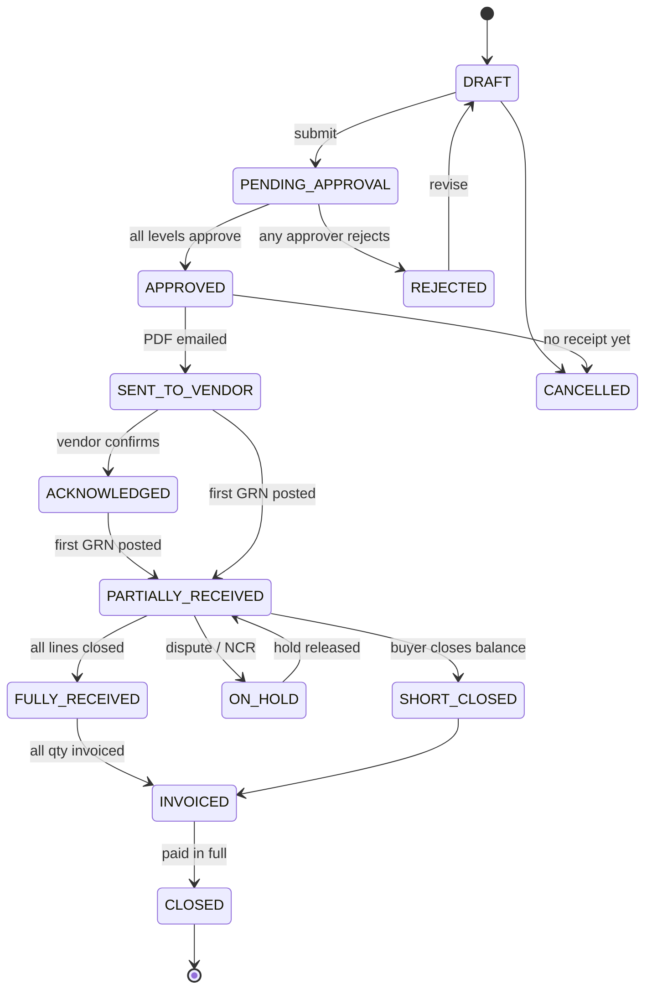
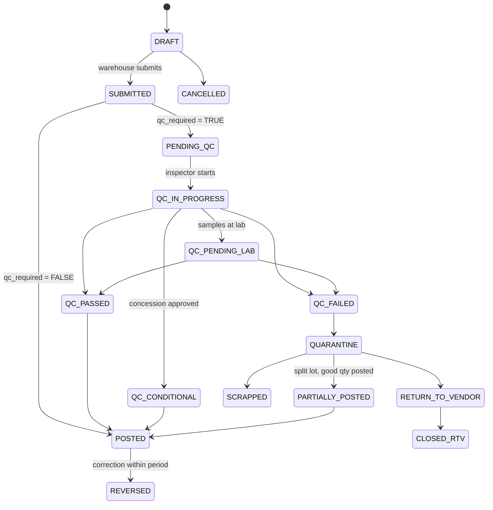
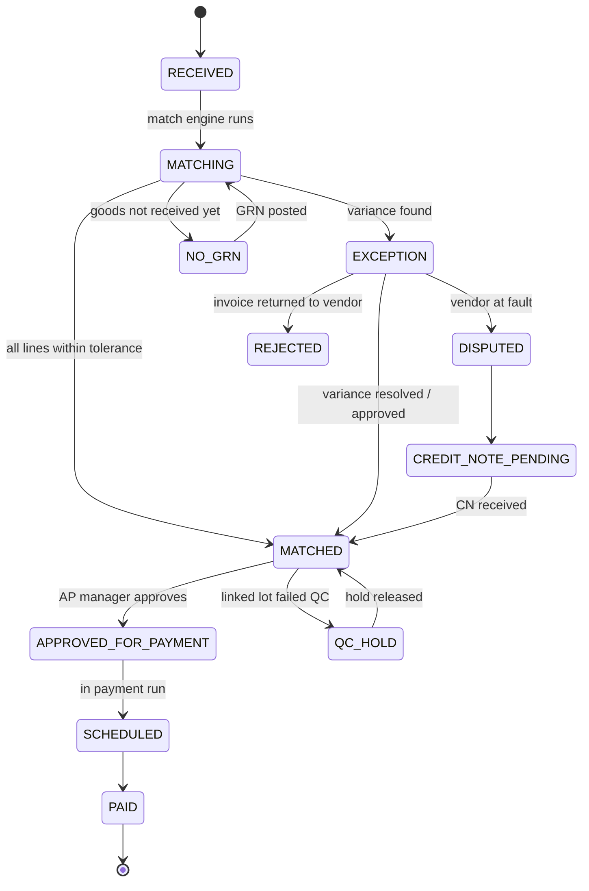

# 01 — Process Flow & State Machine

**Scope:** Purchase Requisition → Purchase Order → Goods Receipt → Quality Control → AP Invoice → Payment.
**Design principle:** every hand-off between departments is a *state transition* on a record, produced by an
explicit trigger, validated by a guard, and written to an append-only audit log. No hand-off happens by email
alone, and no state changes without a row in `Status_History`.

---

## 1. End-to-end flow

```mermaid
flowchart LR
    subgraph PUR["1 · Purchasing"]
        PR["PR raised"] --> PRA{"PR approved?"}
        PRA -->|yes| PO["PO created"]
        PRA -->|no| PRX["PR rejected"]
        PO --> POA{"Approval matrix"}
        POA -->|approved| POS["PO sent to vendor<br/>PDF + email"]
        POA -->|rejected| POR["PO revised or cancelled"]
    end
    subgraph WH["2 · Warehouse"]
        POS --> ARR["Goods arrive"]
        ARR --> GRN["GRN captured<br/>qty, lot, expiry, photos"]
        GRN --> GSUB["GRN submitted"]
    end
    subgraph QC["3 · Quality Control"]
        GSUB -->|qc_required| QCR["QC inspection auto-created"]
        QCR --> QCD{"Result"}
        QCD -->|pass| ACC["Qty accepted"]
        QCD -->|conditional| CON["Concession +<br/>price deduction"]
        QCD -->|fail| NCR["NCR raised"]
    end
    subgraph ACCT["4 · Accounting"]
        ACC --> POST["GRN posted<br/>PO lines updated"]
        CON --> POST
        POST --> INV["Invoice registered"]
        INV --> M3{"3-way match"}
        M3 -->|within tolerance| APR["Approved for payment"]
        M3 -->|variance| EXC["Exception queue"]
        EXC --> APR
        APR --> PAY["Payment run"]
        PAY --> CLOSE["PO closed"]
    end
    NCR --> RTV["Return / rework / debit note"]
    RTV --> HOLD["AP hold on rejected qty"]
    HOLD --> EXC
    GSUB -->|qc_required = FALSE| POST
```



---

## 2. Document states

### 2.1 Purchase Requisition (`PR_Header.status`)

`DRAFT → PENDING_APPROVAL → APPROVED → CONVERTED` · side states: `REJECTED`, `CANCELLED`

### 2.2 Purchase Order (`PO_Header.status`)



`PO_Header` also carries two **derived** flags recomputed on every GRN/invoice event, so the header status stays
simple and the detail lives on lines:

- `receipt_status` ∈ `NONE | PARTIAL | FULL | OVER`
- `invoice_status` ∈ `NONE | PARTIAL | FULL | OVER`

`PO_Lines.line_status` ∈ `OPEN | PARTIAL | RECEIVED | CLOSED | CANCELLED | SHORT_CLOSED`.
A PO is `FULLY_RECEIVED` only when **every** line is `RECEIVED`, `CLOSED`, `CANCELLED`, or `SHORT_CLOSED`.

### 2.3 Goods Received Note (`GRN_Header.status`)



`GRN_Lines.line_status` ∈ `PENDING_QC | ACCEPTED | REJECTED | PARTIAL_ACCEPT | ON_HOLD | RETURNED | SCRAPPED`.
**A GRN is a container; acceptance is decided per line/lot.** A single delivery can contain one passing lot and
one failing lot, and the accounting outcome must follow the lot — not the delivery.

### 2.4 QC Inspection (`QC_Header.status` / `.result`)

`status`: `PENDING → ASSIGNED → SAMPLING → TESTING → PENDING_LAB → PENDING_APPROVAL → COMPLETED` · side: `CANCELLED`
`result`: `PENDING | PASS | FAIL | CONDITIONAL`

`PENDING_APPROVAL` exists for one reason: **a conditional accept must never be an inspector's unilateral call.**
It requires QC Manager sign-off plus Purchasing agreement on the commercial remedy (deduction, replacement, or
waiver), because it directly changes what Accounting is allowed to pay.

### 2.5 Non-Conformance Report (`NCR.status`)

`OPEN → VENDOR_NOTIFIED → VENDOR_RESPONDED → DISPOSITION_APPROVED → REMEDY_IN_PROGRESS → CLOSED`
· side: `CANCELLED`, `ESCALATED`

`disposition` ∈ `RETURN | REWORK | SCRAP | CONCESSION | PRICE_DEDUCTION | REPLACEMENT`
`claim_type` ∈ `DEBIT_NOTE | CREDIT_NOTE_EXPECTED | REPLACEMENT | NONE`

### 2.6 AP Invoice (`Invoice_Header.match_status` / `.payment_status`)



`payment_status` ∈ `UNPAID | PARTIALLY_PAID | PAID | VOID`.

---

## 3. Transition table — triggers, guards, effects

This table is the contract implemented in [`apps-script/02_StateMachine.gs`](../apps-script/02_StateMachine.gs).
Every row is: *who or what fires it, what must be true, what the system does automatically.*

### 3.1 Purchasing

| # | From → To | Trigger | Guard (must be true) | Automated effect |
|---|---|---|---|---|
| P1 | PR `DRAFT` → `PENDING_APPROVAL` | Requester submits | ≥1 line, qty > 0, need-by ≥ today, cost centre valid | Resolve approver from `Approval_Matrix`; queue approval email; set `sla_due_at` |
| P2 | PR `PENDING_APPROVAL` → `APPROVED` | Approver clicks Approve | Actor = assigned approver **and** actor ≠ requester; amount ≤ `approval_limit_thb` | Notify buyer queue; PR appears in "Convert to PO" list |
| P3 | PR `APPROVED` → `CONVERTED` | Buyer converts | Vendor `approved_status` ∈ {APPROVED, CONDITIONAL}; every item active | Create `PO_Header` + `PO_Lines`; back-link `pr_no`; copy need-by dates |
| P4 | PO `DRAFT` → `PENDING_APPROVAL` | Buyer submits | Vendor not `BLACKLISTED`; vendor cert not expired; totals recomputed = stored totals; currency has FX rate for PO date; prices > 0 | Determine required approval levels by amount band; queue level-1 approval email |
| P5 | PO `PENDING_APPROVAL` → `APPROVED` | Final approver approves | All levels signed in order; actor ≠ `created_by` (SoD) | Generate PO PDF from Docs template → `/02_Transactions/YYYY/MM/{PO_NO}/01_PO/`; register in `Documents`; lock header fields |
| P6 | PO `APPROVED` → `SENT_TO_VENDOR` | Buyer clicks Send (or auto on approval, per config) | PDF exists; vendor `contact_email` present | Email PDF to vendor + CC buyer; stamp `sent_to_vendor_at`; PO becomes visible to Warehouse as an *expected receipt* |
| P7 | PO `SENT_TO_VENDOR` → `ACKNOWLEDGED` | Vendor reply logged, or buyer marks ack | — | Stamp `vendor_ack_at`; set `promised_delivery_date` if vendor proposed a new date (writes a `PO_Revisions` row) |
| P8 | PO any → `revision +1` | Buyer edits an approved PO | Change is in {qty, price, date, item, vendor}; PO not `CLOSED` | Increment `po_revision`; write before/after to `PO_Revisions`; **re-trigger approval if amount ↑ > 5% or crosses a band**; regenerate PDF marked `REV n`; re-notify vendor |
| P9 | PO → `PARTIALLY_RECEIVED` / `FULLY_RECEIVED` | GRN posted (W6) | — | Recompute per line `qty_received/accepted/rejected/open`; recompute header `receipt_status`; recompute status |
| P10 | PO → `SHORT_CLOSED` | Buyer closes remaining balance | Buyer role; reason mandatory | Set open lines `SHORT_CLOSED`, `qty_open = 0`; notify AP so the open commitment is released |
| P11 | PO → `CANCELLED` | Buyer cancels | `receipt_status = NONE` **and** no invoice registered | Notify vendor; release PR lines back to `APPROVED` for re-sourcing |
| P12 | PO → `CLOSED` | Nightly job | `receipt_status` ∈ {FULL, OVER} or short-closed; `invoice_status = FULL`; all invoices `PAID`; no open NCR | Stamp `closed_at`; move Drive folder to `/03_Archive/YYYY/` |

### 3.2 Purchasing → Warehouse

| # | From → To | Trigger | Guard | Automated effect |
|---|---|---|---|---|
| W1 | — → GRN `DRAFT` | Warehouse selects an expected PO | PO status ∈ {SENT_TO_VENDOR, ACKNOWLEDGED, PARTIALLY_RECEIVED}; ≥1 line with `qty_open > 0` | Pre-fill lines from open PO lines; create `/03_GRN/{GRN_NO}/` Drive folder; issue `grn_no` |
| W2 | GRN `DRAFT` → `SUBMITTED` | Receiver submits | Delivery-note no. + date present; ≥1 line with `qty_received > 0`; **lot + expiry present for every lot-tracked item**; remaining shelf life ≥ `min_remaining_shelf_life_pct`; ≥1 photo attached; over-receipt within `over_receipt_tolerance_pct` or supervisor-approved; `idempotency_key` unused | Compute `variance_qty` / `variance_pct` per line; flag `over_tolerance_flag`; run **document completeness check** against `QC_Specs.doc_requirements` (COA, health cert, CO, packing list) and list what is missing |
| W3 | GRN `SUBMITTED` → `PENDING_QC` | System, immediately | Any line where `Items.qc_required = TRUE` | **Create one `QC_Header` per (item, lot)**; explode `QC_Lines` from the current `QC_Specs` + `QC_Spec_Params`; set `sla_due_at = now + qc_sla_hours`; notify QC group + assign by round-robin; set GRN lines `PENDING_QC` (stock is *received but not available*) |
| W4 | GRN `SUBMITTED` → `POSTED` | System, immediately | No line requires QC | Auto-accept: `qty_accepted = qty_received`; write an audit row `AUTO_PASS_NO_QC_REQUIRED`; jump to W6 effects |
| W5 | GRN `DRAFT` → `CANCELLED` | Receiver cancels | Not submitted | Release pre-filled qty; keep the number burnt (never reuse) |
| W6 | GRN → `POSTED` / `PARTIALLY_POSTED` | QC result recorded (Q3/Q4/Q5) | Every line has an acceptance decision | Update `PO_Lines` accepted/rejected/open; recompute PO status; optionally append `Stock_Ledger` rows; **notify Accounting: "ready to invoice"**; stamp `posted_at` |
| W7 | GRN `POSTED` → `REVERSED` | Warehouse supervisor reverses | Within open GL period; no invoice matched to it | Write a **reversing** GRN (negative qty) rather than editing history; roll back PO line quantities; re-open PO |

### 3.3 Warehouse → QC

| # | From → To | Trigger | Guard | Automated effect |
|---|---|---|---|---|
| Q1 | QC `PENDING` → `ASSIGNED`/`SAMPLING` | Inspector opens the record | Actor has QC role; GRN `PENDING_QC` | Stamp `started_at`; GRN → `QC_IN_PROGRESS`; compute `sample_size` from `aql_level` and `qty_submitted` |
| Q2 | QC `SAMPLING` → `PENDING_LAB` | Inspector sends samples to lab | Spec has micro/chemical params; lab name + sent date recorded | GRN → `QC_PENDING_LAB`; lines → `ON_HOLD`; set `lab_due_at`; escalate daily once overdue; **stock stays quarantined** |
| Q3 | QC → `COMPLETED` result `PASS` | Inspector saves results | Every non-optional `QC_Lines` param has a measured value; zero critical defects; majors/minors ≤ AQL limits | `qty_accepted = qty_submitted`; GRN lines `ACCEPTED`; generate QC report PDF; fire W6; notify Warehouse (release to stock) + Purchasing + Accounting |
| Q4 | QC → `PENDING_APPROVAL` result `CONDITIONAL` | Inspector proposes concession | Deviation is non-critical; `conditional_deduction_pct` or remedy proposed; justification text present | Notify QC Manager **and** buyer; block posting until both approve; on approval → `COMPLETED`, GRN → `QC_CONDITIONAL`, create NCR with `disposition = CONCESSION` or `PRICE_DEDUCTION`, and **write the agreed deduction into the invoice tolerance** so 3-way match expects the lower amount |
| Q5 | QC → `COMPLETED` result `FAIL` | Inspector saves failing results | ≥1 critical defect, or defects > AQL, or a spec param out of range, or a mandatory document missing | Auto-create **NCR**; `qty_rejected` set; GRN → `QUARANTINE`; GRN lines `REJECTED`/`PARTIAL_ACCEPT`; notify Purchasing + QC Manager + Warehouse + AP; **set `Invoice_Header.qc_hold_flag` on any existing invoice for that PO**; PO lines keep `qty_open` for the rejected qty so the balance can be re-delivered |
| Q6 | QC re-inspection | Vendor reworks / re-delivers | Original NCR open; `inspection_type = REWORK` | Create a *new* `QC_Header` linked to the same GRN + NCR; never overwrite the original result (audit integrity) |

### 3.4 QC → Accounting

| # | From → To | Trigger | Guard | Automated effect |
|---|---|---|---|---|
| A1 | — → Invoice `RECEIVED` | AP registers a vendor invoice (or Drive-drop + parse) | `vendor_invoice_no` + vendor unique (`duplicate_check_hash`); PO exists and is approved; tax invoice no. present for VAT | Create folder link, register file in `Documents`; compute `due_date` from `Payment_Terms.base_event` |
| A2 | Invoice `RECEIVED` → `MATCHING` | AP submits, or the 15-min job picks it up | Lines mapped to PO lines | Run the match engine (§4) |
| A3 | → `MATCHED` | Match engine | Every line within qty **and** price tolerance; no `qc_hold_flag` | Queue for AP Manager approval |
| A4 | → `NO_GRN` | Match engine | No posted GRN for the invoiced lines | Park invoice; notify buyer ("goods not received / GRN missing"); auto-retry each night; escalate after `no_grn_escalation_days` |
| A5 | → `EXCEPTION` | Match engine | Any variance outside tolerance | Write `Match_Results` rows with an `exception_code`; route by code (price → buyer, qty → warehouse, tax → AP, quality → QC); block payment |
| A6 | `EXCEPTION` → `MATCHED` | Owner resolves | Resolution reason recorded; if price variance accepted → PO revision raised (P8) | Re-run match; log override with actor + reason |
| A7 | → `QC_HOLD` | NCR raised against a matched lot | — | Freeze payment for the affected qty only; the clean qty may proceed (partial payment) |
| A8 | `MATCHED` → `APPROVED_FOR_PAYMENT` | AP/Finance Manager approves | Actor ≠ invoice registrant (SoD); actor's `approval_limit_thb` ≥ amount; no open critical NCR | Recompute WHT; add to payment proposal |
| A9 | → `SCHEDULED` → `PAID` | Payment run executed | Bank details verified; net amount = gross − WHT − NCR deductions | Write `Payments` + `Payment_Allocations`; set `invoice_status` on PO; generate remittance advice PDF; email vendor; recompute PO close eligibility (P12) |
| A10 | → `REJECTED` | AP returns invoice | Reason mandatory | Email vendor with the reason; keep the record (never delete) for audit |

---

## 4. Three-way matching logic

Match on **PO price × QC-accepted quantity × invoice line** — never against the delivered quantity, only the
accepted quantity. That single rule is what stops you paying for rejected goods.

```
For each invoice line L (linked to po_no, po_line_no):
  po_price        = PO_Lines.unit_price          (at the PO revision in force on the GRN date)
  accepted_qty    = Σ GRN_Lines.qty_accepted     for that PO line, GRN status POSTED
  already_invoiced= Σ Invoice_Lines.qty_invoiced for that PO line, invoice not REJECTED/VOID
  matchable_qty   = accepted_qty − already_invoiced

  qty_variance    = L.qty_invoiced − matchable_qty
  price_variance  = L.unit_price   − po_price
  expected_amount = min(L.qty_invoiced, matchable_qty) × po_price × (1 − ncr_deduction_pct)

  PASS if:
     qty_variance   ≤ 0                                             (never pay more than accepted)
     |price_variance| ≤ max(po_price × price_tol_pct, price_tol_abs)
     total_variance ≤ amount_tol_abs
     qc_hold_flag = FALSE
```

| Exception code | Meaning | Routed to |
|---|---|---|
| `PRICE_OVER` | Invoice unit price > PO price beyond tolerance | Buyer |
| `PRICE_UNDER` | Invoice cheaper than PO (still flagged — usually a wrong PO link) | Buyer |
| `QTY_OVER` | Invoiced more than accepted | Warehouse + Buyer |
| `QTY_NO_RECEIPT` | No posted GRN | Buyer |
| `QC_REJECTED` | Linked lot failed QC | QC + Buyer |
| `DUP_INVOICE` | Same vendor + invoice no. already registered | AP |
| `TAX_MISMATCH` | VAT ≠ recomputed VAT | AP |
| `FX_MISMATCH` | FX rate differs from the rate table beyond tolerance | AP |
| `UOM_MISMATCH` | Invoice UOM ≠ PO purchase UOM | AP + Buyer |
| `PO_CLOSED` | Invoice against a closed/cancelled PO | AP + Buyer |
| `NO_PO` | Non-PO invoice (freight, duty, service) | AP — routed to the non-PO approval path, **not** the match engine |
| `DEPOSIT_UNAPPLIED` | Goods invoice ignores an existing deposit payment | AP |

Default tolerances (configurable in `Config`): `price_tol_pct = 2%`, `price_tol_abs = THB 200`,
`amount_tol_abs = THB 500`, over-receipt `2%` — whichever is **lower** for price. See Appendix A §3.

### Import-specific handling

For overseas purchases (FOB/CIF), the vendor invoice is only part of the cost. Model each of the following as a
separate `Invoice_Header` with `invoice_type` and **no** 3-way match:

- `DEPOSIT` — e.g. 30% T/T advance before shipment. Registered against the PO, paid before any GRN exists;
  the later `GOODS` invoice must net it off (`DEPOSIT_UNAPPLIED` guards this).
- `FREIGHT` / `DUTY` / `SERVICE` — forwarder and customs invoices, matched to a `PO`-level cost budget rather
  than to lines, and optionally allocated to landed cost (Phase 6, `Landed_Cost` tab).
- `CREDIT_NOTE` — negative invoice closing out an NCR debit claim.

---

## 5. Edge cases and how each is handled

| # | Edge case | Handling |
|---|---|---|
| 1 | **QC rejects the entire batch** | Q5: NCR auto-created, GRN → `QUARANTINE`, all lines `REJECTED`, `qty_accepted = 0`. PO lines retain `qty_open` so a replacement delivery is possible on the same PO. Any invoice gets `qc_hold_flag`; if already paid, a debit note is raised. Vendor notified with the QC report PDF and photos attached. |
| 2 | **QC rejects part of the batch (split lot)** | Decision is per `GRN_Lines` row / lot. Passing lots post to stock and become invoiceable; failing lots go to quarantine with their own NCR. `PARTIALLY_POSTED` exists precisely for this. AP may pay the accepted portion — partial payment is normal, not an exception. |
| 3 | **Over-delivery** | W2 compares to `qty_open`. Within `over_receipt_tolerance_pct` → accepted, flagged. Beyond → hard block requiring Warehouse Supervisor + Buyer approval, which writes a PO revision (P8). Never silently accept extra quantity: it becomes an unmatched invoice later. |
| 4 | **Under-delivery / short shipment** | GRN posts what arrived; PO line stays `PARTIAL` with `qty_open`. Buyer either awaits the balance or short-closes (P10). Aging report tracks the open balance against `promised_delivery_date`. |
| 5 | **Late delivery** | `promised_delivery_date` vs `received_datetime` → `delivery_days_late`, fed to the vendor scorecard nightly. Overdue POs escalate to the buyer, then the Purchasing Manager. |
| 6 | **Wrong or substitute item shipped** | Cannot be received against a mismatched PO line. Receiver books it as an `UNPLANNED` GRN line flagged `ITEM_MISMATCH` → NCR `disposition = RETURN`, or Buyer raises a PO revision adding the substitute item (needs re-approval). |
| 7 | **Damage in transit** | `qty_damaged` captured separately from `qty_rejected`, plus `truck_condition` / `temp_on_arrival_c` / `seal_no`. NCR `source_type = GRN` with `claim_target = CARRIER` vs `VENDOR` — this determines who gets the debit note, so capture it at the dock or you will never reconstruct it. |
| 8 | **Short shelf life at receipt** | W2 computes `remaining_shelf_life_days` from `expiry_date` and blocks if below `Items.min_remaining_shelf_life_pct`. Override requires QC Manager, which auto-creates a `CONCESSION` NCR. |
| 9 | **Lab results pending 5–7 days (micro tests)** | `QC_PENDING_LAB` + `ON_HOLD` lines. Stock is physically present but *not available and not invoiceable*. Config flag `allow_conditional_release` permits release under quarantine for fast-moving items, with the lot recorded so it can be recalled if the lab fails it. |
| 10 | **Price changed after PO issued** | Buyer raises a PO revision (P8) with reason. Re-approval if amount ↑ > 5% or a new approval band is crossed. The match engine uses the revision **in force on the GRN date**, not the latest one — otherwise historic receipts silently re-price. |
| 11 | **Invoice arrives before the goods** | `NO_GRN` state, parked and retried nightly, never rejected outright (common and legitimate for imports). Escalates after N days. |
| 12 | **Deposit / advance payment** | `invoice_type = DEPOSIT`, approved on the PO commitment without a GRN. Tracked on the PO so the balance invoice nets it off. |
| 13 | **Duplicate invoice** | `duplicate_check_hash = SHA(vendor_code + normalised invoice_no + amount)` uniqueness-checked at A1. Blocks at entry, which is the only place it is cheap to catch. |
| 14 | **Duplicate GRN (double-submit / flaky mobile signal)** | Client-generated `idempotency_key` on the GRN payload; the `Idempotency` tab makes a resubmit return the original result instead of creating a second receipt. |
| 15 | **PO cancelled after partial receipt** | Cancellation is blocked (P11). The correct action is short-close (P10), which preserves the received history. |
| 16 | **Vendor documents missing (COA, health cert, CO)** | `doc_requirements` per QC spec; W2 lists `doc_missing_list`; QC cannot record `PASS` while a mandatory document is absent — it becomes a `FAIL` reason code `DOC_MISSING` or a `CONDITIONAL` pending the document. |
| 17 | **Posted GRN was wrong** | Never edit — reverse (W7) and re-book. Blocked once an invoice is matched; then the correction goes through AP as a credit/debit note. |
| 18 | **Vendor blacklisted or certificate expired mid-PO** | Nightly job flags open POs for vendors that became `BLACKLISTED` or whose `approval_expiry_date` passed. New POs are blocked at P4; existing ones raise a management alert rather than auto-cancelling. |

---

## 6. Bottleneck and SLA model

Visibility means answering *"where is it stuck and for how long"* without opening a record. Each stage has an
SLA and every transition stores `duration_in_prev_status_hrs` in `Status_History`, so aging is a lookup, not a
recalculation.

| Stage | Owner | Clock starts | Clock stops | Default SLA |
|---|---|---|---|---|
| PR approval | Requester's manager | PR submitted | PR approved | 24 h |
| PO approval | Approval matrix | PO submitted | Final approval | 24 h |
| PO issue | Buyer | PO approved | Sent to vendor | 4 h |
| Delivery | Vendor | PO sent | Goods received | `Vendors.lead_time_days` |
| GR booking | Warehouse | Goods physically arrive | GRN submitted | 4 h |
| QC inspection | QC | GRN `PENDING_QC` | QC completed | 24 h (48 h with lab) |
| GRN posting | System | QC completed | GRN posted | automatic |
| Invoice registration | AP | Invoice received | Registered | 24 h |
| 3-way match | System | Registered | Matched | automatic |
| Exception resolution | Varies by code | Exception raised | Resolved | 48 h |
| Payment approval | Finance | Matched | Approved | 48 h |

**Bottleneck definition:** the stage with the highest `Σ open records × mean aging hours`, refreshed nightly into
`VW_Bottleneck`. Aging buckets `0–24h / 24–48h / 48–72h / >72h`, with anything past SLA marked `BREACHED` and
escalated to the stage owner's manager (doc 04, automation A14).

KPIs derived from the same log: PR→PO cycle time, PO→GR lead time, GR→QC turnaround, QC pass rate by vendor and
item, GRN→invoice lag, invoice first-pass match rate, exception aging, on-time delivery %, and AP days-to-pay.
Formulas in [Appendix A §4](appendix-a-reference-data.md).
