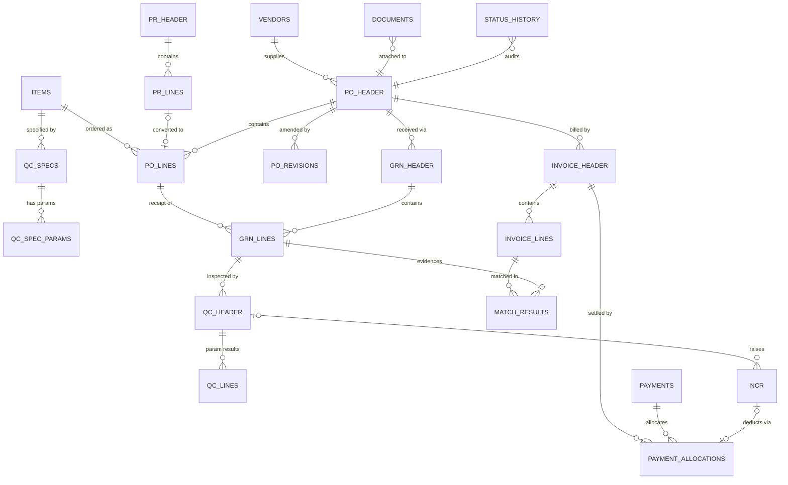

# 02 — Data Model: Google Sheets Structure & Google Drive

**Container:** one spreadsheet per fiscal year — `PU-ACC-DB-2026` — living in `/PU-ACC/00_System/Database/`.
**Access rule:** the spreadsheet is shared with **nobody** except the system owner and one break-glass admin
account. All reads and writes go through the Apps Script API or AppSheet. This is the only meaningful security
boundary Sheets gives you; if end users hold the URL, the design is void.

---

## 1. Conventions

| Rule | Detail |
|---|---|
| Row 1 = header | Frozen. Column names are `snake_case`, stable, and referenced by name in code — never by index. |
| One row = one record | No merged cells, no blank spacer rows, no sub-headers, ever. |
| Primary keys | `*_id` = opaque UUID (`Utilities.getUuid()`), immutable, never shown to users. `*_no` = human document number (`PO-26-0042`), unique, shown everywhere. Foreign keys reference the **`*_no`** for readability, with `*_id` retained for integrity checks. |
| Append-only bias | Nothing is deleted. Use `status`, `is_active`, or a reversing entry. `Status_History` is strictly append-only. |
| Timestamps | ISO 8601 with offset, stored as **plain text**: `2026-07-30T14:05:00+07:00`. Storing as text avoids locale/timezone corruption when a user in another locale opens the file. Dates only (`need_by_date`) stored as text `yyyy-MM-dd`. |
| Money | Always three columns together: `amount`, `currency`, `fx_rate`, plus a derived `*_thb`. Never store a single mixed-currency number. |
| Booleans | `TRUE` / `FALSE` (uppercase text), never checkbox format on transaction tabs. |
| Computed values | Written by script as **values**, not formulas. Live formulas on 50k-row transaction tabs are the #1 cause of Sheets slowdowns and break on row insertion. Formulas are allowed only on `VW_*` view tabs. |
| Concurrency | `row_version` integer incremented on every write; the API rejects a write whose submitted `row_version` is stale (optimistic locking) and returns the current record. |
| Validation | Dropdowns bound to named ranges on `Lookups`; the API re-validates server-side because AppSheet and manual edits can bypass Sheets validation. |
| Deleted rows | Never. `status = CANCELLED` + `Status_History` entry. |

---

## 2. Entity relationship overview



---

## 3. Tab inventory

| Group | Tabs |
|---|---|
| **Master (10)** | `Users`, `Roles_Permissions`, `Vendors`, `Items`, `Warehouses`, `Cost_Centers`, `Payment_Terms`, `Tax_Codes`, `Currencies_FX`, `Approval_Matrix` |
| **QC master (2)** | `QC_Specs`, `QC_Spec_Params` |
| **Transaction (16)** | `PR_Header`, `PR_Lines`, `PO_Header`, `PO_Lines`, `PO_Revisions`, `GRN_Header`, `GRN_Lines`, `QC_Header`, `QC_Lines`, `NCR`, `Invoice_Header`, `Invoice_Lines`, `Match_Results`, `Payments`, `Payment_Allocations`, `Stock_Ledger` *(optional, Phase 6)* |
| **System (7)** | `Documents`, `Status_History`, `Notification_Log`, `Error_Log`, `Idempotency`, `Counters`, `Config` |
| **Lookup (1)** | `Lookups` |
| **Views (5)** | `VW_Bottleneck`, `VW_Open_PO`, `VW_Pending_QC`, `VW_AP_Exceptions`, `VW_Vendor_Scorecard` — materialised nightly by script |

Total ≈ 41 tabs. All are created with correct headers, formats, and validation by
`setupWorkspace()` in [`apps-script/09_Setup.gs`](../apps-script/09_Setup.gs); the authoritative column list
lives in [`apps-script/00_Schema.gs`](../apps-script/00_Schema.gs) so the doc and the code cannot drift.

---

## 4. Master tables

### 4.1 `Users` — PK `user_id`, unique `email`

`user_id` · `email` (Workspace address, the identity key) · `full_name` · `employee_code` · `department` ·
`job_title` · `role_codes` (CSV of `Roles_Permissions.role_code`) · `warehouse_scope` (CSV or `ALL`) ·
`cost_center_scope` · `approval_limit_thb` · `delegate_email` · `delegate_until` · `manager_email` ·
`notify_channel` (`EMAIL|CHAT|BOTH`) · `digest_optin` · `is_active` · `created_at` · `updated_at`

> `delegate_email` + `delegate_until` are not optional niceties — without them, one manager's leave stalls every
> approval in the pipeline, and users respond by sharing credentials.

### 4.2 `Roles_Permissions` — PK (`role_code`, `module`, `permission`)

`role_code` · `role_name` · `module` (`PR|PO|GRN|QC|NCR|INVOICE|PAYMENT|MASTER|REPORT`) ·
`permission` (`VIEW|CREATE|EDIT|SUBMIT|APPROVE|POST|REVERSE|EXPORT|ADMIN`) ·
`scope` (`ALL|OWN_DEPT|OWN_RECORD|OWN_WAREHOUSE`) · `field_restrictions` (CSV of read-only columns) ·
`is_active` · `notes`

Role codes: `REQUESTER`, `BUYER`, `PUR_MGR`, `WH_OFFICER`, `WH_SUP`, `QC_INSPECTOR`, `QC_MGR`, `AP_OFFICER`,
`FIN_MGR`, `MGMT_VIEW`, `SYS_ADMIN`.

### 4.3 `Vendors` — PK `vendor_id`, unique `vendor_code`

`vendor_id` · `vendor_code` · `vendor_name_en` · `vendor_name_th` · `vendor_type`
(`LOCAL|IMPORT|SERVICE|FORWARDER|LAB`) · `tax_id` · `branch_code` · `country` · `address` · `contact_name` ·
`contact_email` · `contact_phone` · `default_currency` · `payment_term_code` · `default_incoterm` ·
`lead_time_days` · `min_order_value` · `bank_name` · `bank_account_no` · `bank_swift` ·
`wht_type` · `qc_required_default` · `approved_status` (`PROSPECT|APPROVED|CONDITIONAL|SUSPENDED|BLACKLISTED`) ·
`approval_date` · `approval_expiry_date` · `certifications` (CSV: `GMP,HACCP,BRC,ISO9001,IEC61215`) ·
`cert_expiry_earliest` · `last_audit_date` · `next_audit_date` · `scorecard_quality` · `scorecard_delivery` ·
`scorecard_overall` · `drive_folder_id` · `is_active` · `created_by` · `created_at` · `updated_by` ·
`updated_at` · `notes`

### 4.4 `Items` — PK `item_id`, unique `item_code`

`item_id` · `item_code` · `item_name_en` · `item_name_th` · `category` · `sub_category` ·
`item_group` (`FOOD|SEAFOOD|SOLAR|MECHANICAL|PACKAGING|CONSUMABLE|SERVICE`) · `uom_base` · `uom_purchase` ·
`uom_conversion_factor` · `hs_code` · `is_food` · `lot_tracked` · `shelf_life_days` ·
`min_remaining_shelf_life_pct` · `storage_condition` (`AMBIENT|CHILLED|FROZEN|DRY`) · `storage_temp_min_c` ·
`storage_temp_max_c` · `qc_required` · `qc_spec_id` · `inspection_level` · `over_receipt_tolerance_pct` ·
`standard_cost` · `last_purchase_price` · `last_purchase_currency` · `last_purchase_date` · `default_vendor_code` ·
`default_gl_account` · `tax_code` · `is_active` · `created_at` · `updated_at`

### 4.5 `QC_Specs` — PK `qc_spec_id`

`qc_spec_id` · `item_id` · `item_code` · `spec_version` · `effective_from` · `effective_to` ·
`inspection_type` (`FULL|AQL_SAMPLING|SKIP_LOT|DOC_ONLY`) · `aql_level` · `sample_plan_ref` ·
`critical_aql` · `major_aql` · `minor_aql` · `doc_requirements` (CSV: `COA,HEALTH_CERT,CO,PACKING_LIST,MSDS,TEST_REPORT`) ·
`lab_required` · `lab_turnaround_days` · `approved_by` · `approved_at` · `is_current` · `spec_file_id` · `notes`

### 4.6 `QC_Spec_Params` — PK `param_id`, FK `qc_spec_id`

`param_id` · `qc_spec_id` · `seq` · `param_group` (`SENSORY|PHYSICAL|CHEMICAL|MICROBIOLOGICAL|PACKAGING|ELECTRICAL|DOCUMENT`) ·
`param_name` · `test_method` · `unit` · `spec_min` · `spec_max` · `spec_target` · `spec_text`
(for non-numeric criteria) · `is_critical` · `defect_class` (`CRITICAL|MAJOR|MINOR`) · `is_mandatory` ·
`requires_lab` · `requires_photo` · `is_active`

### 4.7 `Approval_Matrix` — PK `rule_id`

`rule_id` · `doc_type` (`PR|PO|PO_REVISION|GRN_OVER_TOL|QC_CONDITIONAL|NCR_DISPOSITION|INVOICE|PAYMENT`) ·
`department` · `item_group` · `amount_from_thb` · `amount_to_thb` · `level` (1,2,3…) ·
`approver_role` · `approver_email` (blank = resolve by role) · `resolve_by` (`ROLE|EMAIL|REQUESTER_MANAGER`) ·
`is_parallel` · `sla_hours` · `escalate_to_email` · `escalate_after_hours` · `condition_expr`
(optional guard, e.g. `vendor_type=IMPORT`) · `is_active` · `effective_from` · `notes`

### 4.8 Remaining master tables (compact)

| Tab | PK | Columns |
|---|---|---|
| `Warehouses` | `warehouse_id` | `warehouse_code`, `warehouse_name`, `address`, `storage_types`, `supervisor_email`, `qc_room_available`, `is_active` |
| `Cost_Centers` | `cost_center_code` | `name`, `department`, `owner_email`, `budget_year`, `budget_amount_thb`, `is_active` |
| `Payment_Terms` | `term_code` | `description`, `base_event` (`INVOICE_DATE|GRN_DATE|BL_DATE|TAX_INVOICE_DATE`), `net_days`, `deposit_pct`, `balance_days`, `is_active` |
| `Tax_Codes` | `tax_code` | `description`, `vat_rate_pct`, `wht_rate_pct`, `is_reverse_charge`, `gl_account`, `is_active` |
| `Currencies_FX` | (`fx_date`,`currency`) | `fx_id`, `rate_to_thb`, `rate_type` (`BOT_MID|BUYING|SELLING|CONTRACT`), `source`, `fetched_at`, `entered_by` |

---

## 5. Transaction tables

### 5.1 `PR_Header` — PK `pr_id`, unique `pr_no`

| Column | Type | Notes |
|---|---|---|
| `pr_id` | UUID | PK |
| `pr_no` | text | `PR-26-0001`, unique |
| `pr_date` | date | |
| `requester_email` | text | FK `Users.email` |
| `department`, `cost_center_code`, `project_code` | text | validated |
| `need_by_date` | date | ≥ `pr_date` |
| `purpose` | text | mandatory |
| `priority` | enum | `NORMAL|URGENT` |
| `currency`, `total_est_amount`, `total_est_amount_thb` | text/number | |
| `status` | enum | see doc 01 §2.1 |
| `approval_level_current`, `approved_by`, `approved_at`, `reject_reason` | | |
| `converted_po_nos` | CSV | one PR may split across vendors |
| `sla_due_at` | ts | drives escalation |
| `created_at`, `created_by`, `updated_at`, `updated_by`, `row_version` | | audit + optimistic lock |

### 5.2 `PR_Lines` — PK `pr_line_id`, FK `pr_no`

`pr_line_id` · `pr_no` · `line_no` · `item_id` · `item_code` · `description` · `qty` · `uom` ·
`est_unit_price` · `currency` · `est_amount` · `need_by_date` · `suggested_vendor_code` · `spec_note` ·
`line_status` (`OPEN|CONVERTED|CANCELLED`) · `po_no` · `po_line_no` · `notes`

### 5.3 `PO_Header` — PK `po_id`, unique `po_no`

| Column | Type | Notes |
|---|---|---|
| `po_id` | UUID | PK |
| `po_no` | text | `PO-26-0042`, unique across revisions |
| `po_revision` | int | 0 = original; header always holds the **current** revision |
| `po_date`, `revision_date` | date | |
| `vendor_id`, `vendor_code`, `vendor_name` | text | denormalised name is deliberate — a vendor rename must not rewrite history |
| `buyer_email`, `department`, `cost_center_code`, `project_code` | text | |
| `currency`, `fx_rate`, `fx_date` | | rate at PO date |
| `incoterm`, `port_of_loading`, `port_of_discharge`, `shipment_mode` | text | import fields |
| `payment_term_code`, `deposit_pct`, `credit_days` | | |
| `requested_delivery_date`, `promised_delivery_date` | date | promised drives the delivery SLA |
| `warehouse_id` | text | destination |
| `subtotal_amount`, `discount_amount`, `other_charges`, `vat_amount`, `wht_amount`, `total_amount`, `total_amount_thb` | number | |
| `status` | enum | doc 01 §2.2 |
| `receipt_status`, `invoice_status` | enum | derived, recomputed on each event |
| `approval_level_required`, `approval_level_current`, `approved_by`, `approved_at`, `reject_reason` | | |
| `sent_to_vendor_at`, `vendor_ack_at`, `vendor_ack_ref` | ts/text | |
| `pdf_file_id`, `drive_folder_id` | text | Drive linkage |
| `has_open_ncr`, `open_ncr_nos` | bool/CSV | fast AP hold check |
| `short_close_reason`, `closed_at`, `close_reason` | | |
| `pr_nos` | CSV | source PRs |
| `sla_due_at`, `remark` | | |
| `created_by`, `created_at`, `updated_by`, `updated_at`, `row_version` | | |

### 5.4 `PO_Lines` — PK `po_line_id`, FK (`po_no`, `line_no`)

| Column | Notes |
|---|---|
| `po_line_id`, `po_no`, `po_revision`, `line_no` | composite business key = (`po_no`, `line_no`) |
| `item_id`, `item_code`, `description`, `spec_note` | |
| `qty_ordered`, `uom`, `unit_price`, `currency`, `discount_pct`, `line_amount`, `tax_code`, `tax_amount` | |
| `requested_date`, `promised_date` | |
| `qty_received` | Σ posted GRN `qty_received` |
| `qty_accepted` | Σ posted GRN `qty_accepted` ← **the only quantity AP may pay for** |
| `qty_rejected`, `qty_returned`, `qty_scrapped` | |
| `qty_invoiced`, `qty_paid` | |
| `qty_open` | `qty_ordered − qty_received − qty_cancelled` |
| `over_tolerance_pct` | copied from `Items` at PO creation (so later master changes don't rewrite history) |
| `qc_required`, `qc_spec_id` | snapshot at PO creation |
| `line_status` | `OPEN|PARTIAL|RECEIVED|CLOSED|SHORT_CLOSED|CANCELLED` |
| `gl_account`, `cost_center_code` | |
| `notes` | |

### 5.5 `PO_Revisions` — PK `rev_id` (append-only)

`rev_id` · `po_no` · `revision` · `revised_at` · `revised_by` · `change_type`
(`PRICE|QTY|DATE|ITEM|VENDOR|TERMS|CANCEL_LINE|ADD_LINE`) · `line_no` · `field_changed` · `old_value` ·
`new_value` · `amount_delta_thb` · `reason` · `requires_reapproval` · `approved_by` · `approved_at` ·
`vendor_notified_at` · `pdf_file_id`

### 5.6 `GRN_Header` — PK `grn_id`, unique `grn_no`

| Column | Notes |
|---|---|
| `grn_id`, `grn_no` | `GR-26-0311` |
| `grn_date`, `received_datetime` | physical arrival time, not entry time |
| `po_no`, `po_revision_at_receipt` | **revision in force at receipt — pins the price for matching** |
| `vendor_code`, `warehouse_id`, `receiver_email` | |
| `carrier_name`, `vehicle_or_container_no`, `seal_no`, `seal_intact` | claim evidence |
| `delivery_note_no`, `delivery_note_date` | mandatory |
| `vendor_invoice_no_ref` | if the invoice travelled with the goods |
| `bl_awb_no`, `import_entry_no` | imports |
| `temp_on_arrival_c`, `truck_condition`, `hygiene_check_pass` | cold-chain / food |
| `total_lines`, `total_qty_received`, `total_qty_damaged` | |
| `doc_required_list`, `doc_received_list`, `doc_missing_list`, `doc_complete` | completeness gate |
| `qc_required`, `qc_nos` (CSV), `qc_result_summary` | |
| `status` | doc 01 §2.3 |
| `posted_at`, `posted_by`, `reversal_of_grn_no`, `reversed_by_grn_no` | |
| `ncr_nos`, `rtv_no` | |
| `drive_folder_id`, `photo_count`, `signature_file_id` | |
| `idempotency_key` | unique — stops duplicate mobile submits |
| `remark`, `created_at`, `created_by`, `updated_at`, `updated_by`, `row_version` | |

### 5.7 `GRN_Lines` — PK `grn_line_id`

| Column | Notes |
|---|---|
| `grn_line_id`, `grn_no`, `line_no` | |
| `po_no`, `po_line_no`, `item_id`, `item_code`, `description` | |
| `lot_no`, `production_date`, `expiry_date`, `remaining_shelf_life_days`, `shelf_life_ok` | one row **per lot** |
| `qty_on_delivery_note`, `qty_received`, `uom`, `qty_damaged`, `qty_short` | |
| `pack_size`, `pack_count`, `gross_weight_kg`, `net_weight_kg`, `pallet_ids` | |
| `location_bin`, `storage_temp_c` | |
| `variance_qty`, `variance_pct`, `over_tolerance_flag`, `over_tolerance_approved_by` | vs `qty_open` |
| `qty_accepted`, `qty_rejected`, `qty_on_hold` | written by QC, never by warehouse |
| `reject_reason_code`, `qc_no`, `ncr_no` | |
| `line_status` | `PENDING_QC|ACCEPTED|REJECTED|PARTIAL_ACCEPT|ON_HOLD|RETURNED|SCRAPPED` |
| `unit_price_snapshot` | price used for matching and stock valuation |
| `notes` | |

### 5.8 `QC_Header` — PK `qc_id`, unique `qc_no`

| Column | Notes |
|---|---|
| `qc_id`, `qc_no` | `QC-26-0290` |
| `grn_no`, `grn_line_id`, `po_no`, `vendor_code` | |
| `item_id`, `item_code`, `lot_no` | one inspection per (item, lot) |
| `qc_spec_id`, `spec_version` | snapshot — a spec revision must not change past verdicts |
| `inspection_type` | `INCOMING|REWORK|RE_INSPECTION|LAB_ONLY|DOC_ONLY` |
| `assigned_to`, `inspector_email` | |
| `requested_at`, `sla_due_at`, `started_at`, `completed_at`, `turnaround_hours` | |
| `qty_submitted`, `uom`, `sample_size`, `aql_level` | |
| `critical_defects`, `major_defects`, `minor_defects`, `defect_rate_pct` | |
| `params_total`, `params_pass`, `params_fail` | |
| `lab_required`, `lab_name`, `lab_sent_at`, `lab_due_at`, `lab_result_received_at`, `lab_report_file_id` | |
| `qty_accepted`, `qty_rejected`, `qty_conditional` | must sum to `qty_submitted` — enforced |
| `result` | `PENDING|PASS|FAIL|CONDITIONAL` |
| `fail_reason_codes` | CSV, e.g. `MICRO_FAIL,DOC_MISSING` |
| `conditional_reason`, `conditional_deduction_pct`, `conditional_approved_by`, `conditional_approved_at`, `buyer_agreed_by` | dual sign-off |
| `ncr_no`, `verified_by`, `verified_at` | |
| `report_file_id`, `drive_folder_id`, `photo_count` | |
| `status`, `remark` | |
| `created_at`, `created_by`, `updated_at`, `updated_by`, `row_version` | |

### 5.9 `QC_Lines` — PK `qc_line_id` (one row per inspected parameter)

`qc_line_id` · `qc_no` · `param_id` · `seq` · `param_group` · `param_name` · `test_method` · `unit` ·
`spec_min` · `spec_max` · `spec_text` · `measured_value` · `measured_text` · `result` (`PASS|FAIL|NA|PENDING`) ·
`defect_class` · `defect_qty` · `is_critical` · `photo_file_ids` (CSV) · `tested_by` · `tested_at` ·
`lab_ref` · `remark`

### 5.10 `NCR` — PK `ncr_id`, unique `ncr_no`

| Column | Notes |
|---|---|
| `ncr_id`, `ncr_no`, `ncr_date` | `NCR-26-0031` |
| `source_type` | `QC|GRN_DAMAGE|WAREHOUSE|CUSTOMER_COMPLAINT|AUDIT` |
| `source_no`, `po_no`, `grn_no`, `qc_no`, `vendor_code`, `item_code`, `lot_no` | full traceability chain |
| `qty_affected`, `uom`, `unit_price`, `currency` | |
| `defect_category`, `defect_detail`, `severity` (`CRITICAL|MAJOR|MINOR`) | |
| `claim_target` | `VENDOR|CARRIER|INTERNAL|INSURANCE` — decides who is billed |
| `root_cause`, `root_cause_category` | |
| `disposition` | `RETURN|REWORK|SCRAP|CONCESSION|PRICE_DEDUCTION|REPLACEMENT|USE_AS_IS` |
| `disposition_proposed_by`, `disposition_approved_by`, `disposition_approved_at` | |
| `financial_impact_amount`, `financial_impact_thb` | |
| `claim_type` | `DEBIT_NOTE|CREDIT_NOTE_EXPECTED|REPLACEMENT|NONE` |
| `claim_amount`, `debit_note_no`, `credit_note_no`, `credit_note_received_at` | closes the AP loop |
| `vendor_notified_at`, `vendor_response`, `vendor_response_at` | |
| `capa_action`, `capa_owner`, `capa_due_date`, `capa_closed_at`, `capa_effective` | |
| `blocks_payment` | `TRUE` → AP hold on the affected qty |
| `status`, `owner_email`, `drive_folder_id`, `closed_at` | |
| `created_by`, `created_at`, `updated_by`, `updated_at`, `row_version` | |

### 5.11 `Invoice_Header` — PK `inv_id`, unique `inv_internal_no`

| Column | Notes |
|---|---|
| `inv_id`, `inv_internal_no` | `AP-26-0501` |
| `vendor_invoice_no`, `vendor_code`, `invoice_date`, `received_date`, `registered_at` | |
| `invoice_type` | `GOODS|DEPOSIT|FREIGHT|DUTY|SERVICE|CREDIT_NOTE|DEBIT_NOTE` |
| `po_no`, `grn_nos` (CSV) | `GOODS` requires a PO; others may be PO-less |
| `currency`, `fx_rate`, `fx_date` | |
| `subtotal_amount`, `discount_amount`, `other_charges`, `vat_amount`, `wht_amount`, `deduction_amount`, `total_amount`, `net_payable`, `total_amount_thb` | `deduction_amount` carries NCR claims |
| `tax_invoice_no`, `tax_invoice_date`, `tax_code` | Thai VAT compliance |
| `payment_term_code`, `due_date`, `discount_due_date` | |
| `match_status`, `match_run_at`, `match_exception_codes` (CSV), `first_pass_match` | KPI: first-pass match rate |
| `qc_hold_flag`, `qc_hold_reason`, `hold_released_by`, `hold_released_at` | |
| `deposit_applied_amount`, `deposit_invoice_no` | |
| `approved_by`, `approved_at`, `approval_level` | |
| `payment_status`, `payment_nos` (CSV), `paid_amount`, `paid_at` | |
| `reject_reason`, `dispute_reason`, `dispute_owner` | |
| `duplicate_check_hash` | unique index (vendor + normalised invoice no + amount) |
| `gl_period`, `posted_to_gl`, `gl_export_batch` | hand-off to the real accounting system |
| `file_id`, `drive_folder_id`, `ap_owner_email` | |
| `created_by`, `created_at`, `updated_by`, `updated_at`, `row_version` | |

### 5.12 `Invoice_Lines` — PK `inv_line_id`

`inv_line_id` · `inv_internal_no` · `line_no` · `po_no` · `po_line_no` · `grn_no` · `grn_line_id` ·
`item_code` · `description` · `qty_invoiced` · `uom` · `unit_price` · `discount_pct` · `line_amount` ·
`tax_code` · `tax_amount` · `gl_account` · `cost_center_code` · `matched_qty` · `matched_amount` ·
`qty_variance` · `price_variance` · `amount_variance` · `match_result` (`PASS|FAIL|PENDING`) ·
`exception_code` · `resolution_note` · `notes`

### 5.13 `Match_Results` — PK `match_id` (append-only; every run leaves evidence)

`match_id` · `run_at` · `run_by` (`SYSTEM` or email) · `inv_internal_no` · `inv_line_id` · `po_no` ·
`po_line_no` · `grn_nos` · `po_unit_price` · `po_revision_used` · `grn_accepted_qty` · `already_invoiced_qty` ·
`matchable_qty` · `inv_qty` · `inv_unit_price` · `qty_variance` · `qty_variance_pct` · `price_variance` ·
`price_variance_pct` · `amount_variance` · `tolerance_applied` · `ncr_deduction_pct` · `within_tolerance` ·
`exception_code` · `exception_detail` · `decision` (`AUTO_PASS|MANUAL_REVIEW|BLOCKED`) · `routed_to` ·
`resolved_by` · `resolved_at` · `resolution_action` · `resolution_note`

### 5.14 `Payments` — PK `payment_id`, unique `payment_no`

`payment_id` · `payment_no` (`PAY-26-0188`) · `payment_date` · `value_date` · `vendor_code` ·
`payment_method` (`TT|CHEQUE|LOCAL_TRANSFER|LC|CASH`) · `bank_account_from` · `currency` · `fx_rate` ·
`gross_amount` · `wht_amount` · `deduction_amount` · `bank_fee` · `net_amount` · `net_amount_thb` ·
`invoice_count` · `status` (`DRAFT|PENDING_APPROVAL|APPROVED|SCHEDULED|EXECUTED|PAID|CANCELLED|FAILED`) ·
`prepared_by` · `approved_by` · `approved_at` · `second_approved_by` · `executed_by` · `executed_at` ·
`bank_ref_no` · `wht_cert_no` · `remittance_file_id` · `remittance_sent_at` · `remark` ·
`created_at` · `updated_at` · `row_version`

### 5.15 `Payment_Allocations` — PK `alloc_id`

`alloc_id` · `payment_no` · `inv_internal_no` · `allocated_amount` · `wht_amount` · `deduction_amount` ·
`deduction_ncr_no` · `residual_amount` · `notes`

### 5.16 `Stock_Ledger` *(optional, Phase 6)* — PK `ledger_id`, append-only

`ledger_id` · `txn_datetime` · `txn_type` (`GR|RETURN|SCRAP|ISSUE|ADJUST|TRANSFER`) · `source_doc_type` ·
`source_doc_no` · `warehouse_id` · `location_bin` · `item_code` · `lot_no` · `expiry_date` · `qty_in` ·
`qty_out` · `uom` · `unit_cost` · `value_in` · `value_out` · `running_qty` · `running_value` · `created_by`

> Only build this if you actually need on-hand balances here. If a separate inventory system owns stock, export
> posted GRNs to it instead — two systems both claiming to hold stock truth is worse than none.

---

## 6. System tables

### 6.1 `Documents` — the attachment registry (PK `doc_id`)

This table, not Drive, is the source of truth for "which documents exist and are they valid". Drive holds bytes;
`Documents` holds meaning.

| Column | Notes |
|---|---|
| `doc_id` | UUID |
| `doc_type` | `PO_PDF`, `PO_REV_PDF`, `VENDOR_QUOTE`, `PROFORMA_INVOICE`, `DELIVERY_NOTE`, `PACKING_LIST`, `BL_AWB`, `CO`, `HEALTH_CERT`, `COA`, `MSDS`, `GRN_PHOTO`, `GRN_SIGNATURE`, `QC_REPORT`, `LAB_REPORT`, `QC_PHOTO`, `NCR_REPORT`, `VENDOR_INVOICE`, `TAX_INVOICE`, `CREDIT_NOTE`, `DEBIT_NOTE`, `PAYMENT_ADVICE`, `WHT_CERT`, `CONTRACT`, `CERTIFICATE`, `OTHER` |
| `entity_type` | `PR|PO|GRN|QC|NCR|INVOICE|PAYMENT|VENDOR|ITEM` |
| `entity_no` | e.g. `GR-26-0311` |
| `po_no` | denormalised — makes "give me every document for this PO" a single filter |
| `drive_file_id`, `file_name`, `file_url`, `mime_type`, `size_bytes`, `page_count` | |
| `version`, `is_current`, `supersedes_doc_id` | document versioning |
| `folder_id` | parent Drive folder |
| `checksum_md5` | duplicate/tamper detection |
| `is_required`, `verification_status` (`PENDING|VERIFIED|REJECTED`), `verified_by`, `verified_at`, `reject_reason` | for certs and vendor docs |
| `valid_from`, `valid_to` | certificate expiry → drives the expiry alert job |
| `uploaded_by`, `uploaded_at`, `source` (`WEB|APPSHEET|EMAIL|SYSTEM`) | |
| `retention_until`, `is_archived` | |
| `notes` | |

### 6.2 `Status_History` — append-only audit (PK `log_id`)

`log_id` · `at_ts` · `entity_type` · `entity_no` · `entity_id` · `action` · `from_status` · `to_status` ·
`actor_email` · `actor_role` · `on_behalf_of` (delegation) · `duration_in_prev_status_hrs` · `sla_hours` ·
`sla_breached` · `reason` · `changed_fields` (CSV) · `payload_json` (truncated) · `source`
(`WEB|APPSHEET|TRIGGER|EMAIL|API`) · `request_id`

> Every KPI, aging bucket, and bottleneck number in this blueprint is derived from this one tab. Write to it on
> *every* mutation, without exception — a state machine you cannot audit is a rumour.

### 6.3 Other system tables

| Tab | PK | Columns |
|---|---|---|
| `Notification_Log` | `notif_id` | `created_at`, `channel` (`EMAIL|CHAT|LINE`), `template_id`, `to_recipients`, `cc`, `subject`, `entity_type`, `entity_no`, `status` (`QUEUED|SENT|FAILED|SUPPRESSED`), `attempts`, `next_retry_at`, `sent_at`, `message_id`, `error`, `dedupe_key` |
| `Error_Log` | `err_id` | `at_ts`, `severity` (`INFO|WARN|ERROR|FATAL`), `function_name`, `entity_type`, `entity_no`, `error_message`, `stack`, `actor_email`, `payload_json`, `request_id`, `resolved`, `resolved_by`, `resolved_at` |
| `Idempotency` | `idempotency_key` | `created_at`, `function_name`, `entity_type`, `entity_no`, `result_json`, `expires_at` |
| `Counters` | `counter_key` | `prefix`, `year`, `last_number`, `padding`, `format`, `updated_at` |
| `Config` | `config_key` | `config_value`, `data_type`, `group`, `description`, `updated_by`, `updated_at` |
| `Lookups` | (`lookup_group`,`code`) | `label_en`, `label_th`, `sort_order`, `is_active`, `meta_json`, `parent_code` |

### 6.4 View tabs (`VW_*`)

Materialised nightly (and on demand) by script into flat values — never live cross-sheet formulas over
transaction tabs.

| Tab | Purpose |
|---|---|
| `VW_Bottleneck` | stage · open count · mean aging h · max aging h · breached count · bottleneck rank |
| `VW_Open_PO` | PO · vendor · buyer · promised date · days late · qty open · value open · receipt status |
| `VW_Pending_QC` | GRN · item · lot · qty · requested at · aging h · SLA due · inspector · lab status |
| `VW_AP_Exceptions` | invoice · vendor · amount · exception code · routed to · aging h · owner |
| `VW_Vendor_Scorecard` | vendor · POs · on-time % · QC pass % · NCR count · avg lead time · claim value · overall score |

---

## 7. Google Drive structure

```
/PU-ACC/                                        (shared drive, recommended over My Drive)
├── 00_System/
│   ├── Database/                               PU-ACC-DB-2026  (owner + admin only)
│   ├── Templates/                              PO, QC report, NCR, remittance (Google Docs templates)
│   ├── Backups/2026/07/                        daily spreadsheet snapshots (30-day rolling)
│   └── Exports/                                GL exports, month-end packs
├── 01_Vendors/
│   └── {VENDOR_CODE}_{VendorName}/
│       ├── 01_Legal/                           registration, tax docs, NDA, contracts
│       ├── 02_Certificates/                    GMP, HACCP, BRC, ISO, IEC — expiry tracked in Documents
│       ├── 03_Audits/                          audit reports, CAPA
│       └── 04_Price_Lists/
├── 02_Transactions/
│   └── {YYYY}/{MM}/{PO_NO}/                    ← one folder per PO: the traceability unit
│       ├── 01_PO/                              PO PDF + revisions
│       ├── 02_Vendor_Docs/                     PI, packing list, BL/AWB, CO, health cert, COA
│       ├── 03_GRN/{GRN_NO}/                    delivery note, receiving photos, signature
│       ├── 04_QC/{QC_NO}/                      QC report, lab report, defect photos
│       ├── 05_NCR/{NCR_NO}/                    NCR report, claim correspondence, CN/DN
│       ├── 06_Invoice/                         vendor invoice, tax invoice, match report
│       └── 07_Payment/                         payment advice, WHT certificate, bank slip
└── 03_Archive/{YYYY}/{PO_NO}/                  closed POs moved here by the nightly job
```

### 7.1 Why folder-per-PO

The PO is the natural root of the traceability tree: everything downstream (GRN → QC → NCR → invoice → payment)
descends from exactly one PO. An auditor asking *"show me everything for PO-26-0042"* gets one folder, and
`Documents` gives the same answer as a filtered list. Do **not** organise primarily by document type — that
optimises for filing and destroys traceability.

### 7.2 File naming convention

```
{DOCTYPE}_{DOC_NO}_{REV}_{yyyyMMdd}_{short-description}.{ext}

PO_PO-26-0042_R0_20260715_SungrowInverter.pdf
DELIVERY-NOTE_GR-26-0311_R0_20260722_DN88231.pdf
QC-REPORT_QC-26-0290_R0_20260723_Lot-SG2207A.pdf
GRN-PHOTO_GR-26-0311_R0_20260722_pallet-03.jpg
HEALTH-CERT_PO-26-0042_R0_20260710_TH-EXP-99182.pdf
VENDOR-INVOICE_AP-26-0501_R0_20260725_INV-2026-8891.pdf
```

Enforced by the upload service, not by human discipline. Every uploaded file is renamed on the way in.

### 7.3 Permissions model

| Folder | Access |
|---|---|
| `00_System/Database` | Owner + `SYS_ADMIN` break-glass account only |
| `00_System/Templates` | `SYS_ADMIN` edit, others none |
| `01_Vendors` | Purchasing edit; QC + AP view; managed by Google Group, never by individual |
| `02_Transactions/**` | **No direct human access.** Files are reached through the app, which serves `file_url` links; the script (running as the owner) grants view access on demand or the folder is shared read-only to a `pu-acc-all@` group |
| `03_Archive` | Read-only to Finance + `MGMT_VIEW` |

Use Google **Groups** (`purchasing@`, `warehouse@`, `qc@`, `accounting@`) for every grant. Individual grants
become unmaintainable within a quarter and are the main source of "why can Somchai see that" incidents.

### 7.4 Attachment rules

- Files always uploaded **through the app**, which: validates MIME + size (≤ 25 MB, images auto-compressed),
  renames per §7.2, places it in the right folder, computes `checksum_md5`, and inserts a `Documents` row.
- **Never copy a file between folders.** Use `DriveApp` shortcuts so there is one byte-stream and one version
  history. Copies diverge and auditors find both.
- Superseding a document sets the old row `is_current = FALSE` and `supersedes_doc_id`; the file itself stays.
- Mandatory-document gates read `QC_Specs.doc_requirements` and check `Documents` — which is why the registry
  must be populated on every upload, including AppSheet ones.

---

## 8. Keys, integrity, and the checks Sheets won't do for you

Sheets has no constraints, so integrity is enforced in code plus a nightly audit job (doc 04, A20):

| Check | Rule |
|---|---|
| Unique | `po_no`, `grn_no`, `qc_no`, `ncr_no`, `inv_internal_no`, `payment_no`, (`vendor_code`+`vendor_invoice_no`), `idempotency_key`, `duplicate_check_hash` |
| Referential | every `GRN_Lines.po_line_no` exists on the referenced PO revision; every `Invoice_Lines.po_line_no` exists; every `QC_Header.grn_no` exists; no orphan lines |
| Arithmetic | `qty_accepted + qty_rejected + qty_on_hold = qty_received` (per GRN line); `Σ line_amount + tax − discount = total_amount`; `Σ Payment_Allocations.allocated_amount = Payments.gross_amount` |
| Never-exceed | `qty_invoiced ≤ qty_accepted` per PO line; `paid_amount ≤ net_payable`; `Σ GRN qty_received ≤ qty_ordered × (1 + tolerance)` |
| State | no `POSTED` GRN whose QC is still `PENDING`; no `PAID` invoice with `qc_hold_flag = TRUE`; no `CLOSED` PO with an open NCR |
| Orphan files | Drive files under `02_Transactions` with no `Documents` row (and vice versa) |

Findings are written to `Error_Log` with `severity = WARN|ERROR` and emailed to `SYS_ADMIN` each morning.
