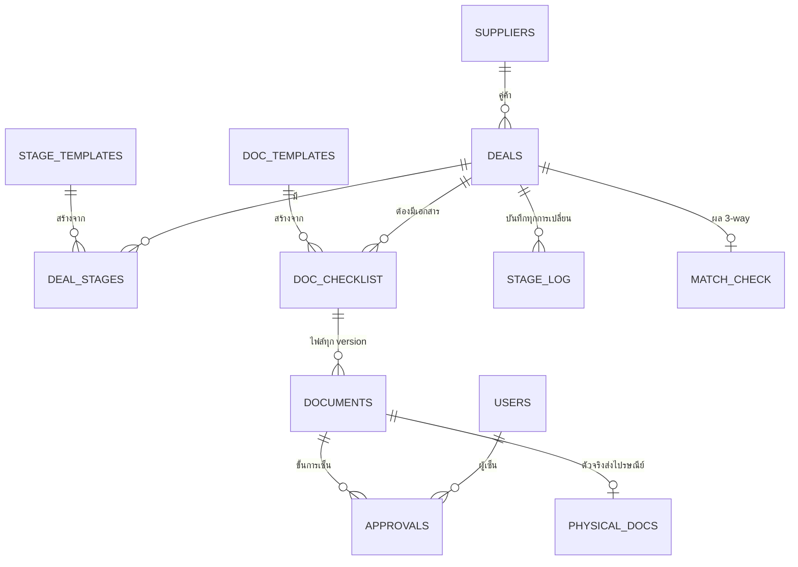

# 02 — โครงสร้างข้อมูล (Google Sheets + Drive)

**สำหรับคนทำระบบ** · ผู้ใช้งานทั่วไปข้ามไป [เอกสาร 03](03-roles-screens.md) ได้

**ที่เก็บ:** Google Spreadsheet 1 ไฟล์ต่อปีบัญชี — `MGS-DOCHUB-2026`
**กฎสำคัญ:** ผู้ใช้**ไม่มีสิทธิ์เข้าถึง Spreadsheet โดยตรง** ทุกการอ่าน/เขียนผ่านเว็บแอปเท่านั้น
(นี่คือมาตรการความปลอดภัยเดียวที่ Google Sheets ให้ได้จริง — ถ้าผู้ใช้มีลิงก์ไฟล์ ระบบสิทธิ์ทั้งหมดเป็นโมฆะ)

---

## 1. ภาพรวม 11 ตาราง



### หลักการที่ทำให้ต่างจาก ERP

| หลักการ | เหตุผล |
|---|---|
| **ไม่เก็บ line item** ของ PO/GR/Invoice | SAP เก็บอยู่แล้ว — เก็บซ้ำจะเพี้ยนกัน ต้องคีย์ 2 รอบ |
| เก็บแค่ **ยอดรวม + จำนวนรวม** ต่อเอกสาร | พอสำหรับเทียบ 3-way และเบากว่ามาก |
| `sap_po_no` เป็นตัวเชื่อมกับ SAP | ไม่พยายาม sync อัตโนมัติใน Phase แรก |
| flow อยู่ใน `Stage_Templates` / `Doc_Templates` | เพิ่ม module ได้โดยไม่แก้โค้ด |
| `Stage_Log` **เขียนเพิ่มเท่านั้น ห้ามแก้/ลบ** | เป็นที่มาของสถานะ คอขวด KPI และหลักฐานตรวจสอบทั้งหมด |

---

## 2. ตารางหลัก

### 2.1 `Deals` — 1 แถว = 1 ดีล (PK `deal_id`)

| คอลัมน์ | ตัวอย่าง | หมายเหตุ |
|---|---|---|
| `deal_id` | UUID | PK ไม่แสดงให้ผู้ใช้เห็น |
| `deal_no` | `D-26-0042` | เลขที่ผู้ใช้เห็น ออกโดยระบบ |
| `module` | `DOMESTIC_FOOD` | ตัวกำหนดว่าใช้ template ไหน |
| `sap_po_no` | `4500012345` | **ตัวเชื่อมกับ SAP** — ว่างได้ก่อนถึง stage 7 |
| `supplier_code`, `supplier_name` | | เก็บชื่อซ้ำไว้เพื่อไม่ให้ประวัติเปลี่ยนเมื่อแก้ master |
| `item_summary` | `กุ้งแช่แข็ง 16/20` | คำอธิบายสั้นให้จำดีลได้ |
| `owner_email` | SR ผู้ดูแลดีล | |
| `currency`, `total_amount` | `THB`, `130000.00` | ยอดตาม PO |
| `payment_condition` | `NET30` | ใช้คำนวณวันเตือนตามใบแจ้งหนี้ |
| `effective_date` | | ที่ SR ต้องแจ้ง AC ในflow เดิม |
| `expected_delivery_date` | | วันนัดรับของ |
| `current_stage` | `QC_INCOMING` | stage ที่ค้างอยู่ |
| `current_owner_email` | | **ใครถืองานอยู่ตอนนี้** |
| `stage_due_at` | | กำหนดเสร็จของ stage ปัจจุบัน |
| `overall_status` | `IN_PROGRESS` | `IN_PROGRESS / ON_HOLD / CLAIM / DONE / CANCELLED / REJECTED` |
| `has_open_claim` | `TRUE` | ถ้า TRUE = ห้ามปิดรายการ |
| `doc_complete` | `FALSE` | เอกสารบังคับครบหรือยัง |
| `match_ready` | `FALSE` | 3-way พร้อมหรือยัง |
| `drive_folder_id` | | โฟลเดอร์ของดีลนี้ |
| `created_by`, `created_at`, `updated_by`, `updated_at`, `row_version` | | `row_version` กัน 2 คนแก้ทับกัน |

### 2.2 `Deal_Stages` — stage ต่อดีล (PK `stage_id`)

`stage_id` · `deal_no` · `seq` · `stage_code` · `stage_name_th` · `owner_dept` · `owner_email` ·
`status` (`PENDING / ACTIVE / DONE / SKIPPED / BLOCKED`) · `started_at` · `done_at` · `due_at` ·
`duration_hrs` · `sla_hours` · `sla_breached` · `skip_reason` · `note`

### 2.3 `Doc_Checklist` — เอกสารที่ต้องมีต่อดีล (PK `checklist_id`)

`checklist_id` · `deal_no` · `doc_type` · `doc_name_th` · `owner_dept` · `is_required` ·
`stage_code` (ผูกกับ stage ไหน) · `doc_status` (`WAITING / UPLOADED / APPROVED / REJECTED / NA`) ·
`current_doc_id` · `amount`, `qty`, `currency` (ยอดบนเอกสาร ใช้เทียบ 3-way) ·
`reject_reason` · `updated_by` · `updated_at`

> **ตารางนี้คือหัวใจที่แก้ปัญหาของบัญชี** — เปิดดีลแล้วเห็นทันทีว่าใบไหน `WAITING` และแผนกไหนต้องส่ง

### 2.4 `Documents` — ไฟล์จริงทุก version (PK `doc_id`)

`doc_id` · `deal_no` · `checklist_id` · `doc_type` · `drive_file_id` · `file_name` · `file_url` ·
`mime_type` · `size_bytes` · `version` · `is_current` · `supersedes_doc_id` · `checksum_md5` ·
`uploaded_by` · `uploaded_at` · `source` (`WEB / LARK / EMAIL`) · `note`

อัพโหลดทับได้เสมอ — ของเก่าถูกตั้ง `is_current = FALSE` ไม่ลบ

### 2.5 `Approvals` — การอนุมัติและลงนาม (PK `approval_id`)

`approval_id` · `deal_no` · `doc_id` · `approval_round` · `seq` · `approver_email` · `approver_role` ·
`decision` (`PENDING / APPROVED / REJECTED`) · `decided_at` · `reject_reason` · `on_behalf_of` ·
**`signed_file_checksum`** · **`signer_ip`** · **`user_agent`** · **`evidence_json`** · `notified_at`

4 คอลัมน์ท้ายคือหลักฐานทางกฎหมาย — ดู [เอกสาร 04 §5](04-automation-approval.md)

### 2.6 `Physical_Docs` — ติดตามเอกสารตัวจริง (PK `phys_id`)

`phys_id` · `deal_no` · `doc_type` · `sent_by` · `sent_from_dept` · `sent_at` · `method`
(`POST / EMS / MESSENGER / HAND`) · `tracking_no` · `courier` · `expected_at` · `received_by` ·
`received_at` · `status` (`SENT / IN_TRANSIT / RECEIVED / LOST`) · `note`

แก้ปัญหา "ใบเสร็จตัวจริงส่งไปรษณีย์แล้วไม่รู้ถึงไหน"

### 2.7 `Match_Check` — ผลตรวจ 3-way (PK `check_id`)

`check_id` · `deal_no` · `checked_at` · `po_amount` · `po_qty` · `invoice_amount` · `invoice_qty` ·
`gr_qty` · `amount_diff` · `qty_diff` · `tolerance_amount` · `tolerance_qty` · `has_open_claim` ·
`credit_note_amount` · `is_ready` · `blocking_reason` · `resolved_by` · `resolved_at` · `resolution_note`

### 2.8 `Stage_Log` — audit เขียนเพิ่มเท่านั้น (PK `log_id`)

`log_id` · `at_ts` · `deal_no` · `entity_type` · `entity_no` · `action` · `from_status` · `to_status` ·
`actor_email` · `actor_dept` · `on_behalf_of` · `duration_prev_hrs` · `sla_hours` · `sla_breached` ·
`reason` · `changed_fields` · `source` · `request_id`

**สถานะ คอขวด KPI และรายงานทุกตัวมาจากตารางนี้** ถ้าไม่เขียนครบทุกครั้ง รายงานจะไม่มีข้อมูล

### 2.9 `Notifications` — คิวแจ้งเตือน (PK `notif_id`)

`notif_id` · `created_at` · `channel` (`LARK / EMAIL`) · `template_id` · `to_recipients` · `cc` ·
`lark_chat_id` · `subject` · `deal_no` · `vars_json` · `status` (`QUEUED / SENT / FAILED / SUPPRESSED`) ·
`attempts` · `next_retry_at` · `sent_at` · `message_id` · `error` · `dedupe_key`

`dedupe_key` กันการส่งซ้ำ — เหตุผลที่ระบบเตือนไม่สแปม 14 ฉบับให้คนเดียว

---

## 3. ตาราง template — หัวใจของการต่อยอด

### 3.1 `Stage_Templates` (PK `template_id`)

| คอลัมน์ | ความหมาย |
|---|---|
| `template_id` | `DOMESTIC_FOOD-01` |
| `module` | `DOMESTIC_FOOD` |
| `seq` | ลำดับ 1–17 |
| `stage_code` | `QC_INCOMING` |
| `stage_name_th` | `QC ตรวจรับที่ห้องเย็นต้นทาง` |
| `owner_dept` | `QC` |
| `owner_resolve` | `DEPT_QUEUE / DEAL_OWNER / ROLE / FIXED_EMAIL` |
| `owner_value` | ค่าประกอบ เช่น role หรืออีเมล |
| `sla_hours` | `24` |
| `skip_condition` | เช่น `has_sap_item_code = TRUE` |
| `branch_on_fail` | เช่น `CLAIM` |
| `requires_approval` | `TRUE` สำหรับ `INTERNAL_APPROVAL` |
| `is_active` | |

### 3.2 `Doc_Templates` (PK `doc_template_id`)

`doc_template_id` · `module` · `doc_type` · `doc_name_th` · `owner_dept` · `is_required` ·
`stage_code` · `needs_amount` (ต้องกรอกยอดไหม) · `needs_approval` · `is_physical`
(ต้องติดตามตัวจริงไหม) · `allowed_mime` · `seq` · `is_active`

**เพิ่ม module ใหม่ = เพิ่มแถวใน 2 ตารางนี้** ไม่ต้องแก้โค้ด ดู [เอกสาร 05](05-module-extensibility.md)

---

## 4. ตาราง master (บาง ๆ)

| ตาราง | คอลัมน์สำคัญ |
|---|---|
| `Users` | `email` (คือ identity), `full_name`, `dept`, `roles`, **`lark_user_id`**, `manager_email`, `delegate_email`, `delegate_until`, `approval_limit`, `notify_channel`, `is_active` |
| `Suppliers` | `supplier_code`, `supplier_name`, `contact_email`, `contact_line`, `payment_term`, `is_active` — **บางมาก** เพราะ master จริงอยู่ใน SAP |
| `Config` | `config_key`, `config_value`, `description` — SLA เริ่มต้น, tolerance, ขนาดไฟล์สูงสุด, Lark chat id ต่อแผนก |
| `Lookups` | `lookup_group`, `code`, `label_th` — ค่า dropdown ทั้งหมด |

`delegate_email` + `delegate_until` ไม่ใช่ของฟุ่มเฟือย — ถ้าไม่มี หัวหน้าลาพักร้อนหนึ่งคนงานค้างทั้งสาย
แล้วคนจะแก้ปัญหาด้วยการยืมรหัสผ่านกันใช้

---

## 5. โครงโฟลเดอร์ Google Drive

```
/MGS-DocHub/                                (Shared Drive — ไม่ใช่ My Drive ของใครคนหนึ่ง)
├── 00_System/
│   ├── Database/                            MGS-DOCHUB-2026  (เฉพาะผู้ดูแลระบบ)
│   ├── Templates/                           เทมเพลตเอกสาร
│   └── Backups/2026/07/                      สำรองอัตโนมัติทุกคืน เก็บ 30 วัน
├── 01_Deals/{YYYY}/{MM}/{DEAL_NO}_{PO_NO}/  ← 1 โฟลเดอร์ต่อดีล
│   ├── 01_Quote_PI/
│   ├── 02_PO/                               PO + PO ที่ซัพเซ็นกลับ + Pattern label
│   ├── 03_QC/                               ผลตรวจตัวอย่าง / ตรวจรับ + รูป
│   ├── 04_GR/
│   ├── 05_Invoice/                          Invoice + ใบลดหนี้
│   ├── 06_Payment/                          สลิป / Swift / ใบเสร็จตัวจริง (สแกน)
│   └── 07_Other/
├── 02_Suppliers/{SUPPLIER_CODE}/            สัญญา ใบรับรอง
└── 03_Archive/{YYYY}/                        ดีลที่ปิดแล้ว ย้ายมาอัตโนมัติ
```

**ทำไมโฟลเดอร์ต่อดีล:** ตรวจสอบย้อนหลังคำถามเดียว — *"เอกสารทั้งหมดของ PO นี้อยู่ไหน"* — ตอบได้
ด้วยโฟลเดอร์เดียว ถ้าจัดตามประเภทเอกสารจะสะดวกตอนเก็บ แต่ตามรอยไม่ได้

### รูปแบบชื่อไฟล์ (ระบบเปลี่ยนชื่อให้เอง ไม่พึ่งวินัยคน)

```
{ประเภท}_{เลขดีล}_{PO}_v{version}_{yyyyMMdd}.{ext}

PO_D-26-0042_4500012345_v1_20260730.pdf
PI_D-26-0042_4500012345_v1_20260722.pdf
QC-RECEIVE_D-26-0042_4500012345_v1_20260728.pdf
GR_D-26-0042_4500012345_v1_20260729.pdf
SLIP_D-26-0042_4500012345_v1_20260805.pdf
```

### สิทธิ์

| โฟลเดอร์ | ใครเข้าได้ |
|---|---|
| `00_System/Database` | ผู้ดูแลระบบเท่านั้น |
| `01_Deals/**` | **ไม่ให้คนเข้าโดยตรง** — เข้าผ่านลิงก์ในแอป |
| `02_Suppliers` | SR แก้ได้ · QC/AC ดูได้ |
| `03_Archive` | AC + ผู้บริหาร ดูได้เท่านั้น |

ให้สิทธิ์ผ่าน **Google Group ต่อแผนก** (`sourcing@`, `qc@`, `warehouse@`, `accounting@`)
ไม่ให้รายบุคคล — ให้รายคนจะดูแลไม่ได้ภายในไตรมาสเดียว

---

## 6. ข้อจำกัดที่ต้องรู้ล่วงหน้า

Google Sheets ไม่ใช่ฐานข้อมูลจริง ต้องยอมรับข้อจำกัดเหล่านี้ตั้งแต่ต้น

| ข้อจำกัด | ผลกระทบ | วิธีลดความเสี่ยง |
|---|---|---|
| เพดาน 10 ล้าน cell ต่อไฟล์ | ที่ปริมาณ ~200 ดีล/เดือน ใช้ไม่ถึง 1 ล้าน/ปี — **สบาย** | แยกไฟล์ต่อปีบัญชี |
| ไม่มี transaction | ถ้าล่มกลางทางข้อมูลอาจไม่สอดคล้อง | ล็อกตอนเขียน + งานตรวจความถูกต้องทุกคืน |
| ไม่มีสิทธิ์ระดับคอลัมน์ | ใครมีลิงก์ไฟล์แก้ได้ทุกอย่าง | **ห้ามแชร์ Spreadsheet ให้ผู้ใช้** |
| ผู้ใช้พร้อมกันมาก ๆ จะช้า | สบายถึง ~25–30 คนทำงานพร้อมกัน | เพียงพอสำหรับ 5 แผนก |
| audit trail แก้ได้ในทางเทคนิค | ผู้ดูแลระบบแก้ `Stage_Log` ได้ | จำกัดคนเป็นผู้ดูแล + สำรองทุกคืน |

**ปริมาณงานของ MGS อยู่ในวิสัยที่ Google Sheets รับได้สบาย** ข้อจำกัดที่ต้องระวังจริงคือเรื่อง
**สิทธิ์และ audit** ไม่ใช่เรื่องขนาด — ถ้าอนาคตฝ่ายตรวจสอบต้องการ audit trail ที่แก้ไม่ได้จริง
นั่นคือสัญญาณว่าต้องย้ายไปฐานข้อมูลจริง (โครงสร้างนี้ออกแบบให้ย้ายได้ ชื่อคอลัมน์เป็น `snake_case`
ใช้กับ SQL ได้ทันที)
