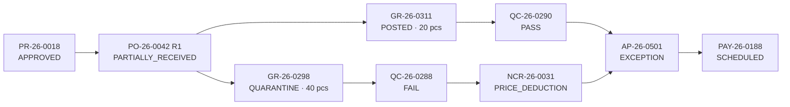

# 03 — Role-Based User Interface

**Design rule:** every screen answers three questions in the first five seconds —
*what needs me now*, *what is overdue*, *what am I waiting on someone else for*.
A dashboard that opens on a full table of records is a report, not a workspace.

**Enforcement rule:** the UI hides fields; the **API decides**. Every payload is re-validated server-side against
`Roles_Permissions` and the state machine. Assume anyone can craft a request — because with AppSheet in the mix,
they effectively can.

---

## 1. Navigation shell (common to all roles)

```
┌───────────────────────────────────────────────────────────────────────────┐
│ PU-ACC   Home │ Purchasing │ Warehouse │ QC │ Accounting │ Reports   [KL] │
├───────────────────────────────────────────────────────────────────────────┤
│  ⚡ MY QUEUE (4)      ⏰ OVERDUE (1)      👀 WATCHING (7)                  │
└───────────────────────────────────────────────────────────────────────────┘
```

- Tabs render only for modules the user has `VIEW` on. A hidden tab is not a permission — the router checks too.
- **Global search** accepts any document number (`PO-26-0042`, `GR-26-0311`, `INV-2026-8891`, a lot number, a
  container number) and lands on the **Traceability view** (§6). This single feature removes most of the
  cross-department phone calls the current process runs on.
- Every record page shows the same **Timeline** strip built from `Status_History`: who did what, when, how long
  each stage took, SLA breaches in red.
- Every record page shows a **Documents** panel from the `Documents` registry: thumbnail, type, version,
  uploader, verification state, plus an upload button restricted to that role's allowed `doc_type`s.

---

## 2. Purchasing

### 2.1 Buyer dashboard

```
┌─ MY QUEUE ────────────────────────────┐ ┌─ ALERTS ────────────────────────┐
│ PRs to convert           6            │ │ ⚠ 3 POs overdue delivery        │
│ POs draft / rejected     2            │ │ ⚠ 2 QC failures need action     │
│ POs awaiting my approval 4            │ │ ⚠ 1 price exception from AP     │
│ Vendor acks outstanding  5            │ │ ⚠ 1 vendor cert expires in 14d  │
└───────────────────────────────────────┘ └─────────────────────────────────┘
┌─ OPEN PO PIPELINE ───────────────────────────────────────────────────────┐
│ PO No       Vendor        Value    Promised   Days ±  Recv   Status      │
│ PO-26-0042  Sungrow       ฿840,000 22-Jul     +3 ⚠    60%    PARTIAL     │
│ PO-26-0051  Thai Frozen   ฿125,400 30-Jul      0      0%     SENT        │
└──────────────────────────────────────────────────────────────────────────┘
┌─ NEEDS MY DECISION ──────────────────────────────────────────────────────┐
│ QC-26-0290  FAIL   Lot SG2207A  qty 40  → [Return] [Rework] [Concession] │
│ AP-26-0501  PRICE_OVER  +฿12,000 vs PO  → [Accept & revise PO] [Dispute] │
└──────────────────────────────────────────────────────────────────────────┘
```

**Inputs (editable):** PR conversion, vendor selection, PO header (dates, incoterm, payment terms, currency,
warehouse, remark), PO lines (item, qty, price, discount, dates, spec note), PO revisions with reason,
short-close with reason, NCR disposition proposal, price-exception decisions, vendor master (if `MASTER.EDIT`).

**Read-only:** all received quantities, all QC results and verdicts, invoice and payment data, other buyers'
draft POs (visible but not editable), any field on a PO past `APPROVED` except through a revision.

**Blocked:** editing `qty_accepted`, overriding a QC `FAIL`, approving own PO, approving an invoice.

### 2.2 PO entry screen

Header + line grid, with server-side validation that a buyer cannot talk their way around:

| Validation | Behaviour |
|---|---|
| Vendor `BLACKLISTED` | hard block |
| Vendor `SUSPENDED` / cert expired | block with Purchasing Manager override, logged |
| Item inactive | hard block |
| Price > `last_purchase_price × (1 + price_alert_pct)` | warning + mandatory justification |
| No FX rate for PO date | block until rate loaded |
| `need_by_date` < today + `lead_time_days` | warning "unrealistic vs vendor lead time" |
| Duplicate PO suspicion (same vendor + item + qty within 7 days) | warning with a link to the existing PO |
| Total crosses an approval band | shows the resulting approval chain **before** submit |

Buttons: `Save Draft` · `Submit for Approval` · `Preview PDF` · `Cancel` — plus `Send to Vendor`, `Create
Revision`, `Short Close` once approved.

### 2.3 Purchasing Manager

Approval inbox with side-by-side context — line detail, vendor scorecard, price history for the item, budget
consumption for the cost centre — because approving on amount alone is rubber-stamping. Actions: `Approve`,
`Reject (reason required)`, `Approve with condition`, `Reassign`, `Delegate`.
Plus a team view: spend by vendor/category, buyer workload, cycle time, exception counts by buyer.

---

## 3. Warehouse (Goods Received)

Primary client: **AppSheet on a phone or rugged tablet.** Design for one thumb, gloves, and patchy signal.

### 3.1 Receiving dashboard

```
┌─ EXPECTED TODAY (4) ───────────────────────────────────────────┐
│ PO-26-0051  Thai Frozen Foods   3 lines   ETA today   [RECEIVE]│
│ PO-26-0042  Sungrow             2 lines   overdue 3d  [RECEIVE]│
└────────────────────────────────────────────────────────────────┘
┌─ MY DRAFTS (1) ─┐ ┌─ AWAITING QC (3) ─┐ ┌─ QUARANTINE (2) ────┐
│ GR-26-0312      │ │ GR-26-0311  6h ⏰  │ │ GR-26-0298 FAIL·RTV │
└─────────────────┘ └───────────────────┘ └─────────────────────┘
```

### 3.2 Receiving flow (5 steps, in this order)

1. **Pick the PO** — scan the PO barcode from the printed PO or pick from Expected. Only POs with `qty_open > 0`.
2. **Truck & document check** — carrier, container/vehicle no., seal no. + seal intact, temperature on arrival,
   truck hygiene, delivery note no. + date. Camera capture of the delivery note.
3. **Count per lot** — for each PO line: `qty_received`, `qty_damaged`, `lot_no`, `production_date`,
   `expiry_date`, pack size, pallet IDs, bin location. **`[+ Add lot]`** splits one PO line into multiple GRN
   rows — the single most important control in the whole receiving screen, because one delivery routinely
   contains several lots with different fates.
4. **Photos** — minimum one; prompts for label close-up, pallet condition, and temperature display. Auto-named
   and filed to `/03_GRN/{GRN_NO}/`.
5. **Submit** — the app shows the live variance vs PO, remaining shelf life, and the missing-document list before
   the confirm button.

Live feedback while counting, not after submit:

```
Line 1 · Frozen Shrimp 16/20 · PO open 500 KG
  Received 480 KG   Variance −20 KG (−4.0%)   ✓ within tolerance
  Lot TF-2607A  exp 2027-01-15  shelf life 169d (91%)  ✓ ≥ 75% required
Line 2 · Frozen Squid · PO open 300 KG
  Received 315 KG   Variance +15 KG (+5.0%)   ✗ over 2% — supervisor approval required
  ⚠ Missing documents: HEALTH_CERT
```

**Inputs (editable):** everything in steps 1–4, until `SUBMITTED`.

**Read-only:** PO prices and values (**warehouse never sees or touches money** — the fastest way to lose
segregation of duties is a price field on the receiving screen), `qty_accepted` / `qty_rejected` (QC owns them),
QC parameter results, invoices.

**Blocked:** receiving against a non-approved or closed PO, editing a submitted GRN (use reversal), releasing
quarantined stock, changing a QC verdict.

### 3.3 Warehouse Supervisor

Adds: over-tolerance approval, short-shelf-life override request, GRN reversal (with reason, blocked once an
invoice is matched), RTV execution, bin transfer, plus a team view of GR-booking SLA (arrival → GRN submitted)
which is where the "goods sat on the dock unrecorded for two days" problem shows up.

---

## 4. Quality Control

### 4.1 QC Inspector dashboard

```
┌─ INSPECTION QUEUE (sorted by SLA) ───────────────────────────────────────┐
│ QC No       Item              Lot       Qty     Aging   SLA      Action  │
│ QC-26-0290  Frozen Shrimp     TF-2607A  480 KG   6h    18h left  [START] │
│ QC-26-0291  Frozen Squid      TF-2607B  315 KG   6h    18h left  [START] │
│ QC-26-0288  PV Module 550W    SG-2207   120 pcs 32h    BREACHED  [START] │
└──────────────────────────────────────────────────────────────────────────┘
┌─ AT LAB (2) ─────────────────────┐ ┌─ AWAITING MY MANAGER (1) ──────────┐
│ QC-26-0285  micro  due tomorrow  │ │ QC-26-0287  CONDITIONAL  −3% claim │
└──────────────────────────────────┘ └────────────────────────────────────┘
```

### 4.2 Inspection screen

The spec drives the form — the inspector never types a parameter name, and cannot invent or skip one:

```
QC-26-0290 · Frozen Shrimp 16/20 · Lot TF-2607A · 480 KG · Spec SPEC-SHR-16/20 v3
Sample size: 32 (AQL 2.5 · Level II · qty band 281–500)

DOCUMENTS               COA ✓   HEALTH_CERT ✗ missing   PACKING_LIST ✓
SENSORY                 Appearance  [Pass ▾]  Odour  [Pass ▾]   📷
PHYSICAL                Net weight/pack  [1.02] kg  spec 0.98–1.02   ✓
                        Glazing %        [12.5]     spec ≤ 15        ✓
                        Core temp °C     [-19.0]    spec ≤ -18       ✓
                        Broken pieces    [3] / 32   Minor · AQL 7    ✓
MICROBIOLOGICAL         Salmonella     [Sent to lab ▾]  ALS  due 04-Aug  CRITICAL
DEFECTS                 Critical 0   Major 1   Minor 3
DISPOSITION             ⦿ Pass   ○ Fail   ○ Conditional   ○ Send to lab
  Accepted 480   Rejected 0   On hold 0        (must total 480)
```

Rules the screen enforces:

- Cannot submit `PASS` while a mandatory parameter is blank, a mandatory document is missing, any critical
  parameter fails, or defects exceed AQL. The form tells you which, at the point of failure.
- Any out-of-spec measurement forces a photo and a remark on that line.
- `qty_accepted + qty_rejected + qty_on_hold` must equal `qty_submitted` — and quantities may be split, so a
  partial rejection is a normal outcome, not a workaround.
- `CONDITIONAL` requires a reason, a proposed remedy (deduction % / replacement / waiver), and routes to QC
  Manager **and** the buyer. The inspector cannot self-approve a concession.
- `FAIL` requires ≥1 reason code and auto-drafts the NCR with quantities and photos pre-filled.

**Inputs (editable):** parameter measurements and verdicts, defect counts, photos, sample size override (with
reason), lab dispatch details, accepted/rejected/on-hold split, `result`, remarks, QC report generation.

**Read-only:** GRN quantities and lot data (warehouse owns them), PO prices and totals, vendor payment terms,
invoices, other inspectors' completed records, the QC spec itself (`QC_MGR` owns specs).

**Blocked:** editing a `COMPLETED` inspection (create a re-inspection instead), approving own conditional
accept, posting a GRN, releasing an AP hold.

### 4.3 QC Manager

Adds: spec and parameter maintenance with versioning, conditional-accept approval, NCR disposition approval,
CAPA tracking and closure, lab management, inspector assignment and workload, plus the analytics that make QC a
sourcing input rather than a cost centre: pass rate by vendor and item, defect Pareto, repeat-offender vendors,
turnaround vs SLA.

---

## 5. Accounting

### 5.1 AP Officer dashboard

```
┌─ INVOICE WORKBENCH ──────────────────────────────────────────────────────┐
│ To register (Drive inbox)   5                                            │
│ Matched · awaiting approval 12   ฿2,480,000                              │
│ EXCEPTIONS                   7   ฿   612,000   ← work here first         │
│ NO_GRN (parked)              3   ฿   145,000                             │
│ QC_HOLD                      2   ฿    84,000                             │
│ Due in 7 days               18   ฿3,120,000                              │
└──────────────────────────────────────────────────────────────────────────┘
┌─ EXCEPTION QUEUE ────────────────────────────────────────────────────────┐
│ Invoice     Vendor      Amount    Exception      Owner   Aging  Action   │
│ AP-26-0501  Sungrow     ฿852,000  PRICE_OVER     Buyer    2d    [OPEN]   │
│ AP-26-0498  Thai Frozen ฿125,400  QTY_OVER       WH       1d    [OPEN]   │
│ AP-26-0495  Thai Frozen ฿ 84,000  QC_REJECTED    QC       4d ⚠  [OPEN]   │
└──────────────────────────────────────────────────────────────────────────┘
```

### 5.2 Three-way match screen

The whole point is that AP never has to open another system, another folder, or another person's inbox:

```
AP-26-0501 · Sungrow Power · INV-2026-8891 · 25-Jul-2026 · USD 24,000 @ 35.50
─────────────────────────────────────────────────────────────────────────────
Line 1 · PV Inverter 110kW
              PO-26-0042 R1      GR-26-0311 (QC PASS)     INVOICE
   Qty            20                 20 accepted             20      ✓
   Unit price     USD 1,150          —                       USD 1,200  ✗ +4.3%
   Amount         USD 23,000                                 USD 24,000
   ⚠ PRICE_OVER · tolerance 2% or ฿200 · variance USD 1,000 (฿35,500)
   Evidence: [PO PDF R1] [Delivery note] [QC-26-0290 report] [Vendor invoice]
   → [Route to buyer] [Accept & request PO revision] [Dispute with vendor] [Reject]
─────────────────────────────────────────────────────────────────────────────
Line 2 · Mounting rail        Qty 200 / 200 accepted / 200   Price ✓   MATCHED
─────────────────────────────────────────────────────────────────────────────
Deductions: NCR-26-0031 price deduction −USD 300
Net payable USD 23,700 · WHT 3% on service portion · Due 24-Aug-2026
```

Every figure carries a click-through to its source record and its source document. That is what "traceability"
has to mean in practice — not a folder someone might have filed correctly.

**Inputs (editable):** invoice registration (all header/line fields), PO/GRN line mapping, tax and WHT fields,
exception routing and resolution notes, deduction application, payment proposal preparation, credit-note
registration, GL account and cost centre coding.

**Read-only:** PO prices and quantities, GRN quantities, QC verdicts and accepted quantities, NCR content.
**Nothing in Accounting may change an upstream number.** If a PO price is wrong, Purchasing revises the PO; if
an accepted quantity is wrong, QC or Warehouse corrects it. AP editing upstream data is the single most common
way an ERP loses its audit trail.

**Blocked:** approving an invoice they registered (SoD), releasing a `QC_HOLD` (QC Manager only), overriding a
`QTY_OVER` beyond accepted quantity, executing a payment they approved.

### 5.3 Finance Manager

Approval queue with match evidence attached, payment-run builder (select by due date / vendor / currency), cash
requirement forecast, dual authorisation on payments above a threshold, WHT certificate generation, GL export,
month-end pack (accrual list = posted GRNs without invoices, GR/IR reconciliation, open commitments).

---

## 6. Traceability view (all roles, read-only)

One screen per PO, the answer to every audit question:



Below the graph: the merged timeline from `Status_History` (every actor, timestamp, and stage duration) and every
document from `Documents`, grouped by stage, with version and verification state. Searchable by PO, GRN, QC,
NCR, invoice, payment, **lot number**, or container number — lot-number search is what you need at 9 p.m. when a
customer complains and you have twenty minutes to find every affected delivery.

---

## 7. Permission matrix

`C` create · `R` read · `U` update · `S` submit · `A` approve · `P` post · `—` none

| Module | REQUESTER | BUYER | PUR_MGR | WH_OFFICER | WH_SUP | QC_INSP | QC_MGR | AP_OFFICER | FIN_MGR | MGMT |
|---|---|---|---|---|---|---|---|---|---|---|
| PR | C R U S (own) | C R U S | R A | — | — | — | — | R | R | R |
| PO | R (own PR) | C R U S | R A | R (no price) | R (no price) | R (no price) | R (no price) | R | R | R |
| PO revision | — | C S | A | — | — | — | — | R | R | R |
| GRN | — | R | R | C R U S (own WH) | C R U S A P | R | R | R | R | R |
| GRN reversal | — | — | R | — | C A | — | — | R | R | R |
| QC | — | R | R | R | R | C R U S | R U A P | R | R | R |
| QC spec | — | R | R | R | R | R | C R U A | — | — | R |
| Conditional accept | — | A (commercial) | R | — | — | S | A | R | R | R |
| NCR | — | R U (disposition) | A | R | C R | C R U S | A P | R | R | R |
| Invoice | — | R U (exception) | R | — | — | R | R (hold) | C R U S | R A | R |
| QC hold release | — | — | — | — | — | — | A | R | R | R |
| Payment | — | — | — | — | — | — | — | C R S | A | R |
| Vendor master | — | C R U | A | R | R | R | R U (QC status) | R U (bank) | A (bank) | R |
| Item master | — | C R U | A | R | R | R U (QC fields) | A | R | R | R |
| Approval matrix | — | — | R | — | — | — | — | — | R | — |
| Reports | own | dept | dept | own WH | own WH | QC | QC | AP | all | all |
| Config / Users | — | — | — | — | — | — | — | — | — | — |

`SYS_ADMIN` holds `ADMIN` on all modules but is explicitly **excluded from the approval chain** — an
administrator who can also approve payments makes the audit trail decorative.

### Segregation of duties — enforced in code, not policy

| Rule | Implementation |
|---|---|
| Cannot approve own document | `actor_email ≠ created_by` on PR, PO, invoice, payment |
| Cannot raise a PO and receive it | if `PO_Header.buyer_email = GRN receiver_email` → flag + supervisor co-sign |
| Cannot inspect and approve own concession | `conditional_approved_by ≠ inspector_email` |
| Cannot register and approve an invoice | `approved_by ≠ created_by` on `Invoice_Header` |
| Cannot approve and execute a payment | `executed_by ≠ approved_by` on `Payments` |
| Payments above threshold need two approvers | `approved_by` + `second_approved_by` |
| Master-data change to bank details | dual control: AP edits, `FIN_MGR` approves before any payment uses it |

Every one of these violations is written to `Status_History` with the attempted action even when blocked. In a
small team you will sometimes have to grant an exception — make it a logged override with a reason, never a
silent hole in the matrix.

---

## 8. Management view (`MGMT_VIEW`)

Read-only, opens on the bottleneck, not on a data dump:

```
┌─ WHERE IS IT STUCK (this week) ──────────────────────────────────────────┐
│ Stage              Open   Mean aging   Breached   Bottleneck             │
│ QC inspection        11      28 h          4      ███████████  #1        │
│ AP exceptions         7      41 h          3      ████████     #2        │
│ PO approval           4      19 h          1      ████         #3        │
│ GR booking            3       5 h          0      █                      │
└──────────────────────────────────────────────────────────────────────────┘
┌─ CYCLE TIME (30d avg) ────────┐ ┌─ QUALITY ──────────────────────────────┐
│ PR → PO          1.8 d        │ │ QC pass rate         94.2%             │
│ PO → GR         12.4 d        │ │ NCR raised              6              │
│ GR → QC done     1.2 d        │ │ Claim value       ฿184,000             │
│ GR → invoice     6.1 d        │ │ Worst vendor   Thai Frozen (82%)       │
│ Invoice → paid  21.3 d        │ │ First-pass match     78%               │
└───────────────────────────────┘ └────────────────────────────────────────┘
```

Plus spend by category and vendor, open commitment value, on-time delivery %, top 10 vendors by claim value, and
budget consumption by cost centre. All from `Status_History` and `VW_*` — no separate data entry, which is the
only way management reporting survives contact with a busy month.
