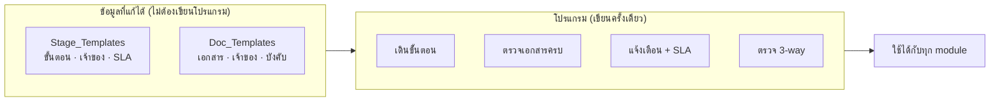

# 05 — การต่อยอด Module อื่น

**คำถามที่เอกสารนี้ตอบ:** ถ้าวันหนึ่งอยากใช้ระบบเดียวกันกับ**งานนำเข้า** หรือ **Solar/Mechanical**
ต้องแก้อะไร และใครทำได้

**คำตอบสั้น:** เพิ่มแถวใน 2 ตาราง ไม่ต้องแก้โปรแกรม และคนที่ทำได้คือ**เจ้าของกระบวนการ** ไม่ใช่ IT

---

## 1. ทำไมทำได้

ระบบไม่ได้เขียน 17 ขั้นตอนไว้ในโค้ด สิ่งที่โค้ดรู้มีแค่ **กฎ 4 ข้อ**:

1. อ่านลำดับ stage ของ module นั้นจาก `Stage_Templates`
2. stage ปัจจุบันเสร็จ → เปิด stage ถัดไป → แจ้งเจ้าของ
3. เอกสารบังคับตาม `Doc_Templates` ต้องครบก่อนจะปิดดีลได้
4. เลย SLA → เตือน → เกินอีก → แจ้งหัวหน้า

กฎ 4 ข้อนี้ใช้กับทุกกระบวนการที่มีลักษณะ "เป็นขั้นตอน มีเจ้าของ มีเอกสารแนบ" — ไม่จำกัดแค่งานจัดซื้อ

---

## 2. ขั้นตอนการเพิ่ม module ใหม่

### ตัวอย่าง: เพิ่ม `IMPORT_FOOD` (นำเข้าอาหารทะเล)

**ขั้นที่ 1** — เขียนขั้นตอนงานจริงลงกระดาษกับเจ้าของงาน (SR ที่ทำงานนำเข้า)

**ขั้นที่ 2** — เพิ่มแถวใน `Stage_Templates` เช่น

| module | seq | stage_code | owner_dept | sla_hours | skip_condition |
|---|---|---|---|---|---|
| `IMPORT_FOOD` | 1 | `PRICE_REQUEST` | SR | 24 | |
| `IMPORT_FOOD` | 2 | `SUPPLIER_AUDIT` | QC | 168 | ซัพผ่านการรับรองแล้ว |
| `IMPORT_FOOD` | 3 | `PI_RECEIVED` | SR | 48 | |
| `IMPORT_FOOD` | 4 | `PO_CREATED` | SR | 24 | |
| `IMPORT_FOOD` | 5 | `INTERNAL_APPROVAL` | SR Head → GM | 24 | |
| `IMPORT_FOOD` | 6 | **`DEPOSIT_PAYMENT`** | AC | 48 | ไม่มีมัดจำ |
| `IMPORT_FOOD` | 7 | **`SHIPMENT_BOOKING`** | LS | 72 | |
| `IMPORT_FOOD` | 8 | **`SHIPPING_DOCS`** | SR | 120 | |
| `IMPORT_FOOD` | 9 | **`CUSTOMS_CLEARANCE`** | LS | 120 | |
| `IMPORT_FOOD` | 10 | **`IMPORT_PERMIT`** | QC | 168 | สินค้าไม่ต้องขออนุญาต |
| `IMPORT_FOOD` | 11 | `QC_INCOMING` | QC | 24 | |
| `IMPORT_FOOD` | 12 | `GR` | WH | 24 | |
| `IMPORT_FOOD` | 13 | **`BALANCE_PAYMENT`** | AC | 48 | |
| `IMPORT_FOOD` | 14 | **`LANDED_COST`** | AC | 72 | |
| `IMPORT_FOOD` | 15 | `AC_CLOSE` | AC | 48 | |

**ขั้นที่ 3** — เพิ่มแถวใน `Doc_Templates` สำหรับเอกสารที่งานนำเข้าต้องมีเพิ่ม

| doc_type | doc_name_th | owner_dept | is_required | stage_code | is_physical |
|---|---|---|---|---|---|
| `BL_AWB` | ใบตราส่ง B/L หรือ AWB | SR | ✅ | `SHIPPING_DOCS` | ✅ |
| `PACKING_LIST` | Packing List | SR | ✅ | `SHIPPING_DOCS` | |
| `CO` | ใบรับรองแหล่งกำเนิด | SR | ✅ | `SHIPPING_DOCS` | ✅ |
| `HEALTH_CERT` | Health Certificate | QC | ✅ | `IMPORT_PERMIT` | ✅ |
| `IMPORT_PERMIT` | ใบอนุญาตนำเข้า | QC | ✅ | `IMPORT_PERMIT` | |
| `CUSTOMS_ENTRY` | ใบขนสินค้า | LS | ✅ | `CUSTOMS_CLEARANCE` | |
| `DUTY_RECEIPT` | ใบเสร็จภาษี/อากร | AC | ✅ | `CUSTOMS_CLEARANCE` | |
| `FREIGHT_INVOICE` | ใบแจ้งหนี้ค่าขนส่ง | AC | ✅ | `LANDED_COST` | |
| `DEPOSIT_SLIP` | สลิปมัดจำ | AC | ตามเงื่อนไข | `DEPOSIT_PAYMENT` | |

**ขั้นที่ 4** — ทดลองสร้าง 1 ดีลใน DEV เดินให้ครบทุก stage

**ขั้นที่ 5** — เปิดใช้จริง (`is_active = TRUE`)

**ไม่มีขั้นที่ต้องแก้ไฟล์โปรแกรมเลย**

---

## 3. Module ที่คาดว่าจะเพิ่ม

| Module | ต่างจาก `DOMESTIC_FOOD` อย่างไร | ความยาก |
|---|---|---|
| `DOMESTIC_FOOD` | — (ตัวตั้งต้น) | ✅ Phase 1 |
| `IMPORT_FOOD` | +9 stage (มัดจำ, ขนส่ง, พิธีการ, ใบอนุญาต, landed cost) · หลายสกุลเงิน | ปานกลาง — ต้องเพิ่มช่องอัตราแลกเปลี่ยน |
| `SOLAR` / `MECHANICAL` | ไม่มีอายุสินค้า/ห้องเย็น · QC เน้นสเปกทางไฟฟ้า/ขนาด · มีการรับประกัน | **ง่าย** — ใช้ template เดียวกันเกือบทั้งหมด |
| `SERVICE` | ไม่มี GR (ไม่มีของเข้าคลัง) · ใช้ใบตรวจรับงานแทน | ง่าย — ตั้ง `GR` เป็นไม่บังคับ |
| `ASSET` / ทรัพย์สิน | +ขั้นอนุมัติงบลงทุน · +ทะเบียนทรัพย์สิน | ปานกลาง |

**`SOLAR` / `MECHANICAL` ทำได้เกือบทันที** — เพราะโครงเรื่อง "เช็คราคา → อนุมัติ → PO → รับของ →
ตรวจ → เอกสาร → จ่าย → ปิด" เหมือนกัน ต่างแค่รายการเอกสารและผู้ตรวจ

---

## 4. ขยายไปเรื่องอื่นที่ไม่ใช่จัดซื้อ

โครงเดียวกันใช้กับกระบวนการอื่นที่ "มีขั้นตอน มีเจ้าของ มีเอกสาร" ได้ เช่น

| งาน | stage คร่าว ๆ |
|---|---|
| ขึ้นทะเบียนซัพพลายเออร์ใหม่ | ขอเอกสาร → ตรวจเอกสาร → QC ตรวจโรงงาน → อนุมัติ → เปิดรหัสใน SAP |
| เคลมคุณภาพจากลูกค้า | รับเรื่อง → สอบสาเหตุ → ตอบลูกค้า → ออกใบลดหนี้ → ปิดเรื่อง |
| ขอเปิดรหัสสินค้าใหม่ | ขอ → SR Head อนุมัติ → LS เปิดใน SAP → แจ้งกลับ |
| ต่ออายุใบรับรอง | เตือนล่วงหน้า → ขอเอกสารจากซัพ → QC ตรวจ → บันทึก |

**ข้อควรระวัง:** อย่าเพิ่ม module เพราะทำได้ ให้เพิ่มเมื่อมีปัญหาการส่งต่อเอกสารจริงเท่านั้น
ระบบที่มี 10 module ที่ไม่มีใครใช้แย่กว่าระบบที่มี 1 module ที่ทุกคนใช้

---

## 5. สิ่งที่ต้องเขียนโปรแกรมเพิ่มจริง ๆ

เพื่อความตรงไปตรงมา — บางเรื่องแก้ template ไม่ได้ ต้องแก้โค้ด

| ต้องการ | ทำไมต้องเขียนโค้ด |
|---|---|
| หลายสกุลเงิน + อัตราแลกเปลี่ยน | ต้องเพิ่มคอลัมน์และตรรกะคำนวณ |
| กระจายต้นทุนนำเข้า (landed cost) | ต้องมีสูตรปันส่วนค่าขนส่ง/อากรลงรายสินค้า |
| เชื่อม SAP อัตโนมัติ | ต้องต่อ API หรือ import ไฟล์ |
| stage ที่แตกขนานพร้อมกัน | เครื่องมือรุ่นแรกเดินทีละขั้น |
| อนุมัติแบบเงื่อนไขซับซ้อน (ตามวงเงิน × ประเภท × แผนก) | รุ่นแรกใช้ลำดับตรง ๆ |
| ลายเซ็นดิจิทัลที่มีใบรับรอง (CA) | ต้องต่อผู้ให้บริการภายนอก |

**5 ข้อแรกไม่ต้องทำใน Phase 1** และควรทำเมื่อมี module ที่ต้องใช้จริงแล้วเท่านั้น

---

## 6. กฎการดูแลระยะยาว

| กฎ | เหตุผล |
|---|---|
| แก้ template ใน DEV ก่อนเสมอ | template ผิดทำให้ดีลที่กำลังวิ่งค้าง |
| **ห้ามลบ stage ที่มีดีลใช้อยู่** — ให้ตั้ง `is_active = FALSE` แทน | ดีลเก่าต้องอ่านประวัติตัวเองได้ |
| ดีลที่สร้างแล้วใช้ template ตอนสร้าง | เปลี่ยน template ไม่ย้อนไปกระทบดีลเก่า |
| เจ้าของ module = หัวหน้าแผนกที่เป็นเจ้าของกระบวนการ | ไม่ใช่ IT — คนที่รู้งานควรแก้ SLA ของตัวเองได้ |
| ทบทวน SLA ทุกไตรมาส | ใช้ข้อมูลคอขวดจริงมาปรับ ไม่ใช่เดา |

**ข้อ "เจ้าของ module คือหัวหน้าแผนก" สำคัญที่สุด** — ถ้าทุกการแก้ SLA ต้องผ่าน IT ระบบจะแข็งตัว
แล้วคนจะกลับไปทำงานในไลน์เหมือนเดิม
