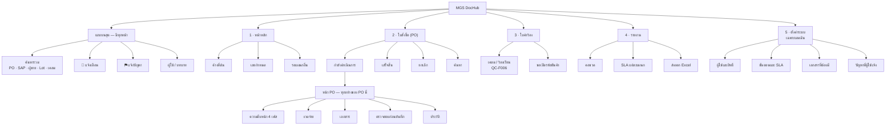
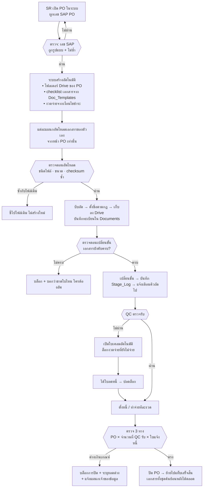
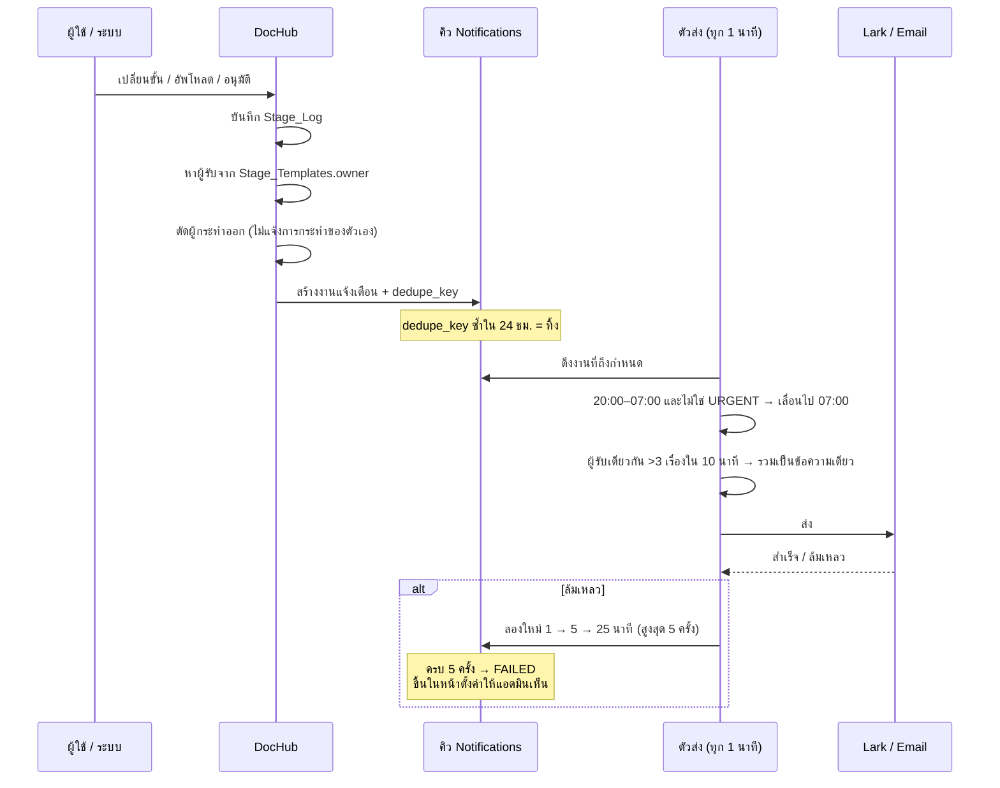
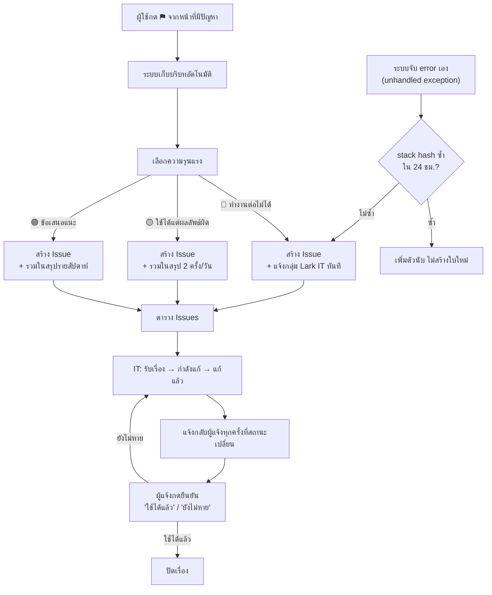

# 07 — โครงสร้างระบบรอบใหม่: เมนู · เอกสารล้อ PO · เทคโนโลยี · แจ้งเตือนและแจ้งบั๊ก

เอกสารนี้ตอบ 4 ข้อ: **โครงสร้างเมนูและการวางหน้าจอ · โฟลว์เอกสารที่ล้อ PO · Tech stack และการประหยัดพื้นที่ ·
โฟลว์แจ้งเตือนและแจ้งบั๊ก** — ต่อยอดจากขอบเขตเดิมใน [เอกสาร 06](06-scope-review.md) ไม่ได้เริ่มใหม่

**หลักที่ใช้ตัดสินทุกข้อในเอกสารนี้**

| หลัก | ผลที่ได้ |
|---|---|
| หน้าจอที่ต่างกันแค่ "ตัวกรอง" = หน้าจอเดียวกัน | 8 หน้าจอเฉพาะแผนก → เหลือ 1 |
| ข้อมูลที่คำนวณได้ ห้ามเก็บ | ตารางเล็กลง ไม่มีข้อมูลขัดแย้งกันเอง |
| ไฟล์ที่สร้างซ้ำได้ ห้ามเก็บ | พื้นที่ลด ~95% |
| ทุกอย่างต้องมีเลข PO กำกับ | ค้นหาย้อนหลังได้จากจุดเดียว |
| ตรวจก่อนบันทึก ดีกว่าตามแก้ทีหลัง | ลด human error ที่ปลายทางบัญชี |

---

# 1. โครงสร้างเมนู (Sitemap) และการวางหน้าจอ

## 1.1 ปัญหาของโครงเดิม: หน้าจอเฉพาะแผนกที่จริง ๆ แล้วเป็นหน้าเดียวกัน

ในเอกสาร 03 เคยออกแบบ "หน้าจอเพิ่มเติม" ให้แต่ละแผนก รวมแล้ว 8 หน้า:

| แผนก | หน้าจอที่เคยออกแบบแยก | จริง ๆ คือ |
|---|---|---|
| SR | รายการที่ต้องตามผู้ขาย | PO ที่ค้างที่ SR |
| QC | คิวตรวจเรียงตาม SLA | PO ที่ค้างที่ QC |
| LS | ต้องจองรถใน 7 วัน · คิวขอรหัสสินค้า | PO ที่ค้างที่ LS |
| WH | ของเข้าใน 7 วัน | PO ที่ค้างที่ WH |
| AC | พร้อมบันทึกบัญชี · ยังไม่พร้อม · รอเอกสารตัวจริง | PO ที่ค้างที่ AC |
| GM | รออนุมัติ | PO ที่ค้างที่ GM |

**ทั้ง 8 หน้าคือ "รายการ PO ที่ค้างที่ฉัน" ที่กรองด้วย `current_owner` ต่างกันเท่านั้น**
เขียนแยกกัน 8 หน้า = โค้ด 8 ชุด บั๊ก 8 ที่ แก้ทีต้องแก้ 8 รอบ และคนย้ายแผนกต้องเรียนใหม่

**จึงยุบเหลือหน้าเดียว** — หน้าหลักอ่านว่าผู้ใช้เป็นใคร แล้วกรองให้เอง เพิ่มแผนกใหม่ในอนาคต
ไม่ต้องเขียนหน้าจอเพิ่มแม้แต่หน้าเดียว

## 1.2 Sitemap



**เมนูหลัก 5 รายการ ไม่มีเมนูซ้อนเกิน 2 ชั้น** — ทุกอย่างเข้าถึงได้ใน 2 คลิก

## 1.3 อะไรถูกยุบรวมเข้าด้วยกัน

| เดิม | ใหม่ | เหตุผล |
|---|---|---|
| หน้าจอเฉพาะแผนก 8 หน้า | **หน้าหลัก 1 หน้า (กรองตามบทบาท)** | ต่างกันแค่ตัวกรอง |
| เมนู "เคลม" + เมนู "รหัสสินค้า" | **ใบคำร้อง** (แท็บย่อย) | ทั้งคู่คือ *ใบขอที่มีสายอนุมัติ ไม่ใช่ PO* — เพิ่มประเภทใหม่ในอนาคต (ขอแก้ PO, ขอคืนสินค้า) = เพิ่มแท็บ ไม่ใช่เพิ่มเมนู |
| ค้นหาแยกในแต่ละหน้า | **ช่องค้นหาเดียวบนแถบบน** | คนจำได้ที่เดียว |
| สลิปอยู่ใน checklist เอกสาร | **ย้ายไปอยู่กับงวดจ่าย** | 1 PO จ่าย 2 งวด = 2 สลิป ใส่ใน checklist เดียวไม่ได้ |
| ตาราง 3-way แยกหน้า | **การ์ดในหน้า PO** | ไม่มีใครเปิดดูแยก |
| "17 ขั้นตอน" กางเต็มหน้า | **4 เฟส + กดดูขั้นย่อย** | ข้อมูลเท่าเดิม แต่ตาไม่ท่วม |

## 1.4 การวางหน้าจอ (Layout)

### โครง 3 ส่วน เหมือนกันทุกหน้า

```
┌──────────┬────────────────────────────────────────────────────────┐
│ MGS      │ ค้นหา…            🔔 3   ⚑ แจ้งปัญหา   สมชาย (จัดซื้อ) │
│ DocHub   ├────────────────────────────────────────────────────────┤
│          │  ชื่อหน้า                              คำอธิบายสั้น      │
│ หน้าหลัก │  ┌─────┬─────┬─────┬─────┐                             │
│ PO    ⑤  │  │  4  │  1  │  9  │  2  │  ← ตัวเลขสำคัญ 4–6 ตัว      │
│ ใบคำร้อง②│  └─────┴─────┴─────┴─────┘                             │
│ รายงาน   │  [กำลังดำเนินการ] [เสร็จสิ้น] [ยกเลิก] [ค้นหา]  ← แท็บ │
│ ตั้งค่า  │  ┌────────────────────────────────────────────────┐   │
│          │  │ ตาราง / รายละเอียด                              │   │
│ ─────    │  └────────────────────────────────────────────────┘   │
│ SAP คือ  │                                                        │
│ ระบบหลัก │                                                        │
└──────────┴────────────────────────────────────────────────────────┘
```

**ทุกหน้าเรียงเหมือนกันเป๊ะ: ชื่อหน้า → ตัวเลขสำคัญ → แท็บ → ตาราง**
เรียนหน้าเดียวแล้วใช้ได้ทุกหน้า — นี่คือเหตุผลเดียวที่คนใช้เป็นภายในวันแรก

### หน้า PO — บล็อกเรียงลำดับตายตัว

| ลำดับ | บล็อก | ทำไมต้องอยู่ตรงนี้ |
|---|---|---|
| 1 | หัวเอกสาร (เลข PO · SAP · ผู้ขาย · มูลค่า · สถานะ) | คำถามแรกของทุกคน |
| 2 | ความคืบหน้า 4 เฟส + ค้างที่ใคร กี่ชั่วโมง | คำถามที่สอง |
| 3 | งวดจ่าย | เฉพาะคนที่เห็นเงินได้ |
| 4 | เอกสาร (ขาดใบไหน ใครต้องอัพ) | คำถามของบัญชี |
| 5 | ตรวจสอบก่อนบันทึก | บอกว่าทำไมยังปิดไม่ได้ |
| 6 | สิ่งที่ทำได้ตอนนี้ | ปุ่มเดียวที่ควรกด อยู่ที่เดิมเสมอ |
| 7 | ประวัติ | เปิดดูเมื่อสงสัย |

**ห้ามสลับลำดับตามบทบาท** — ถ้า QC เห็นบล็อกเรียงคนละแบบกับบัญชี เวลาคุยกันทางโทรศัพท์จะอธิบายกันไม่รู้เรื่อง
สิ่งที่ต่างกันตามบทบาทคือ **บล็อกไหนถูกซ่อน** ไม่ใช่ลำดับ

### กฎการออกแบบที่บังคับใช้

| กฎ | เหตุผล |
|---|---|
| ปุ่มหลักของหน้ามีได้ **ปุ่มเดียว** สีเข้ม | ถ้ามี 4 ปุ่มเท่ากันหมด คนจะไม่กดอะไรเลย |
| ตารางไม่เกิน **7 คอลัมน์** ที่เหลือยุบเป็นบรรทัดรอง | เกินนั้นต้องเลื่อนแนวนอน = อ่านไม่ออกบนมือถือ |
| สถานะใช้ **ข้อความ + สี** เสมอ ห้ามใช้สีอย่างเดียว | คนตาบอดสี ~8% ของผู้ชาย และหน้าจอในคลังสีเพี้ยน |
| QC / WH ออกแบบ **มือถือก่อน** ปุ่มสูง ≥ 44 px | ทำงานยืน ใส่ถุงมือ ในห้องเย็น |
| ไม่มีคำว่า "ดีล" "record" "entity" | ใช้คำที่แผนกใช้อยู่จริง: PO, ใบแจ้งหนี้, ใบเคลม |
| ทุกช่องที่ระบบเติมให้ได้ **ห้ามให้คนพิมพ์** | ชื่อผู้ขาย/สินค้าดึงจากเลข PO — พิมพ์เอง = สะกดไม่ตรงกัน ค้นไม่เจอ |

---

# 2. โฟลว์เอกสารที่ล้อ PO

## 2.1 กฎเหล็ก: ไม่มีไฟล์ลอย

**ทุกไฟล์ต้องผูกกับเอกสารแม่เสมอ ไม่มีปุ่ม "อัพโหลดไฟล์" ที่ไหนที่ไม่ได้อยู่ในบริบทของ PO / ใบคำร้อง**

```
Documents.ref_type = PO | CLAIM | ITEM_REQ | PAYMENT
Documents.ref_no   = PO-26-0042 | EX-2026001 | IC-26-0007 | PO-26-0042#2   ← บังคับ ห้ามว่าง
```

`PAYMENT` ใช้กับสลิปและใบเสร็จซึ่งผูกกับ**งวดจ่าย** ไม่ใช่กับ PO ทั้งใบ — 1 PO จ่าย 2 งวดก็มี 2 สลิป
(ดู [เอกสาร 08](08-payment-module.md))

ใบเคลมที่มาจากลูกค้าอ้าง PI/DN (ฝั่งขาย) จึงเก็บใต้ `CLAIM` ของตัวเอง
แต่ **เมื่อไหร่ที่เคลมย้อนไปหาผู้ขาย ระบบบังคับให้ระบุ `po_no`** — จึงยังตามกลับมาเจอฝั่งซื้อได้เสมอ

## 2.2 โฟลว์เอกสารตลอดอายุ PO



## 2.3 เอกสารทั้งหมดที่ผูกกับ PO

| เอกสาร | เจ้าของ | เกิดที่ขั้น | บังคับ | ที่เก็บ |
|---|---|---|---|---|
| PI จากผู้ขาย | SR | 5 | ✓ | `01_PO/…/01_PI/` |
| PO ที่เซ็นครบแล้ว | SR | 9 | ✓ | `…/02_PO/` |
| Pattern label | SR | 9 | ตามสินค้า | `…/02_PO/` |
| ผลตรวจรับ / RC + รูป | QC | 11 | ✓ | `…/03_QC/` |
| GR จาก SAP | WH | 12 | ✓ | `…/04_GR/` |
| ใบแจ้งหนี้ | AC | 13 | ✓ | `…/05_Invoice/` |
| ใบลดหนี้ | AC | เมื่อมีเคลม | เงื่อนไข | `…/05_Invoice/` |
| สลิป / Swift | AC | **ต่องวดจ่าย** | ✓ ทุกงวด | `…/06_Payment/` |
| ใบเสร็จตัวจริง | AC | 16 | ✓ | `…/06_Payment/` |

## 2.4 ระบบตรวจสอบก่อนบันทึก (Validation)

แบ่ง 3 จังหวะ — จับให้เร็วที่สุดเท่าที่จะเร็วได้

### จังหวะที่ 1 — ขณะพิมพ์ (ทันที ไม่ต้องรอกดบันทึก)

| ช่อง | กฎ | ข้อความที่แสดง |
|---|---|---|
| เลข PO ใน SAP | 10 หลัก ขึ้นต้น `45` | "เลข PO ของ SAP มี 10 หลัก ขึ้นต้นด้วย 45" |
| จำนวน / มูลค่า | > 0 และไม่เกิน 9 หลัก | "จำนวนต้องมากกว่า 0" |
| วันครบกำหนดจ่าย | ≥ วันที่เปิด PO | "วันครบกำหนดอยู่ก่อนวันเปิด PO" |
| อีเมล / เบอร์ผู้ขาย | รูปแบบถูกต้อง | ขีดเส้นใต้แดงใต้ช่อง |

### จังหวะที่ 2 — ตอนกดบันทึก

| # | กฎ | ระดับ | ข้อความ |
|---|---|---|---|
| 1 | ไฟล์แนบครบตามที่ขั้นนั้นบังคับ | 🚫 บล็อก | "ยังขาด: ใบแจ้งหนี้" |
| 2 | ชนิดไฟล์ ∈ {pdf, jpg, png} และ ≤ 20 MB | 🚫 บล็อก | "รองรับ PDF/JPG/PNG ไม่เกิน 20 MB" |
| 3 | checksum ตรงกับไฟล์ที่มีอยู่แล้วใน PO นี้ | ⚠️ เตือน | "ไฟล์นี้อัพไปแล้วเมื่อ 2 ส.ค. — ต้องการทับหรือไม่" |
| 4 | ผลรวมงวดจ่าย = มูลค่า PO | 🚫 บล็อก | "งวดจ่ายรวม ฿128,000 ไม่เท่ากับมูลค่า PO ฿130,000" |
| 5 | จำนวนใน GR ≤ จำนวนใน PO | 🚫 บล็อก | "GR 520 KG เกิน PO 500 KG — ตรวจสอบกับ SAP" |
| 6 | ยอดใบแจ้งหนี้ ต่างจาก PO ≤ 2% | ⚠️ เตือน + ต้องใส่เหตุผล | "ยอดต่างจาก PO ฿2,000 (1.5%) — ระบุเหตุผล" |
| 7 | ยอดใบแจ้งหนี้ ต่างจาก PO > 5% | 🚫 บล็อก | "ต่างเกิน 5% ต้องให้จัดซื้อแก้ที่ต้นทางก่อน" |
| 8 | วันที่ในเอกสาร ไม่อยู่ในอนาคต | ⚠️ เตือน | "วันที่ในใบแจ้งหนี้เป็นวันข้างหน้า" |
| 9 | เลขที่ใบแจ้งหนี้ไม่ซ้ำกับ PO อื่นของผู้ขายเดียวกัน | 🚫 บล็อก | "เลขใบแจ้งหนี้นี้ใช้แล้วใน PO-26-0031" |

### จังหวะที่ 3 — ตอนเปลี่ยนขั้น / ปิด PO

| # | กฎ | ระดับ |
|---|---|---|
| 10 | เอกสารบังคับของขั้นก่อนหน้าครบทุกใบ | 🚫 บล็อก |
| 11 | ไม่มีใบเคลมที่ยังไม่ได้ใบลดหนี้ | 🚫 บล็อก |
| 12 | ทุกงวดจ่ายมีสถานะ `PAID` และมีสลิปครบ | 🚫 บล็อก |
| 13 | ตรวจ 3 ทางผ่าน — **เทียบกับจำนวนที่ QC รับ ไม่ใช่จำนวนที่ส่งมา** | 🚫 บล็อก |
| 14 | ผู้กดอนุมัติ ≠ ผู้สร้าง/ผู้อัพโหลด (แยกหน้าที่) | 🚫 บล็อก |
| 15 | มีรหัสสินค้าจริงจาก SAP แล้ว | 🚫 บล็อก |

**หลักการแสดงผล:** แสดงกฎที่ไม่ผ่าน **ทั้งหมดพร้อมกัน** ไม่ใช่ทีละข้อ และบอกเสมอว่า
*ใครต้องเป็นคนแก้* — เช่น "ยอดใบแจ้งหนี้เกิน PO → ต้องให้จัดซื้อแก้ราคาใน SAP ก่อน (คุณสมชาย)"
พร้อมปุ่มแจ้งคนนั้นในคลิกเดียว

การพยายามบันทึกที่ถูกบล็อก **ถูกบันทึกลง `Stage_Log` ด้วย** — เพราะกฎที่ถูกชนบ่อยคือกฎที่ตั้งผิด
ไม่ใช่คนผิด และต้องเห็นตัวเลขก่อนถึงจะรู้

---

# 3. เทคโนโลยีและการประหยัดพื้นที่

## 3.1 คำตอบตรง ๆ เรื่อง stack

| ระยะ | Stack | ใช้เมื่อ |
|---|---|---|
| **A — เริ่มต้น** | Google Sheets + Apps Script + Drive | ปริมาณปัจจุบัน (~50 PO/เดือน) · ไม่มีค่าใช้จ่ายเพิ่ม · IT ไม่ต้องดูแลเซิร์ฟเวอร์ |
| **B — เมื่อโตเกิน** | PostgreSQL (Supabase / Neon) + ไฟล์อยู่ Drive หรือ S3-compatible | เมื่อชนเกณฑ์ข้อใดข้อหนึ่งด้านล่าง |

**ที่ปริมาณงานปัจจุบัน Google Sheets เพียงพอจริง** — ไม่ได้พูดเพื่อเข้าข้างข้อจำกัดเดิม แต่มาจากตัวเลข:

| ตาราง | แถวต่อปี (ที่ 50 PO/เดือน) | เพดาน Sheets |
|---|---|---|
| `Purchase_Orders` | 600 | 50,000 (แนะนำ) |
| `Stage_Log` | 600 × 17 ≈ 10,200 | 50,000 |
| `Documents` | 600 × 8 ≈ 4,800 | 50,000 |
| `Notifications` | ~25,000 | แยก tab ต่อปี |

ตารางที่โตเร็วที่สุดคือ `Stage_Log` — **ใช้เวลา ~5 ปีกว่าจะชนเพดาน** และแก้ได้ด้วยการแยก tab ต่อปี

### เกณฑ์ย้ายไปฐานข้อมูลจริง (ตั้งเป็นตัวเลขไว้ล่วงหน้า จะได้ไม่ต้องเถียงกันตอนนั้น)

ย้ายเมื่อเข้าเงื่อนไข **ข้อใดข้อหนึ่ง**:

1. เกิน **200 PO/เดือน** ต่อเนื่อง 3 เดือน
2. ผู้ใช้พร้อมกันเกิน **15 คน** (LockService เริ่มทำให้รอคิว)
3. `Stage_Log` เกิน **100,000 แถว**
4. ฝ่ายตรวจสอบต้องการ audit trail ที่**แก้ไม่ได้จริง** (Sheets ทำไม่ได้ — คนที่มีลิงก์ไฟล์แก้ได้เสมอ)
5. ต้องเปิด **API ให้ SAP เรียก** แบบสองทาง

**ออกแบบให้ย้ายได้ตั้งแต่วันแรก:** ชื่อคอลัมน์เป็น `snake_case` · ทุกตารางมี PK เดี่ยว ·
ห้ามใส่สูตรในเซลล์ (ตรรกะอยู่ในโค้ดทั้งหมด) · วันที่เก็บเป็น ISO 8601 · ไม่มีเซลล์ merge
→ ย้ายเป็น `CREATE TABLE` + `COPY` ตรง ๆ ไม่ต้องแปลงข้อมูล

## 3.2 ทำให้เร็ว — รูปแบบที่ต้องใช้บน Apps Script

Apps Script ช้าเพราะ **จำนวนครั้งที่เรียก API ของ Google** ไม่ใช่เพราะจำนวนข้อมูล

| อย่าทำ | ให้ทำ | ผลต่าง |
|---|---|---|
| `getRange(i,j).getValue()` ในลูป | `getDataRange().getValues()` ครั้งเดียวแล้ววนใน memory | **~100 เท่า** |
| เขียนทีละเซลล์ | สะสมแล้ว `setValues()` ครั้งเดียว | ~50 เท่า |
| อ่าน `Stage_Templates` ทุก request | `CacheService` 6 ชั่วโมง | ตัด 1 การอ่านต่อ request |
| สแกนทั้งตารางเพื่อหา 1 แถว | ทำ tab `_Index` (คีย์ → เลขแถว) | ~20 เท่าบนตารางใหญ่ |
| คำนวณสถานะจาก `Stage_Log` ทุกครั้ง | cache `current_stage` บน `Purchase_Orders` แล้วคำนวณเต็มเฉพาะหน้าประวัติ | หน้าแรกโหลดเร็วขึ้นมาก |
| ล็อกทั้งไฟล์ทุก operation | ล็อกเฉพาะตอน **เขียน** และใช้ตัวนับความลึกกัน deadlock | ลดคิวรอ |

**เป้าหมายที่ตั้งไว้:** หน้าแรกไม่เกิน **2 วินาที** · กดบันทึกไม่เกิน **3 วินาที** ·
ถ้าเกินให้แสดงตัวหมุนพร้อมข้อความว่ากำลังทำอะไร (คนรอได้ถ้ารู้ว่าระบบไม่ค้าง)

## 3.3 ประหยัดพื้นที่ — ตัวเลขจริง

### สมมติฐาน (ปรับได้ถ้าตัวเลขจริงต่างจากนี้)

50 PO/เดือน · 7 เอกสาร/PO · สแกนสี 300 dpi ≈ 5 MB/ใบ · เคลม 5 ใบ/เดือน × 5 รูป × 4.5 MB/รูป

| รายการ | ก่อนปรับ /เดือน | หลังปรับ /เดือน |
|---|---|---|
| เอกสารสแกน | 1,750 MB | **140 MB** (200 dpi เทา ≈ 400 KB/ใบ) |
| รูปถ่าย QC / เคลม | 112 MB | **7 MB** (บีบฝั่งเบราว์เซอร์ก่อนอัพ) |
| ไฟล์ "รวมชุด" ที่สแกนซ้ำทั้งชุด | 1,750 MB | **0** (สร้างตอนกดพิมพ์ ไม่เก็บ) |
| เวอร์ชันเก่า + ไฟล์ซ้ำ | 372 MB | **20 MB** (จำกัดเวอร์ชัน + กันซ้ำด้วย checksum) |
| **รวม** | **≈ 3.98 GB/เดือน · 48 GB/ปี** | **≈ 167 MB/เดือน · 2 GB/ปี** |

**ลดลงประมาณ 95%** และรายการที่ประหยัดได้มากที่สุดคือ **"ไฟล์รวมชุด"** ซึ่งเป็นงานที่จัดซื้อ
ต้องนั่งสแกนและรวมเองอยู่ทุกวันนี้ — ตัดออกได้ทั้งงานคนและพื้นที่พร้อมกัน

### 8 มาตรการ

| # | มาตรการ | วิธี |
|---|---|---|
| 1 | **บีบรูปก่อนอัพ** | ย่อด้านยาวเหลือ 1,600 px + JPEG q0.75 บนเบราว์เซอร์ก่อนส่ง — 4.5 MB → ~280 KB ยังอ่านฉลากและเทอร์โมมิเตอร์ได้ชัด |
| 2 | **ตั้งค่าเครื่องสแกนใหม่** | 200 dpi เฉดเทา แทน 300 dpi สี — 5 MB → ~400 KB ตั้งครั้งเดียวที่เครื่อง |
| 3 | **เลิกเก็บไฟล์รวมชุด** | ระบบรวม PDF ให้ตอนกด "พิมพ์ชุดเอกสาร" แล้วทิ้ง — ไม่เก็บถาวร |
| 4 | **PDF ที่ระบบสร้างเอง ไม่เก็บไฟล์** | Inspection Report / ใบเคลม / ใบขอรหัส — เก็บแค่ข้อมูล สร้างใหม่ได้เสมอ **ยกเว้นฉบับที่เซ็นแล้ว** ซึ่งต้องเก็บเป็นหลักฐาน |
| 5 | **กันไฟล์ซ้ำด้วย checksum** | MD5 ตรงกัน = ชี้ไปไฟล์เดิม (คนชอบอัพไฟล์เดียวกันหลายที่) |
| 6 | **จำกัดเวอร์ชัน** | เก็บ 3 เวอร์ชันล่าสุด + ฉบับที่อนุมัติเสมอ · ที่เหลือลบอัตโนมัติหลัง 90 วัน |
| 7 | **ไม่ copy ข้อมูลจาก SAP** | เก็บเลขอ้างอิงอย่างเดียว ไม่ดึง line item มาเก็บซ้ำ |
| 8 | **ย้ายเข้าคลังเมื่อปิดเกิน 12 เดือน** | ย้ายโฟลเดอร์ไป `05_Archive/` ทะเบียนยังค้นเจอเหมือนเดิม |

> ข้อ 4 มีข้อควรระวัง: เอกสารที่ต้องใช้เป็นหลักฐานทางกฎหมายหรือให้ผู้สอบบัญชีตรวจ
> **ต้องเก็บไฟล์จริงที่ตรึงเนื้อหาไว้แล้ว** ไม่ใช่สร้างใหม่ตอนขอ เพราะถ้าเทมเพลตเปลี่ยน
> เอกสารที่พิมพ์วันนี้จะไม่เหมือนที่เซ็นไปเมื่อปีก่อน — จึงเก็บเฉพาะ**ฉบับที่มีลายเซ็น**

## 3.4 ตารางข้อมูล: 14 → 15

เพิ่ม `Issues` หนึ่งตารางสำหรับระบบแจ้งบั๊ก (ดู §4.2)

`Purchase_Orders` · `PO_Payments` · `Doc_Checklist` · `Documents` · `Approvals` · `Stage_Log` ·
`Notifications` · **`Issues`** · `Claims` · `ItemCode_Requests` · `Stage_Templates` · `Doc_Templates` ·
`Users` · `Suppliers` · `Config`/`Lookups`

---

# 4. ระบบแจ้งเตือนและระบบแจ้งบั๊ก

## 4.1 แจ้งเตือน

### หลัก: 3 ชั้น แยกตามว่า "ต้องลงมือหรือไม่"

| ชั้น | ช่องทาง | ใช้กับ | เวลา |
|---|---|---|---|
| 1 | **ในเว็บ 🔔** | ทุกเหตุการณ์ที่เกี่ยวกับฉัน | ทันที |
| 2 | **Lark** (bot/กลุ่ม) | เฉพาะเรื่องที่**ต้องลงมือ** | ภายใน 1 นาที |
| 3 | **Email** | สรุปรายวัน + เรื่องที่ escalate ถึงหัวหน้า | 08:30 ทุกวัน / ทันทีถ้า escalate |

**เหตุผลที่แยกชั้น:** ถ้าส่งทุกอย่างเข้า Lark คนจะปิดการแจ้งเตือนภายในสัปดาห์แรก
แล้วระบบแจ้งเตือนก็ตายทั้งระบบ — ส่งเข้าแชทเฉพาะเรื่องที่ต้องลงมือเท่านั้น

### ✅ ตัดสินใจแล้ว: แจ้งเตือนภายในใช้ **Lark อย่างเดียว** ไม่ทำ LINE

| | ช่องทาง | หมายเหตุ |
|---|---|---|
| **แจ้งเตือนภายใน (พนักงาน)** | **Lark เท่านั้น** | ไม่ต้องดูแล adapter ที่สอง ไม่ต้องถามว่าใครอยู่ช่องทางไหน |
| ติดต่อ**ผู้ขาย**ภายนอก | Email เป็นหลัก · LINE ตามที่ผู้ขายใช้อยู่ | ผู้ขายไม่ได้อยู่ใน Lark ของบริษัท — ฟิลด์ `Suppliers.contact_line` ยังคงไว้ |

**สองเรื่องนี้เป็นคนละเรื่องกัน** — "ใช้ Lark อย่างเดียว" หมายถึงคิวแจ้งเตือนของพนักงาน
ไม่ได้แปลว่าเลิกคุยกับผู้ขายทาง LINE ซึ่งเป็นการติดต่อภายนอกที่ระบบไม่ได้เข้าไปยุ่ง

สิ่งที่ได้จากการตัดข้อนี้ออก:

| | ผล |
|---|---|
| โค้ด | เหลือ adapter เดียว — `Notifications.channel` มีค่า `LARK` / `EMAIL` / `WEB` เท่านั้น |
| การตั้งค่า | `Users` ต้องมี `lark_user_id` ครบทุกคน (เดิมถ้ามี 2 ช่องทางจะปล่อยว่างได้) |
| ความเสี่ยงที่เพิ่มขึ้น | **Lark ล่ม = ชั้น 2 หายทั้งหมด** — จึงตั้งกติกาสำรองไว้ในตารางถัดไป |

**กติกาสำรองเมื่อ Lark ส่งไม่ได้** (จำเป็นเพราะไม่มีช่องทางที่สองแล้ว)

| สถานการณ์ | ระบบทำอะไร |
|---|---|
| ส่ง Lark ไม่สำเร็จ | ลองใหม่ 1 → 5 → 25 นาที (สูงสุด 5 ครั้ง) |
| ครบ 5 ครั้งแล้วยังไม่สำเร็จ | **ตกไปที่ Email อัตโนมัติ** แล้วทำเครื่องหมาย `FALLBACK_EMAIL` |
| ล้มเหลวเกิน 10 ข้อความใน 15 นาที | ขึ้นแบนเนอร์ในหน้าเว็บ "Lark ส่งไม่ได้ชั่วคราว — ดูงานค้างในหน้าหลัก" + แจ้งแอดมิน |
| ผู้ใช้ไม่มี `lark_user_id` | หน้าตั้งค่าขึ้นเตือน และแจ้งเตือนของคนนั้นไปทาง Email แทน |

ชั้น 1 (ในเว็บ) ไม่กระทบเลยไม่ว่ากรณีไหน — **หน้าหลักยังบอกได้เสมอว่างานค้างที่ใคร**
นี่คือเหตุผลที่ชั้น 1 ต้องมีอยู่ ไม่ใช่ของประดับ

### โฟลว์



### เหตุการณ์ที่แจ้ง

| เหตุการณ์ | ใครได้รับ | ชั้น |
|---|---|---|
| งานเข้าคิวของคุณ | เจ้าของขั้นถัดไป | 1 + 2 |
| เอกสารที่คุณต้องอัพยังไม่มา | เจ้าของเอกสาร | 1 + 2 |
| ค้างเกิน SLA (100%) | ผู้ถืองาน | 1 + 2 |
| ค้างเกิน 150% | ผู้ถืองาน + หัวหน้าแผนก | 1 + 2 + 3 |
| ค้างเกิน 200% | + ผู้บริหาร (รวมในสรุปรายวัน) | 3 |
| รออนุมัติ | ผู้อนุมัติ | 1 + 2 |
| ตรวจรับไม่ผ่าน / เปิดเคลม | SR + AC + หัวหน้า QC | 1 + 2 |
| ได้รับใบลดหนี้ → ปลดล็อกจ่าย | AC | 1 + 2 |
| งวดจ่ายครบกำหนดใน 3 วัน | AC | 1 + 3 |
| การตรวจสอบไม่ผ่าน (เช่น ยอดไม่ตรง) | ผู้กด + แผนกที่ต้องแก้ | 1 + 2 |
| PO ปิดแล้ว | ทุกคนที่เคยแตะ PO นี้ | 1 |
| สรุปงานค้างของฉัน | ทุกคน | 3 (08:30) |

### กฎกันสแปม (สำคัญกว่าตัวระบบแจ้งเตือนเอง)

| กฎ | ผล |
|---|---|
| ไม่แจ้งการกระทำของตัวเอง | ตัดข้อความไปได้ ~40% |
| `dedupe_key` = เหตุการณ์ + เอกสาร + ผู้รับ + วัน | เรื่องเดิมไม่เด้งซ้ำ |
| รวมเป็นชุดถ้าเกิน 3 เรื่องใน 10 นาที | "คุณมีงานใหม่ 5 รายการ" แทน 5 ข้อความ |
| เงียบ 20:00–07:00 และวันหยุด ยกเว้น `URGENT` | ไม่รบกวนนอกเวลา |
| ผู้ใช้ปิดรายประเภทได้เอง แต่**ปิด "งานเข้าคิวของคุณ" ไม่ได้** | ไม่มีใครอ้างว่าไม่รู้ |

## 4.2 ระบบแจ้งบั๊ก

### ปุ่ม ⚑ อยู่บนแถบบนทุกหน้า

**ผู้ใช้พิมพ์แค่ "เกิดอะไรขึ้น" ที่เหลือระบบเก็บให้เอง** — เพราะการขอให้ผู้ใช้กรอกว่าอยู่หน้าไหน
ใช้เบราว์เซอร์อะไร คือวิธีที่แน่นอนที่สุดที่จะทำให้ไม่มีใครแจ้งปัญหาเลย

| ระบบเก็บอัตโนมัติ | ผู้ใช้กรอก |
|---|---|
| หน้าจอที่เปิดอยู่ · แท็บย่อย | เกิดอะไรขึ้น (บังคับ) |
| PO / ใบคำร้องที่กำลังดูอยู่ | ความรุนแรง (3 ระดับ) |
| ผู้ใช้ · บทบาท · แผนก | แนบรูปเพิ่ม (ไม่บังคับ) |
| เบราว์เซอร์ · ขนาดจอ · เวลา | |
| 20 การกระทำล่าสุดในระบบ | |
| ข้อผิดพลาดล่าสุดใน console | |

### โฟลว์



### `Issues` — คอลัมน์

`issue_id` · `issue_no` (`BUG-26-0031`) · `severity` (`BLOCKER / WRONG / SUGGEST`) ·
`title` · `description` · `page` · `ref_type` · `ref_no` · `reported_by` · `reported_role` ·
`user_agent` · `screen_size` · `last_actions_json` · `console_error` · `stack_hash` · `occurrences` ·
`screenshot_file_id` · `status` (`NEW / ACK / FIXING / FIXED / CLOSED / WONTFIX`) ·
`assigned_to` · `acked_at` · `fixed_at` · `fix_note` · `confirmed_by_reporter` · `created_at`

### กฎที่ทำให้ระบบแจ้งบั๊กไม่ตาย

| กฎ | เหตุผล |
|---|---|
| **ผู้แจ้งเห็นสถานะเรื่องของตัวเองเสมอ** | ถ้าแจ้งแล้วเงียบ ครั้งที่สองจะไม่มีใครแจ้ง |
| **IT ต้องกดรับเรื่องภายใน 1 วันทำการ** ไม่งั้นเตือนหัวหน้า IT | กันเรื่องค้างเงียบ |
| **ผู้แจ้งเป็นคนกดปิด ไม่ใช่ IT** | "แก้แล้ว" ต้องแปลว่าคนที่เจอปัญหาใช้ได้จริง |
| `stack_hash` กันเรื่องซ้ำ | error เดียวกัน 50 คนเจอ = 1 ใบ ตัวนับ 50 |
| แสดง 5 อันดับหน้าจอที่มีปัญหามากสุดในหน้าตั้งค่า | บอกว่าควรแก้ตรงไหนก่อน |
| **ไม่มีปุ่มลบ Issue** ปิดได้อย่างเดียว | สถิติปัญหาเป็นข้อมูลของบริษัท ไม่ใช่ของ IT |

---

## 5. ผลรวมของการปรับรอบนี้

| ตัวชี้วัด | ก่อน | หลัง |
|---|---|---|
| เมนูหลัก | 5 (+8 หน้าจอเฉพาะแผนก) | **5 (ไม่มีหน้าจอเฉพาะแผนก)** |
| หน้าจอที่ต้องเขียนโค้ด | 13 | **6** |
| หน้าจอที่ต้องเพิ่มเมื่อมีแผนกใหม่ | 1–2 | **0** |
| พื้นที่จัดเก็บ/ปี | ~48 GB | **~2 GB** |
| จุดที่ตรวจข้อมูลก่อนบันทึก | 0 | **15 กฎ ใน 3 จังหวะ** |
| ช่องทางแจ้งเตือน | ถามกันในแชท | **3 ชั้น + คิว + retry + กันสแปม** |
| ช่องทางแจ้งบั๊ก | บอกปากเปล่า | **ปุ่มในทุกหน้า + เก็บบริบทเอง + ติดตามสถานะได้** |
| ตารางข้อมูล | 14 | **15** (+`Issues`) |

## 6. สิ่งที่ยังต้องการจากทีม

1. **เกณฑ์ยอมรับส่วนต่างของใบแจ้งหนี้** — ตอนนี้ตั้งไว้ 2% เตือน / 5% บล็อก ขอให้บัญชียืนยัน
2. ~~ช่องทางแจ้งเตือน~~ — ✅ **ตอบแล้ว: Lark อย่างเดียว** (ดู §4.1) · ที่ยังต้องการต่อคือ
   **`lark_user_id` ของพนักงานทุกคน** เพราะไม่มีช่องทางสำรองรายบุคคลแล้ว
3. **ใครคือแอดมินระบบ** — ต้องไม่อยู่ในสายอนุมัติ
4. **ใครรับเรื่องบั๊ก** และ SLA รับเรื่องกี่ชั่วโมง
5. **นโยบายเก็บเอกสาร** — กฎหมายบัญชีไทยกำหนด 5 ปี ขอให้ยืนยันว่าใช้กับเอกสารชุดนี้ทั้งหมดหรือไม่
   (มีผลต่อแผนย้ายเข้าคลังในข้อ 3.3)
