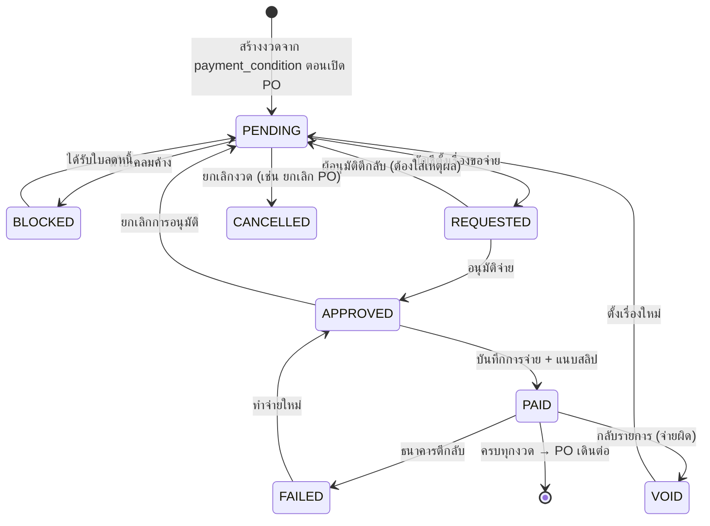

# 08 — โมดูลการชำระเงิน: หน้าจอบันทึกจ่าย และระบบหลังบ้าน

ต่อยอดจาก `PO_Payments` ที่ตั้งไว้ใน [06 §8.2](06-scope-review.md) — เอกสารนี้ลงรายละเอียด
**ฟอร์มบันทึกการจ่าย · ฟิลด์วันที่จ่าย · สถานะและสายอนุมัติ · กฎตรวจสอบ · การกระทบยอด**

---

## 0. ขอบเขต — ระบบนี้ "บันทึก" การจ่าย ไม่ได้ "จ่าย" เอง

| ระบบนี้ทำ | ระบบนี้**ไม่**ทำ |
|---|---|
| บันทึกว่าจ่ายงวดไหน วันไหน เท่าไหร่ ด้วยวิธีอะไร | ไม่เชื่อมต่อธนาคาร ไม่สั่งโอนเงิน |
| คุมสายอนุมัติก่อนจ่าย และแยกหน้าที่ | ไม่แทนการบันทึกบัญชีใน SAP |
| เก็บสลิป/Swift ผูกกับงวดจ่าย | ไม่ทำ payment run แบบ ERP เต็มรูป |
| เตือนวันครบกำหนด และล็อกงวดเมื่อมีเคลม | ไม่คำนวณภาษีให้ (กรอกและตรวจว่าสมเหตุผลเท่านั้น) |
| ตรวจยอดและกระทบกับ statement | ไม่ออกหนังสือรับรองหัก ณ ที่จ่าย |

**เงินยังโอนที่ธนาคาร บัญชียังบันทึกใน SAP** — ที่เพิ่มขึ้นคือ *ทุกแผนกเห็นตรงกันว่าจ่ายหรือยัง
จ่ายวันไหน และเหลืออีกกี่งวด* ซึ่งวันนี้ต้องเดินไปถามบัญชี

---

## 1. หน้าจอบันทึกการจ่าย

เปิดจาก **หน้า PO → การ์ดการจ่ายเงิน → ปุ่มบนงวดที่อนุมัติแล้ว** ไม่มีทางเข้าอื่น
(กฎ "ไม่มีไฟล์ลอย ไม่มีรายการจ่ายลอย" — ทุกการจ่ายต้องผูกกับงวดของ PO)

### 1.1 ส่วนที่ระบบเติมให้ (แก้ไม่ได้)

| ช่อง | ตัวอย่าง |
|---|---|
| PO / ผู้ขาย | `PO-26-0042` · ABC Foods |
| งวดที่ / ประเภท | งวด 2 · ส่วนที่เหลือ 70% |
| ยอดตามงวด | ฿91,000.00 |
| วันครบกำหนด | 30/08/2026 |
| ใบแจ้งหนี้อ้างอิง | `INV-2607-118` |

### 1.2 ส่วนที่บัญชีกรอก

| # | ช่อง | ชนิด | บังคับ | หมายเหตุ |
|---|---|---|---|---|
| 1 | **วันที่จ่าย** (`payment_date`) | วันที่ | ✓ | วันที่ทำรายการโอน — ค่าเริ่มต้นคือวันนี้ |
| 2 | **วันที่ธนาคารตัดเงิน** (`value_date`) | วันที่ | ✓ | ค่าเริ่มต้นเท่ากับวันที่จ่าย · ต่างกันเมื่อโอนนอกเวลาทำการหรือเป็นเช็ค |
| 3 | วิธีจ่าย | โอน / เช็ค / Swift / เงินสด | ✓ | เลือก Swift → เปิดช่องสกุลเงินและอัตราแลกเปลี่ยน |
| 4 | ธนาคาร / บัญชีที่จ่ายออก | เลือกจากรายการ | ✓ | จาก `Config` ไม่ให้พิมพ์เอง |
| 5 | เลขอ้างอิงธนาคาร / เลขเช็ค | ข้อความ | ✓ | ใช้กระทบยอดกับ statement |
| 6 | ภาษีหัก ณ ที่จ่าย | % + จำนวนเงิน | — | ว่างได้ถ้าเป็นการซื้อสินค้า · ดู §1.4 |
| 7 | ค่าธรรมเนียมโอน | จำนวนเงิน + **ใครรับภาระ** | — | บริษัท / ผู้ขาย — มีผลต่อยอดที่ตัดบัญชี |
| 8 | **ยอดที่ตัดจากบัญชีจริง** (`paid_amount`) | จำนวนเงิน | ✓ | ระบบคำนวณให้ แก้ได้ถ้าไม่ตรง **แต่ต้องใส่เหตุผล** |
| 9 | แนบสลิป / Swift | ไฟล์ | ✓ | บังคับ — บันทึกจ่ายโดยไม่มีหลักฐานไม่ได้ |
| 10 | หมายเหตุ | ข้อความ | — | |

### 1.3 การคำนวณที่แสดงสด ๆ ขณะกรอก

```
ยอดตามงวด                            91,000.00
− ภาษีหัก ณ ที่จ่าย (0%)                   0.00
+ ค่าธรรมเนียมโอน (บริษัทรับภาระ)          35.00
─────────────────────────────────────────────
= ยอดที่ควรตัดจากบัญชี                91,035.00
  ผู้ขายได้รับ                        91,000.00
```

สูตร:

```
ยอดที่ควรตัดบัญชี = ยอดตามงวด − ภาษีหัก ณ ที่จ่าย + (ค่าธรรมเนียม ถ้าบริษัทรับภาระ)
ผู้ขายได้รับ      = ยอดตามงวด − ภาษีหัก ณ ที่จ่าย − (ค่าธรรมเนียม ถ้าผู้ขายรับภาระ)
```

ถ้ายอดที่กรอกต่างจากที่คำนวณเกิน **฿1** → ต้องใส่เหตุผลก่อนบันทึก (ไม่บล็อก เพราะของจริงมีเศษ
และมีเคสจ่ายบางส่วน) แต่ **เหตุผลถูกบันทึกและขึ้นในรายงานให้หัวหน้าบัญชีเห็น**

### 1.4 ภาษีหัก ณ ที่จ่าย — ระบบช่วย ไม่ตัดสินใจแทน

| ประเภทรายจ่าย | อัตราที่ระบบเสนอ |
|---|---|
| ซื้อสินค้า | **ไม่หัก** |
| ค่าขนส่ง | 1% |
| ค่าบริการ / รับจ้างทำของ | 3% |
| ค่าเช่า | 5% |
| ค่าโฆษณา | 2% |

ระบบ**เสนอ**อัตราตามประเภทที่เลือก แล้วให้บัญชีกดยืนยันหรือแก้ — ไม่คำนวณให้อัตโนมัติโดยไม่ถาม
เพราะการหักผิดเป็นภาระของบริษัท ไม่ใช่ของระบบ

> **ต้องให้บัญชียืนยัน:** อัตราในตารางนี้เป็นค่าที่ใช้กันทั่วไป ขอให้ฝ่ายบัญชีตรวจว่าตรงกับที่บริษัทใช้จริง
> และมีประเภทอื่นที่ต้องเพิ่มหรือไม่ · ระบบ**ไม่ออก**หนังสือรับรองหัก ณ ที่จ่าย มีแค่ช่องบันทึกเลขที่

---

## 2. สถานะของงวดจ่าย



| สถานะ | หมายความว่า | ใครทำให้เปลี่ยน |
|---|---|---|
| `PENDING` | ยังไม่ถึงคิว / รอถึงกำหนด | ระบบ |
| `BLOCKED` | ล็อกเพราะมีเคลมค้าง | ระบบ (จาก QC) |
| `REQUESTED` | ตั้งเรื่องขอจ่ายแล้ว รออนุมัติ | AC |
| `APPROVED` | อนุมัติแล้ว รอทำจ่าย | AC Head / GM ตามวงเงิน |
| `PAID` | จ่ายแล้ว มีสลิป | AC (คนละคนกับผู้อนุมัติ) |
| `FAILED` | ธนาคารตีกลับ | AC |
| `VOID` | กลับรายการเพราะจ่ายผิด | AC Head |
| `CANCELLED` | ยกเลิกงวด | AC Head |

**ไม่มีการลบรายการจ่าย** — จ่ายผิดต้อง `VOID` ซึ่งสร้างรายการกลับ (`void_of_payment_id`)
พร้อมเหตุผลและผู้อนุมัติ · ถ้าลบได้ audit trail ก็ไม่มีความหมาย

---

## 3. สายอนุมัติและการแยกหน้าที่

| กฎ | เหตุผล |
|---|---|
| **ผู้ตั้งเรื่องขอจ่าย ≠ ผู้อนุมัติจ่าย** | กันการจ่ายเงินคนเดียวจบ |
| **ผู้อนุมัติ ≠ ผู้บันทึกจ่าย** | คนอนุมัติไม่ควรเป็นคนกรอกยอดที่จ่ายจริง |
| ต้องมีใบแจ้งหนี้ก่อนตั้งเรื่องขอจ่าย | กันจ่ายโดยไม่มีเอกสารตั้งหนี้ |
| งวดที่ `BLOCKED` ตั้งเรื่องไม่ได้ | เคลมต้องจบก่อน |
| `VOID` และ `CANCELLED` ต้องเป็นหัวหน้าบัญชี | เป็นการกลับรายการเงิน |

### วงเงินอนุมัติ (ค่าตั้งต้นที่เสนอ — **ขอให้ยืนยัน**)

| วงเงินต่องวด | ผู้อนุมัติ |
|---|---|
| ≤ ฿50,000 | หัวหน้าบัญชี |
| > ฿50,000 | หัวหน้าบัญชี → ผู้บริหาร |
| การจ่ายต่างประเทศ (Swift) ทุกวงเงิน | หัวหน้าบัญชี → ผู้บริหาร |

เก็บหลักฐานการอนุมัติในตาราง `Approvals` เดิม โดยใช้ `ref_type = PAYMENT` —
**ไม่ต้องเพิ่มตารางใหม่** และได้หลักฐาน e-signature ชุดเดียวกับที่ออกแบบไว้ใน [04 §5](04-automation-approval.md)

---

## 4. โครงสร้างข้อมูล

### 4.1 `PO_Payments` — ฉบับเต็ม

| กลุ่ม | คอลัมน์ |
|---|---|
| คีย์ | `payment_id` (PK) · `po_no` · `seq` |
| แผนการจ่าย | `payment_type` (`DEPOSIT/BALANCE/FULL/PARTIAL`) · `percent` · `amount` · `currency` · `due_date` |
| **วันที่** | **`payment_date`** (วันที่จ่าย) · **`value_date`** (วันที่ธนาคารตัดเงิน) · `posting_period` (`YYYY-MM` จาก `value_date`) · `days_late` (คำนวณ `payment_date − due_date`) |
| วิธีจ่าย | `method` (`TRANSFER/CHEQUE/SWIFT/CASH`) · `bank_account_code` · `bank_ref` · `cheque_no` |
| ยอดเงิน | `wht_type` · `wht_rate` · `wht_amount` · `wht_cert_no` · `fee_amount` · `fee_borne_by` (`OUR/SUPPLIER`) · **`paid_amount`** · `net_to_supplier` · `variance_amount` · `variance_reason` |
| ต่างประเทศ | `fx_rate` · `amount_thb` |
| สถานะ | `status` · `blocked_by_claim_no` |
| สายอนุมัติ | `requested_by` · `requested_at` · `approved_by` · `approved_at` · `reject_reason` |
| การบันทึกจ่าย | `paid_by` · `paid_at` · `slip_doc_id` · `receipt_doc_id` · `note` |
| การกลับรายการ | `void_of_payment_id` · `void_reason` · `voided_by` · `voided_at` |
| ระบบ | `idempotency_key` · `row_version` · `created_at` · `updated_at` |

**จำนวนตารางไม่เพิ่ม — ยังเป็น 15 ตาราง** เพราะการอนุมัติใช้ `Approvals` เดิม
สลิปและใบเสร็จใช้ `Documents` เดิมโดยเพิ่มค่า `ref_type = PAYMENT`

### 4.2 ที่เก็บไฟล์

```
/MGS-DocHub/01_PO/2026/07/PO-26-0042/06_Payment/
├── SLIP_PO-26-0042_s1_20260805.pdf     ← สลิปงวดที่ 1
├── SLIP_PO-26-0042_s2_20260830.pdf     ← สลิปงวดที่ 2
└── RECEIPT_PO-26-0042_s2_20260905.pdf  ← ใบเสร็จจากผู้ขาย
```

ชื่อไฟล์มี `_s{seq}_` กำกับเสมอ — เปิดโฟลเดอร์แล้วรู้ทันทีว่าสลิปใบไหนของงวดไหน
โดยไม่ต้องเปิดไฟล์ดู

---

## 5. กฎตรวจสอบของโมดูลจ่าย

เพิ่มจาก 15 กฎใน [07 §2.4](07-system-blueprint.md) อีก 12 ข้อ

### ขณะพิมพ์

| # | กฎ | ข้อความ |
|---|---|---|
| P1 | `payment_date` ไม่เป็นวันในอนาคต | "วันที่จ่ายเป็นวันข้างหน้า — บันทึกได้เมื่อจ่ายจริงแล้ว" |
| P2 | `value_date` ≥ `payment_date` | "วันที่ธนาคารตัดเงินต้องไม่ก่อนวันที่จ่าย" |
| P3 | ยอดที่จ่าย > 0 | "จำนวนเงินต้องมากกว่า 0" |
| P4 | อัตราภาษีหัก ณ ที่จ่าย ∈ 0–15% | "อัตราหัก ณ ที่จ่ายผิดปกติ — ตรวจสอบอีกครั้ง" |

### ตอนกดบันทึก

| # | กฎ | ระดับ | ข้อความ |
|---|---|---|---|
| P5 | มีสลิปแนบ | 🚫 บล็อก | "ต้องแนบสลิปหรือ Swift ก่อนบันทึกการจ่าย" |
| P6 | มีเลขอ้างอิงธนาคาร | 🚫 บล็อก | "ต้องใส่เลขอ้างอิงเพื่อกระทบยอดกับ statement" |
| P7 | `paid_amount` ต่างจากที่คำนวณ > ฿1 | ⚠️ เตือน + ใส่เหตุผล | "ยอดต่างจากที่คำนวณ ฿X — ระบุเหตุผล" |
| P8 | ยอดสะสมที่จ่าย ≤ มูลค่า PO | 🚫 บล็อก | "จ่ายรวมเกินมูลค่า PO ฿X" |
| P9 | `payment_date` ย้อนหลังเกิน 7 วัน | ⚠️ ต้องให้หัวหน้าบัญชีอนุมัติ | "จ่ายย้อนหลัง X วัน — ต้องขออนุมัติเพิ่ม" |
| P10 | `posting_period` ยังไม่ปิดงวด | 🚫 บล็อก | "งวดบัญชี 2026-07 ปิดแล้ว — บันทึกในงวดปัจจุบันแทน" |
| P11 | `bank_ref` ไม่ซ้ำกับรายการจ่ายอื่น | 🚫 บล็อก | "เลขอ้างอิงนี้ใช้แล้วใน PO-26-0031 งวด 1" |
| P12 | สถานะเป็น `APPROVED` เท่านั้น | 🚫 บล็อก | "งวดนี้ยังไม่ผ่านการอนุมัติจ่าย" |

**P11 คือกฎที่ป้องกันการจ่ายซ้ำ** ซึ่งเป็นความผิดพลาดที่แพงที่สุดในงาน AP —
เลขอ้างอิงธนาคารไม่ซ้ำกันโดยธรรมชาติ จึงใช้เป็นตัวจับได้ตรง ๆ

### กันการกดซ้ำ (idempotency)

```
idempotency_key = po_no + seq + payment_date + bank_ref
```

กดปุ่มบันทึกสองครั้งเพราะเน็ตช้า → ครั้งที่สองเจอคีย์ซ้ำ **คืนผลเดิม ไม่สร้างรายการใหม่**
ประกอบกับ `row_version` ที่กันสองคนแก้งวดเดียวกันพร้อมกัน

---

## 6. การแจ้งเตือนของโมดูลจ่าย

ทั้งหมดผ่าน **Lark** (ชั้น 2) ตามที่ตัดสินใจไว้ · สรุปรายวันทางอีเมล (ชั้น 3)

| เหตุการณ์ | ใครได้รับ | เมื่อไหร่ |
|---|---|---|
| งวดครบกำหนดใน 3 วัน | AC | 08:30 |
| งวดเลยกำหนดแล้วยังไม่จ่าย | AC + หัวหน้าบัญชี | ทุกวัน 08:30 |
| ตั้งเรื่องขอจ่าย | ผู้อนุมัติตามวงเงิน | ทันที |
| อนุมัติ / ตีกลับ | ผู้ตั้งเรื่อง | ทันที |
| บันทึกจ่ายแล้ว | SR ผู้ดูแล PO | ทันที |
| บันทึกจ่ายแล้ว | **ผู้ขาย** (อีเมล + สลิป) | ทันที — เลิกให้ SR ส่งเอง |
| ธนาคารตีกลับ | AC + หัวหน้าบัญชี | ทันที |
| จ่ายครบทุกงวด | SR + AC | ทันที |
| ใบเสร็จตัวจริงยังไม่มาเกิน 15 วัน | AC | ทุก 7 วัน |

**"บันทึกจ่ายแล้ว → แจ้งผู้ขายเอง"** คือข้อที่ตัดงานของจัดซื้อออกได้ตรงที่สุด —
วันนี้บัญชีส่งสลิปให้ SR แล้ว SR ส่งต่อให้ผู้ขาย

---

## 7. การกระทบยอดกับธนาคาร

| ทำเมื่อ | วิธี |
|---|---|
| สิ้นเดือน | บัญชีอัพโหลด statement (CSV) → ระบบจับคู่ด้วย `bank_ref` + ยอด + วันที่ |
| ผลลัพธ์ | 3 กอง: **จับคู่ได้** · **มีในระบบแต่ไม่มีใน statement** · **มีใน statement แต่ไม่มีในระบบ** |

กองที่สองคือรายการที่บันทึกว่าจ่ายแล้วแต่เงินไม่ออก · กองที่สามคือเงินออกแล้วแต่ไม่มีใครบันทึก
— **ทั้งสองกองคือสิ่งที่วันนี้ไม่มีใครเห็นจนกว่าจะปิดงบ**

> การกระทบยอดเป็นงาน Phase 5 ไม่ใช่ของที่ต้องมีวันแรก แต่ออกแบบคอลัมน์ `bank_ref` และ
> `value_date` ไว้ตั้งแต่ต้นเพราะถ้าไม่เก็บวันนี้ จะกระทบยอดย้อนหลังไม่ได้เลย

---

## 8. ตัวชี้วัดที่ได้มาฟรีจากข้อมูลชุดนี้

| ตัวชี้วัด | คำนวณจาก | ใช้ทำอะไร |
|---|---|---|
| **จ่ายตรงเวลากี่ %** | `days_late ≤ 0` | ต่อรองเครดิตกับผู้ขายได้ |
| จ่ายช้าเฉลี่ยกี่วัน แยกตามผู้ขาย | `days_late` | หาว่าช้าเพราะใคร |
| เวลาเฉลี่ยจากตั้งเรื่องถึงอนุมัติ | `approved_at − requested_at` | คอขวดอยู่ที่การอนุมัติหรือการทำจ่าย |
| ยอดค้างจ่ายแยกตามอายุหนี้ | `due_date` vs วันนี้ | วางแผนกระแสเงินสด |
| ยอดที่ถูกล็อกจากเคลม | `status = BLOCKED` | เร่งปิดเคลมที่กระทบเงินมากสุดก่อน |

ทั้งหมดนี้ **ไม่ต้องกรอกอะไรเพิ่ม** — เป็นผลพลอยได้จากการที่บันทึกวันที่และสถานะไว้ครบ

---

## 9. ที่ยังต้องการจากฝ่ายบัญชี

1. **วงเงินอนุมัติจ่าย** — ที่เสนอไว้ ≤฿50,000 หัวหน้าบัญชี / >฿50,000 ถึงผู้บริหาร ใช่หรือไม่
2. **อัตราภาษีหัก ณ ที่จ่าย** ที่บริษัทใช้จริง และประเภทรายจ่ายที่ต้องมีในรายการ
3. **ค่าธรรมเนียมโอน** ปกติบริษัทรับภาระหรือหักจากผู้ขาย
4. **จ่ายย้อนหลังได้กี่วัน** โดยไม่ต้องขออนุมัติเพิ่ม (ตั้งไว้ 7 วัน)
5. **รายการบัญชีธนาคาร** ที่ใช้จ่ายออก เพื่อทำเป็นตัวเลือกแทนการพิมพ์
6. ปัจจุบัน**ใครส่งสลิปให้ผู้ขาย** และจะให้ระบบส่งแทนได้เลยหรือไม่
