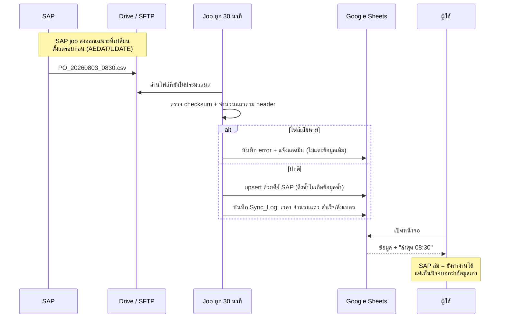

# 09 — ผลการทดลองใช้จริง · มาตรการกันพลาด · การดึงข้อมูลจาก SAP

เอกสารนี้มี 3 ส่วน: **(1) ลองสวมบทเป็นผู้ใช้ทุกแผนกแล้วเจออะไร และแก้อะไรไปแล้ว
(2) มาตรการกันพลาดที่ใส่เข้าระบบ (3) การเชื่อมกับ SAP ให้ดึงข้อมูลมาใช้ได้จริง**

---

# ส่วนที่ 1 — ลองใช้จริงทีละแผนก

วิธีทดสอบ: เปิดตัวอย่างระบบ สวมบทบาททั้ง 6 แผนก ทำงานตั้งแต่ต้นจนจบ 1 PO
แล้วจดทุกจุดที่ต้อง "คิด" หรือ "หา" นานเกิน 3 วินาที

## 1.1 สิ่งที่เจอ และแก้ไปแล้ว

| # | ใครเจอ | ปัญหาที่เจอตอนใช้ | แก้เป็น |
|---|---|---|---|
| 1 | **ทุกแผนก** | เปิดหน้า PO มา ปุ่มที่ต้องกดอยู่**ล่างสุดอันดับ 7** ต้องเลื่อนผ่าน 5 การ์ดก่อนเจอ | ย้ายกล่อง **"งานนี้อยู่ที่คุณ"** ขึ้นไว้บนสุดถัดจากหัวเอกสาร มีปุ่มเดียวที่ต้องกด |
| 2 | **ทุกแผนก** | กดปุ่มแล้วไม่รู้ว่าเกิดอะไรต่อ งานไปไหน ต้องบอกใครไหม | ใต้ปุ่มบอกล่วงหน้าเสมอ: *"กดแล้วงานจะไปที่ คลังสินค้า (คุณประเสริฐ) และระบบแจ้งเตือนให้เอง"* |
| 3 | **QC / คลัง / โลจิสติกส์** | ช่อง "มูลค่า" ขึ้นว่า **"— ไม่มีสิทธิ์ดู"** ทำให้รู้สึกว่าถูกกันข้อมูล | **ซ่อนช่องไปเลย** ไม่ต้องรู้ว่ามีช่องนี้อยู่ |
| 4 | **คลัง / โลจิสติกส์** | เปิดหน้า PO ที่ไม่ใช่งานตัวเอง ไม่รู้ว่าต้องรออะไร | ขึ้นว่า **"ตอนนี้ไม่มีอะไรที่คุณต้องทำ — รออยู่ที่ QC (คุณสมหญิง) ค้างมาแล้ว 1 วัน"** + ปุ่มเตือน |
| 5 | **ทุกแผนก** | การ์ด "17 ขั้นตอน" และ "ประวัติ" กางเต็มตลอดเวลา ทำให้หน้ายาวขึ้นเท่าตัว | **พับเก็บ** เปิดดูเมื่อต้องการ |
| 6 | **จัดซื้อ / คลัง** | หน้าหลักมีตาราง "รอแผนกอื่น" ยาวมาก ไม่เกี่ยวกับตัวเอง | แบ่งเป็น **① ต้องทำวันนี้ · ② กำลังจะถึงคิวคุณ · ③ งานแผนกอื่น (พับเก็บ)** |
| 7 | **คลัง** | เปิดมาเจอ 0 งาน แล้วไม่รู้ว่าควรทำอะไรต่อ | ขึ้นข้อความ *"ไม่มีอะไรที่คุณต้องทำ — ระบบจะแจ้งทาง Lark เมื่อถึงคิว ไม่ต้องเปิดมานั่งเช็ค"* |
| 8 | **โลจิสติกส์** | **บั๊กจริง**: กดใบขอรหัสสินค้าใบไหนก็ตาม รายละเอียดข้างล่างแสดงใบเดิมเสมอ | แก้ให้รายละเอียดตามใบที่กด และเปิด**เต็มหน้า**พร้อมปุ่มย้อนกลับ |
| 9 | **QC** | ใบเคลมแสดง**ใต้ตาราง** กดแล้วเหมือนไม่มีอะไรเกิดขึ้นเพราะอยู่นอกจอ | เปิด**เต็มหน้า**เหมือนหน้า PO — รูปแบบเดียวกันทั้งระบบ |
| 10 | **บัญชี** | ฟอร์มบันทึกจ่ายมี **10 ช่อง** ทั้งที่การโอนปกติใช้จริง 4 ช่อง | เหลือ **4 ช่อง + ติ๊กแนบสลิป** · ภาษีหัก ณ ที่จ่าย ค่าธรรมเนียม วันที่ตัดเงิน ย้ายไปใต้ **"ตัวเลือกเพิ่มเติม"** |
| 11 | **บัญชี** | การ์ด "ตรวจสอบก่อนบันทึก" ขึ้นแดงตั้งแต่ PO ยังอยู่ขั้นเช็คราคา ทำให้ตกใจว่าผิดพลาด | แสดงเต็มเฉพาะช่วง**ตั้งหนี้/จ่าย** ก่อนหน้านั้นขึ้นบรรทัดเดียวว่า *"ยังไม่ต้องสนใจ ระบบจะตรวจให้เองเมื่อถึงเวลา"* |
| 12 | **จัดซื้อ** | ต้อง**พิมพ์เลข PO ของ SAP เอง** ซึ่งพิมพ์ผิดได้และตรวจไม่ได้ | เปลี่ยนเป็นปุ่ม **"ดึงข้อมูล PO จาก SAP"** — ได้เลข ผู้ขาย จำนวน มูลค่า เงื่อนไขจ่าย มาพร้อมกัน |
| 13 | **ทุกแผนก** | ไม่รู้ว่าตัวเลขที่เห็นมาจากไหน และสดแค่ไหน | ป้าย **`SAP`** กำกับทุกช่องที่ดึงมา + แถบบนหน้าหลักบอก *"ข้อมูลจาก SAP ล่าสุด 08:30"* |
| 14 | **QC** | ปุ่ม "ไม่ผ่าน → เปิดใบเคลม" กดปุ๊บเกิดผลทันที ทั้งที่ล็อกเงินของ PO ทั้งใบ | **ถามยืนยันก่อน** พร้อมบอกผลกระทบ (ดูส่วนที่ 2) |
| 15 | **บัญชี** | ปุ่ม "กลับรายการ" อยู่ข้างปุ่มปกติ กดพลาดได้ | **ถามยืนยันก่อน** และบอกว่าของเดิมไม่ถูกลบ |

## 1.2 หน้า PO — ลำดับใหม่

| เดิม | ใหม่ |
|---|---|
| 1 หัวเอกสาร | 1 หัวเอกสาร (+ ป้าย `SAP`) |
| 2 ความคืบหน้า | **2 งานนี้อยู่ที่คุณ + ปุ่ม + บอกว่าจะไปหาใครต่อ** |
| 3 การจ่ายเงิน | 3 ความคืบหน้า 4 เฟส |
| 4 เอกสาร | 4 เอกสาร |
| 5 ตรวจสอบ | 5 การจ่ายเงิน |
| 6 17 ขั้นตอน (กางเต็ม) | 6 ตรวจสอบ *(เฉพาะเมื่อเกี่ยวข้อง)* |
| **7 ปุ่มที่ต้องกด** ← ล่างสุด | 7 17 ขั้นตอน *(พับ)* |
| 8 ประวัติ (กางเต็ม) | 8 ประวัติ *(พับ)* |

**ผลที่วัดได้:** จากต้องเลื่อน ~6 หน้าจอเพื่อหาปุ่ม → เห็นปุ่มตั้งแต่ยังไม่เลื่อน

## 1.3 กติกาหน้าจอที่บังคับตัวเองไว้

| กติกา | เหตุผล |
|---|---|
| **หนึ่งหน้า = หนึ่งคำถาม** — หน้า PO ตอบว่า "ฉันต้องทำอะไร" ก่อนเรื่องอื่น | คนเปิดมาด้วยคำถามเดียว |
| **รูปแบบเดียวกันทุกที่** — PO, เคลม, ใบขอรหัส เปิดเต็มหน้า มีปุ่มย้อนกลับเหมือนกัน | เรียนครั้งเดียวใช้ได้ทั้งระบบ |
| **สิ่งที่ไม่มีสิทธิ์ = ซ่อน ไม่ใช่แสดงว่าห้าม** | ลดจำนวนสิ่งที่ต้องอ่านบนจอ |
| **ทุกปุ่มบอกผลลัพธ์ล่วงหน้า** | ไม่ต้องกดเพื่อดูว่าเกิดอะไร |
| **ที่ใช้ไม่บ่อย = พับเก็บ ไม่ใช่ตัดทิ้ง** | ข้อมูลยังครบ แต่ไม่รก |

---

# ส่วนที่ 2 — มาตรการกันพลาด (Preventive)

แบ่งตาม "พลาดแล้วแก้ยากแค่ไหน"

## 2.1 กันไว้ก่อนกด — ยืนยันพร้อมบอกผลกระทบ

ใช้กับ 3 การกระทำที่ย้อนกลับยาก:

| การกระทำ | ข้อความยืนยันบอกว่า |
|---|---|
| **QC ตรวจรับไม่ผ่าน** | เปิดใบเคลมทันที + **ล็อกงวดจ่ายที่ยังไม่จ่ายทั้งหมด** + แจ้ง 3 แผนกพร้อมกัน |
| **ไม่อนุมัติ PO** | ตีกลับไปจัดซื้อพร้อมเหตุผล บันทึกในประวัติถาวร |
| **กลับรายการจ่าย** | ของเดิม**ไม่ถูกลบ** จะเปิดงวดใหม่ให้ตั้งเรื่องอีกครั้ง และขึ้นในรายงานหัวหน้าบัญชี |

**ไม่ใส่การยืนยันกับปุ่มปกติ** — ถ้าถามทุกปุ่ม คนจะกดยืนยันโดยไม่อ่านภายในสัปดาห์แรก
แล้วการยืนยันก็ไร้ความหมายทั้งระบบ

## 2.2 กันตอนกรอก — 27 กฎที่มีอยู่แล้ว

15 กฎทั่วไป ([07 §2.4](07-system-blueprint.md)) + 12 กฎของโมดูลจ่าย ([08 §5](08-payment-module.md))
กฎที่ป้องกันความเสียหายเป็นเงินโดยตรง:

| กฎ | กันอะไร |
|---|---|
| เลขอ้างอิงธนาคารห้ามซ้ำ | **จ่ายซ้ำ** |
| idempotency key | กดปุ่มสองครั้งตอนเน็ตช้า |
| ยอดใบแจ้งหนี้เกิน PO > 5% | จ่ายเกินสัญญา |
| GR เกินจำนวนใน PO | รับของเกินแล้วตั้งหนี้เกิน |
| ผู้อนุมัติ ≠ ผู้ตั้งเรื่อง ≠ ผู้บันทึกจ่าย | จ่ายเงินคนเดียวจบ |
| ปิด PO ไม่ได้ถ้ามีเคลมค้าง | จ่ายทั้งที่ของมีปัญหา |

## 2.3 กันตอนระบบมีปัญหา — โหมดถดถอย

**หลัก: ระบบภายนอกล่ม ต้องไม่ทำให้คนทำงานไม่ได้**

| ถ้า... | ระบบทำอะไร | คนยังทำอะไรได้ |
|---|---|---|
| **SAP ดึงไม่ได้** | ขึ้นแถบเหลือง "ข้อมูล SAP ล่าสุด 08:30 (2 ชม.ที่แล้ว)" + แจ้งแอดมิน | ทำได้ทุกอย่าง ยกเว้นดึง PO ใหม่ |
| **Lark ส่งไม่ได้** | ลองใหม่ 5 ครั้ง → ตกไปที่อีเมล → ขึ้นแบนเนอร์ | หน้าหลักยังบอกงานค้างครบ |
| **Drive เต็ม** | บล็อกการอัพโหลดพร้อมข้อความชัด + แจ้งแอดมินก่อนเต็ม 90% | บันทึกสถานะได้ อัพไฟล์ทีหลัง |
| **Google Sheets ช้า** | ขึ้นตัวหมุนพร้อมข้อความว่ากำลังทำอะไร | รอได้เพราะรู้ว่าไม่ค้าง |
| **มีคนแก้ Sheet ตรง ๆ** | `row_version` ไม่ตรง → ปฏิเสธการเขียนทับ + บันทึกลง `Stage_Log` | ข้อมูลไม่หาย |
| **สองคนแก้พร้อมกัน** | คนที่สองได้ข้อความว่าข้อมูลเปลี่ยนไปแล้ว ให้โหลดใหม่ | ไม่มีใครเขียนทับใครเงียบ ๆ |

## 2.4 กันความผิดพลาดที่ตรวจไม่ได้ตอนกรอก

| ความเสี่ยง | มาตรการ |
|---|---|
| คนพิมพ์เลข PO ผิดแล้วไม่มีใครรู้ | **ไม่ให้พิมพ์** — ดึงจาก SAP |
| ชื่อผู้ขายสะกดไม่ตรงกันในแต่ละใบ | ดึงจากทะเบียนผู้ขายของ SAP |
| ไฟล์อัพผิด PO | อัพได้จากในหน้า PO เท่านั้น + ระบบตั้งชื่อไฟล์เอง |
| เอกสารเวอร์ชันเก่าถูกใช้ | เก็บทุกเวอร์ชันแต่แสดงฉบับล่าสุดเสมอ + checksum |
| งานหายเพราะไม่มีใครรับผิดชอบ | ทุกขั้นมีเจ้าของเดียว + SLA + escalate อัตโนมัติ |

---

# ส่วนที่ 3 — การดึงข้อมูลจาก SAP

## 3.1 หลักการที่ยึด: ทิศทางเดียว

```
SAP  ──────►  MGS DocHub          ระบบนี้ไม่เขียนกลับเข้า SAP เลย
(อ่านอย่างเดียว)
```

| ผลที่ได้ | ทำไมสำคัญ |
|---|---|
| ไม่มีทางทำข้อมูลใน SAP เสียหาย | ลดการต่อต้านจากฝ่ายที่ดูแล SAP ลงเกือบทั้งหมด |
| ขอแค่สิทธิ์ **อ่าน** | อนุมัติง่ายกว่ามาก และไม่ต้องผ่านการทดสอบระดับเขียน |
| SAP ยังเป็นแหล่งความจริงเดียว | ไม่มีปัญหา "ตัวเลขสองที่ไม่ตรงกัน แล้วเชื่ออันไหน" |

## 3.2 ต้องรู้ก่อน: SAP ที่ใช้เป็นรุ่นไหน

**คำถามแรกที่ต้องถามฝ่าย IT** เพราะเปลี่ยนวิธีเชื่อมทั้งหมด

| รุ่น | วิธีที่ดีที่สุด |
|---|---|
| **S/4HANA** (on-prem หรือ Cloud) | OData API มาตรฐาน — `API_PURCHASEORDER_PROCESS_SRV`, `API_BUSINESS_PARTNER`, `API_SUPPLIERINVOICE_PROCESS_SRV` |
| **ECC 6.0** + SAP Gateway | สร้าง OData service จาก CDS/RFC |
| **ECC 6.0** ไม่มี Gateway | RFC/BAPI ผ่านตัวกลาง หรือ **ส่งออกไฟล์ตามเวลา** |
| **Business One** | Service Layer (REST) |

## 3.3 4 ทางเลือก และข้อเสนอ

| ทาง | วิธี | ข้อดี | ข้อเสีย |
|---|---|---|---|
| **A** | เรียก OData/REST ตรงจาก Apps Script | สดที่สุด · โค้ดน้อย | ต้องเปิด SAP ออกอินเทอร์เน็ต หรือทำ reverse proxy · ต้องให้ IT สร้าง service |
| **B** | RFC/BAPI ผ่าน middleware (PI/PO หรือ connector เล็ก ๆ) | ครอบคลุมทุกข้อมูล | ต้องมีเซิร์ฟเวอร์และคนดูแล |
| **C** ⭐ | **SAP ส่งออกไฟล์ตามเวลา → วางบน Shared Drive/SFTP → ระบบอ่านเข้า** | **ไม่ต้องแก้ SAP · ไม่ต้องเปิดพอร์ต · ไม่ต้องผ่านความมั่นคง** · ใช้ job ที่ SAP มีอยู่แล้ว | ข้อมูลช้าตามรอบ (30 นาที) |
| **D** | ให้คน export Excel มาอัพเอง | เริ่มพรุ่งนี้ได้ | ต้องมีคนทำทุกวัน — ผิดหลักที่พยายามลดงานมือ |

### ข้อเสนอ: เริ่มที่ **C** แล้วย้ายไป **A** เมื่อพร้อม

เหตุผลที่ไม่เริ่มที่ A ทั้งที่ดีกว่า: การขอเปิด SAP ออกมาข้างนอกต้องผ่านฝ่ายความมั่นคง
ซึ่งมักใช้เวลาหลายเดือน — และ**เราไม่ควรให้โครงการทั้งโครงการรออยู่กับเรื่องนั้น**

**สิ่งสำคัญคือออกแบบให้เปลี่ยนได้โดยไม่รื้อ:**

```
โค้ดทั้งระบบ  ──►  SapAdapter  ──►  ① อ่านไฟล์จาก Drive   (Phase 1)
                   (ไฟล์เดียว)      ② เรียก OData          (Phase 2)
                                    ③ อ่านจากฐานข้อมูล      (อนาคต)
```

`SapAdapter.getPurchaseOrder(poNo)` คืนค่าโครงเดียวกันเสมอ ไม่ว่าข้างหลังจะเป็นแบบไหน
→ **ย้ายจาก C ไป A คือแก้ไฟล์เดียว ไม่แตะโค้ดส่วนอื่นเลย**

## 3.4 ข้อมูลที่ต้องดึง (Data Contract)

| ข้อมูล | ตารางใน ECC | OData ใน S/4 | คีย์ | ความถี่ |
|---|---|---|---|---|
| PO header | `EKKO` | `A_PurchaseOrder` | `EBELN` | ทุก 30 นาที |
| PO item | `EKPO` | `A_PurchaseOrderItem` | `EBELN`+`EBELP` | ทุก 30 นาที |
| ผู้ขาย | `LFA1` | `A_BusinessPartner` | `LIFNR` | ทุกคืน |
| รหัสสินค้า | `MARA` + `MAKT` | `A_Product` | `MATNR` | ทุกคืน |
| การรับเข้า (GR) | `MKPF` + `MSEG` | `A_MaterialDocumentItem` | `MBLNR`+`ZEILE` | ทุก 30 นาที |
| ใบแจ้งหนี้ที่ตั้งหนี้แล้ว | `RBKP` + `RSEG` | `A_SupplierInvoice` | `BELNR`+`GJAHR` | ทุก 30 นาที |

### ฟิลด์ที่ใช้จริง (ตัดเหลือเท่าที่ต้องใช้)

| จาก | ฟิลด์ | ใช้ทำอะไรในระบบ |
|---|---|---|
| `EKKO` | `EBELN` `LIFNR` `WAERS` `BEDAT` `ZTERM` `BUKRS` | เลข PO · ผู้ขาย · สกุลเงิน · วันที่ · **เงื่อนไขชำระ (ใช้สร้างงวดจ่ายอัตโนมัติ)** |
| `EKPO` | `EBELP` `MATNR` `TXZ01` `MENGE` `MEINS` `NETWR` | สินค้า · จำนวน · หน่วย · มูลค่า |
| `LFA1` | `LIFNR` `NAME1` `LAND1` | ชื่อผู้ขายที่สะกดตรงกันทุกใบ |
| `MARA`/`MAKT` | `MATNR` `MAKTX` `MEINS` | ยืนยันว่ารหัสสินค้าเปิดแล้วจริง |
| `MSEG` | `MBLNR` `BUDAT` `EBELN` `MENGE` `BWART` | GR (`BWART` 101) และการคืน (102) |
| `RSEG` | `BELNR` `XBLNR` `EBELN` `WRBTR` | เลขใบแจ้งหนี้ของผู้ขาย + ยอด เพื่อตรวจ 3 ทาง |

**ไม่ดึง:** ราคาต้นทุน · บัญชีแยกประเภท · ข้อมูลพนักงาน · ข้อมูลลูกค้า —
ขอเฉพาะที่ใช้จริง ทำให้การขออนุมัติสิทธิ์ผ่านง่ายขึ้นมาก

## 3.5 กลไกการซิงก์



### กฎ 6 ข้อของการซิงก์

| # | กฎ | เหตุผล |
|---|---|---|
| 1 | **Upsert ด้วยคีย์ของ SAP** ไม่ใช่ insert | ดึงซ้ำกี่ครั้งก็ไม่เกิดข้อมูลซ้ำ |
| 2 | **ดึงเฉพาะที่เปลี่ยน** (delta) ไม่ดึงทั้งฐาน | รอบละไม่กี่วินาที แทนที่จะเป็นหลายนาที |
| 3 | **ไฟล์เสีย = ข้ามรอบ ไม่เขียนทับของเดิม** | ข้อมูลเก่าที่ถูกต้อง ดีกว่าข้อมูลใหม่ที่พัง |
| 4 | **บันทึกทุกรอบใน `Sync_Log`** | ตอบได้ว่าข้อมูล ณ เวลาไหนมาจากรอบไหน |
| 5 | **ตรวจนับรายวัน** — จำนวน PO เปิดอยู่ในระบบ = ใน SAP | จับกรณีตกหล่นเงียบ ๆ |
| 6 | **หน้าจอบอกความสดเสมอ** | คนตัดสินใจเองได้ว่าจะเชื่อหรือรอ |

### ตารางใหม่ 1 ตาราง: `Sync_Log`

`sync_id` · `object` (`PO/VENDOR/MATERIAL/GR/INVOICE`) · `started_at` · `finished_at` ·
`source_file` · `rows_read` · `rows_upserted` · `rows_rejected` · `status` · `error_msg` · `watermark`

`watermark` คือเวลาล่าสุดที่ดึงมาแล้ว — รอบถัดไปเริ่มจากตรงนี้
**รวมเป็น 16 ตาราง**

## 3.6 สิ่งที่เปลี่ยนในการทำงานเมื่อมี SAP จริง

| งาน | เดิม | หลังเชื่อม SAP |
|---|---|---|
| กรอกเลข PO | จัดซื้อพิมพ์เอง 10 หลัก | **กดปุ่มเดียว** ได้เลข ผู้ขาย จำนวน มูลค่า เงื่อนไขจ่าย |
| สร้างงวดจ่าย | กรอกเอง | **สร้างจาก `ZTERM` ของ SAP อัตโนมัติ** |
| เช็คว่ารหัสสินค้าเปิดหรือยัง | โทรถาม LS | ระบบเช็คกับ `MARA` เอง |
| เช็คว่า GR เข้าหรือยัง | ถามคลัง | ระบบเห็นจาก `MSEG` ภายใน 30 นาที |
| ตรวจ 3 ทาง | เปิด SAP เทียบเอง | ระบบเทียบ PO × QC รับ × ใบแจ้งหนี้ ให้ |

**ข้อ 2 สำคัญที่สุด** — เงื่อนไขชำระอยู่ใน SAP อยู่แล้ว (`ZTERM`) การให้ระบบสร้างงวดจ่ายจากตรงนั้น
แปลว่า **ไม่มีทางที่งวดจ่ายในระบบจะไม่ตรงกับสัญญา**

## 3.7 ความปลอดภัย

| เรื่อง | มาตรการ |
|---|---|
| ผู้ใช้ SAP ที่ระบบใช้ | **บัญชี technical แบบอ่านอย่างเดียว** จำกัดเฉพาะ 6 ออบเจ็กต์ข้างต้น |
| ไฟล์ระหว่างทาง | โฟลเดอร์เฉพาะ เข้าถึงได้แค่บัญชีระบบ · ลบอัตโนมัติหลัง 7 วัน |
| ข้อมูลที่ไม่ควรออกจาก SAP | ไม่ดึงตั้งแต่แรก (ดู §3.4) |
| การเขียนกลับ | **ไม่มี** — ไม่ต้องออกแบบสิทธิ์เขียนเลย |
| บันทึกการเข้าถึง | `Sync_Log` เก็บทุกรอบว่าใครดึงอะไรเมื่อไหร่ |

---

# ส่วนที่ 4 — โครงสร้างที่แข็งแรง

## 4.1 การแบ่งชั้น

```
หน้าจอ (HTML Service)
    │  เรียกฟังก์ชันเดียว ไม่รู้จักโครงสร้างข้อมูล
Api  ─┼─ ตรวจสิทธิ์ · ตรวจกฎ · idempotency
      │
บริการ (StageEngine · Checklist · Payment · Claim)
      │  ตรรกะธุรกิจทั้งหมดอยู่ชั้นนี้ ไม่มีที่อื่น
Repo  ─┼─ อ่าน/เขียน Sheets · row_version · lock
      │
SapAdapter ── ไฟล์ / OData / ฐานข้อมูล (สลับได้)
```

**กฎ:** หน้าจอห้ามอ่าน Sheets ตรง · บริการห้ามรู้จัก HTML · Repo ห้ามมีตรรกะธุรกิจ
ถ้าทำตามนี้ การย้ายจาก Sheets ไป Postgres คือแก้ชั้น Repo ชั้นเดียว

## 4.2 สิ่งที่ทำให้ระบบไม่พังเมื่อโต

| กลไก | ป้องกันอะไร |
|---|---|
| `Stage_Log` เขียนอย่างเดียว ไม่แก้ | ประวัติปลอมไม่ได้ · เป็นที่มาของ KPI ทุกตัว |
| `row_version` ทุกตาราง | สองคนแก้พร้อมกันแล้วเขียนทับกันเงียบ ๆ |
| `idempotency_key` ทุกการเขียนที่มีผลทางเงิน | กดซ้ำ / เน็ตหลุดแล้วกดใหม่ |
| Flow อยู่ในตาราง ไม่ใช่ในโค้ด | เพิ่ม module ใหม่ = เพิ่มแถว |
| `SapAdapter` ชั้นเดียว | เปลี่ยนวิธีเชื่อม SAP โดยไม่แตะระบบ |
| แยก tab ต่อปีสำหรับตารางที่โตเร็ว | ชนเพดาน Sheets |
| ทุกกฎตรวจสอบอยู่ในชั้นบริการ ไม่ใช่ในหน้าจอ | คนเรียก API ตรงก็ยังผ่านกฎเดียวกัน |

## 4.3 สิ่งที่ยังเป็นจุดอ่อน (พูดตรง ๆ)

| จุดอ่อน | ผลกระทบ | ทางแก้เมื่อถึงเวลา |
|---|---|---|
| Google Sheets แก้ไขได้จากภายนอกถ้ามีลิงก์ | audit trail ไม่แข็งพอสำหรับผู้สอบบัญชีเข้ม | ย้ายไป Postgres ([07 §3.1](07-system-blueprint.md)) |
| LockService ทำให้การเขียนเป็นคิว | ผู้ใช้พร้อมกัน >15 คนเริ่มรอ | เกณฑ์ย้ายตั้งไว้แล้ว |
| ไม่มี staging/test แยก | แก้แล้วพังกระทบคนใช้ทันที | ทำสำเนา Sheet + Apps Script อีกชุดเป็น DEV |
| ยังไม่ได้ทดสอบกับคนจริง | ที่เขียนในเอกสารนี้มาจากการสวมบทเอง | **ต้องให้แต่ละแผนกลองกด 15 นาที ก่อนเริ่ม Phase 2** |

---

## 5. ที่ต้องการจากทีม

1. **SAP ที่ใช้เป็นรุ่นไหน** (S/4HANA / ECC 6.0 / Business One) และมี SAP Gateway หรือไม่
2. **ใครเป็นเจ้าของ SAP ฝั่ง IT** และขอสิทธิ์อ่านต้องผ่านใคร
3. ปัจจุบันมี **job ส่งออกไฟล์จาก SAP** อยู่แล้วหรือไม่ (ถ้ามี ใช้ต่อได้เลย)
4. **เงื่อนไขชำระ (`ZTERM`) ที่บริษัทใช้มีกี่แบบ** เพื่อแปลงเป็นงวดจ่ายให้ถูก
5. ให้แต่ละแผนก **ลองกดตัวอย่างระบบ 15 นาที** แล้วบอกจุดที่ยังงง — ส่วนที่ 1 มาจากการสวมบทเอง
   ยังไม่ใช่ผลจากผู้ใช้จริง
