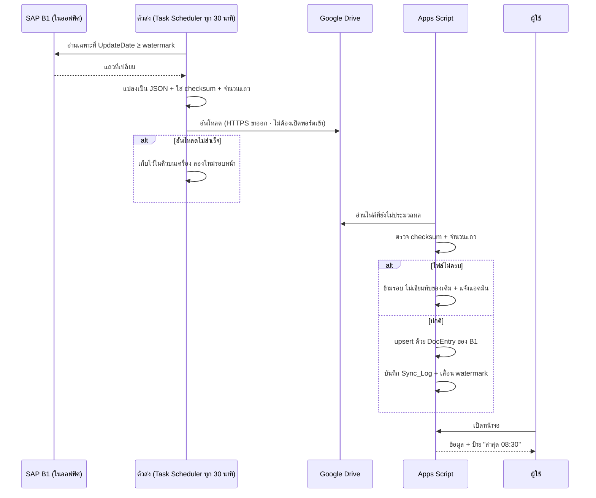

# 09 — ผลการทดลองใช้จริง · มาตรการกันพลาด · การดึงข้อมูลจาก SAP

เอกสารนี้มี 3 ส่วน: **(1) ลองสวมบทเป็นผู้ใช้ทุกแผนกแล้วเจออะไร และแก้อะไรไปแล้ว
(2) มาตรการกันพลาดที่ใส่เข้าระบบ (3) การเชื่อมกับ SAP ให้ดึงข้อมูลมาใช้ได้จริง**

---

# ส่วนที่ 1 — ลองใช้จริงทีละแผนก

วิธีทดสอบ: เปิดตัวอย่างระบบ สวมบทบาททั้ง 6 แผนก ทำงานตั้งแต่ต้นจนจบ 1 PO
แล้วจดทุกจุดที่ต้อง "คิด" หรือ "หา" นานเกิน 3 วินาที

## 1.1 สิ่งที่เจอ และแก้ไปแล้ว

| # | ใครเจอ | ปัญหาที่เจอตอนใช้ | แก้เป็น |
|---|---|---|---|
| 1 | **ทุกแผนก** | เปิดหน้า PO มา ปุ่มที่ต้องกดอยู่**ล่างสุดอันดับ 7** ต้องเลื่อนผ่าน 5 การ์ดก่อนเจอ | ย้ายกล่อง **"งานนี้อยู่ที่คุณ"** ขึ้นไว้บนสุดถัดจากหัวเอกสาร มีปุ่มเดียวที่ต้องกด |
| 2 | **ทุกแผนก** | กดปุ่มแล้วไม่รู้ว่าเกิดอะไรต่อ งานไปไหน ต้องบอกใครไหม | ใต้ปุ่มบอกล่วงหน้าเสมอ: *"กดแล้วงานจะไปที่ คลังสินค้า (คุณประเสริฐ) และระบบแจ้งเตือนให้เอง"* |
| 3 | **QC / คลัง / โลจิสติกส์** | ช่อง "มูลค่า" ขึ้นว่า **"— ไม่มีสิทธิ์ดู"** ทำให้รู้สึกว่าถูกกันข้อมูล | **ซ่อนช่องไปเลย** ไม่ต้องรู้ว่ามีช่องนี้อยู่ |
| 4 | **คลัง / โลจิสติกส์** | เปิดหน้า PO ที่ไม่ใช่งานตัวเอง ไม่รู้ว่าต้องรออะไร | ขึ้นว่า **"ตอนนี้ไม่มีอะไรที่คุณต้องทำ — รออยู่ที่ QC (คุณสมหญิง) ค้างมาแล้ว 1 วัน"** + ปุ่มเตือน |
| 5 | **ทุกแผนก** | การ์ด "17 ขั้นตอน" และ "ประวัติ" กางเต็มตลอดเวลา ทำให้หน้ายาวขึ้นเท่าตัว | **พับเก็บ** เปิดดูเมื่อต้องการ |
| 6 | **จัดซื้อ / คลัง** | หน้าหลักมีตาราง "รอแผนกอื่น" ยาวมาก ไม่เกี่ยวกับตัวเอง | แบ่งเป็น **① ต้องทำวันนี้ · ② กำลังจะถึงคิวคุณ · ③ งานแผนกอื่น (พับเก็บ)** |
| 7 | **คลัง** | เปิดมาเจอ 0 งาน แล้วไม่รู้ว่าควรทำอะไรต่อ | ขึ้นข้อความ *"ไม่มีอะไรที่คุณต้องทำ — ระบบจะแจ้งทาง Lark เมื่อถึงคิว ไม่ต้องเปิดมานั่งเช็ค"* |
| 8 | **โลจิสติกส์** | **บั๊กจริง**: กดใบขอรหัสสินค้าใบไหนก็ตาม รายละเอียดข้างล่างแสดงใบเดิมเสมอ | แก้ให้รายละเอียดตามใบที่กด และเปิด**เต็มหน้า**พร้อมปุ่มย้อนกลับ |
| 9 | **QC** | ใบเคลมแสดง**ใต้ตาราง** กดแล้วเหมือนไม่มีอะไรเกิดขึ้นเพราะอยู่นอกจอ | เปิด**เต็มหน้า**เหมือนหน้า PO — รูปแบบเดียวกันทั้งระบบ |
| 10 | **บัญชี** | ฟอร์มบันทึกจ่ายมี **10 ช่อง** ทั้งที่การโอนปกติใช้จริง 4 ช่อง | เหลือ **4 ช่อง + ติ๊กแนบสลิป** · ภาษีหัก ณ ที่จ่าย ค่าธรรมเนียม วันที่ตัดเงิน ย้ายไปใต้ **"ตัวเลือกเพิ่มเติม"** |
| 11 | **บัญชี** | การ์ด "ตรวจสอบก่อนบันทึก" ขึ้นแดงตั้งแต่ PO ยังอยู่ขั้นเช็คราคา ทำให้ตกใจว่าผิดพลาด | แสดงเต็มเฉพาะช่วง**ตั้งหนี้/จ่าย** ก่อนหน้านั้นขึ้นบรรทัดเดียวว่า *"ยังไม่ต้องสนใจ ระบบจะตรวจให้เองเมื่อถึงเวลา"* |
| 12 | **จัดซื้อ** | ต้อง**พิมพ์เลข PO ของ SAP เอง** ซึ่งพิมพ์ผิดได้และตรวจไม่ได้ | เปลี่ยนเป็นปุ่ม **"ดึงข้อมูล PO จาก SAP"** — ได้เลข ผู้ขาย จำนวน มูลค่า เงื่อนไขจ่าย มาพร้อมกัน |
| 13 | **ทุกแผนก** | ไม่รู้ว่าตัวเลขที่เห็นมาจากไหน และสดแค่ไหน | ป้าย **`SAP`** กำกับทุกช่องที่ดึงมา + แถบบนหน้าหลักบอก *"ข้อมูลจาก SAP ล่าสุด 08:30"* |
| 14 | **QC** | ปุ่ม "ไม่ผ่าน → เปิดใบเคลม" กดปุ๊บเกิดผลทันที ทั้งที่ล็อกเงินของ PO ทั้งใบ | **ถามยืนยันก่อน** พร้อมบอกผลกระทบ (ดูส่วนที่ 2) |
| 15 | **บัญชี** | ปุ่ม "กลับรายการ" อยู่ข้างปุ่มปกติ กดพลาดได้ | **ถามยืนยันก่อน** และบอกว่าของเดิมไม่ถูกลบ |

## 1.2 หน้า PO — ลำดับใหม่

| เดิม | ใหม่ |
|---|---|
| 1 หัวเอกสาร | 1 หัวเอกสาร (+ ป้าย `SAP`) |
| 2 ความคืบหน้า | **2 งานนี้อยู่ที่คุณ + ปุ่ม + บอกว่าจะไปหาใครต่อ** |
| 3 การจ่ายเงิน | 3 ความคืบหน้า 4 เฟส |
| 4 เอกสาร | 4 เอกสาร |
| 5 ตรวจสอบ | 5 การจ่ายเงิน |
| 6 17 ขั้นตอน (กางเต็ม) | 6 ตรวจสอบ *(เฉพาะเมื่อเกี่ยวข้อง)* |
| **7 ปุ่มที่ต้องกด** ← ล่างสุด | 7 17 ขั้นตอน *(พับ)* |
| 8 ประวัติ (กางเต็ม) | 8 ประวัติ *(พับ)* |

**ผลที่วัดได้:** จากต้องเลื่อน ~6 หน้าจอเพื่อหาปุ่ม → เห็นปุ่มตั้งแต่ยังไม่เลื่อน

## 1.3 กติกาหน้าจอที่บังคับตัวเองไว้

| กติกา | เหตุผล |
|---|---|
| **หนึ่งหน้า = หนึ่งคำถาม** — หน้า PO ตอบว่า "ฉันต้องทำอะไร" ก่อนเรื่องอื่น | คนเปิดมาด้วยคำถามเดียว |
| **รูปแบบเดียวกันทุกที่** — PO, เคลม, ใบขอรหัส เปิดเต็มหน้า มีปุ่มย้อนกลับเหมือนกัน | เรียนครั้งเดียวใช้ได้ทั้งระบบ |
| **สิ่งที่ไม่มีสิทธิ์ = ซ่อน ไม่ใช่แสดงว่าห้าม** | ลดจำนวนสิ่งที่ต้องอ่านบนจอ |
| **ทุกปุ่มบอกผลลัพธ์ล่วงหน้า** | ไม่ต้องกดเพื่อดูว่าเกิดอะไร |
| **ที่ใช้ไม่บ่อย = พับเก็บ ไม่ใช่ตัดทิ้ง** | ข้อมูลยังครบ แต่ไม่รก |

---

# ส่วนที่ 2 — มาตรการกันพลาด (Preventive)

แบ่งตาม "พลาดแล้วแก้ยากแค่ไหน"

## 2.1 กันไว้ก่อนกด — ยืนยันพร้อมบอกผลกระทบ

ใช้กับ 3 การกระทำที่ย้อนกลับยาก:

| การกระทำ | ข้อความยืนยันบอกว่า |
|---|---|
| **QC ตรวจรับไม่ผ่าน** | เปิดใบเคลมทันที + **ล็อกงวดจ่ายที่ยังไม่จ่ายทั้งหมด** + แจ้ง 3 แผนกพร้อมกัน |
| **ไม่อนุมัติ PO** | ตีกลับไปจัดซื้อพร้อมเหตุผล บันทึกในประวัติถาวร |
| **กลับรายการจ่าย** | ของเดิม**ไม่ถูกลบ** จะเปิดงวดใหม่ให้ตั้งเรื่องอีกครั้ง และขึ้นในรายงานหัวหน้าบัญชี |

**ไม่ใส่การยืนยันกับปุ่มปกติ** — ถ้าถามทุกปุ่ม คนจะกดยืนยันโดยไม่อ่านภายในสัปดาห์แรก
แล้วการยืนยันก็ไร้ความหมายทั้งระบบ

## 2.2 กันตอนกรอก — 27 กฎที่มีอยู่แล้ว

15 กฎทั่วไป ([07 §2.4](07-system-blueprint.md)) + 12 กฎของโมดูลจ่าย ([08 §5](08-payment-module.md))
กฎที่ป้องกันความเสียหายเป็นเงินโดยตรง:

| กฎ | กันอะไร |
|---|---|
| เลขอ้างอิงธนาคารห้ามซ้ำ | **จ่ายซ้ำ** |
| idempotency key | กดปุ่มสองครั้งตอนเน็ตช้า |
| ยอดใบแจ้งหนี้เกิน PO > 5% | จ่ายเกินสัญญา |
| GR เกินจำนวนใน PO | รับของเกินแล้วตั้งหนี้เกิน |
| ผู้อนุมัติ ≠ ผู้ตั้งเรื่อง ≠ ผู้บันทึกจ่าย | จ่ายเงินคนเดียวจบ |
| ปิด PO ไม่ได้ถ้ามีเคลมค้าง | จ่ายทั้งที่ของมีปัญหา |

## 2.3 กันตอนระบบมีปัญหา — โหมดถดถอย

**หลัก: ระบบภายนอกล่ม ต้องไม่ทำให้คนทำงานไม่ได้**

| ถ้า... | ระบบทำอะไร | คนยังทำอะไรได้ |
|---|---|---|
| **SAP ดึงไม่ได้** | ขึ้นแถบเหลือง "ข้อมูล SAP ล่าสุด 08:30 (2 ชม.ที่แล้ว)" + แจ้งแอดมิน | ทำได้ทุกอย่าง ยกเว้นดึง PO ใหม่ |
| **Lark ส่งไม่ได้** | ลองใหม่ 5 ครั้ง → ตกไปที่อีเมล → ขึ้นแบนเนอร์ | หน้าหลักยังบอกงานค้างครบ |
| **Drive เต็ม** | บล็อกการอัพโหลดพร้อมข้อความชัด + แจ้งแอดมินก่อนเต็ม 90% | บันทึกสถานะได้ อัพไฟล์ทีหลัง |
| **Google Sheets ช้า** | ขึ้นตัวหมุนพร้อมข้อความว่ากำลังทำอะไร | รอได้เพราะรู้ว่าไม่ค้าง |
| **มีคนแก้ Sheet ตรง ๆ** | `row_version` ไม่ตรง → ปฏิเสธการเขียนทับ + บันทึกลง `Stage_Log` | ข้อมูลไม่หาย |
| **สองคนแก้พร้อมกัน** | คนที่สองได้ข้อความว่าข้อมูลเปลี่ยนไปแล้ว ให้โหลดใหม่ | ไม่มีใครเขียนทับใครเงียบ ๆ |

## 2.4 กันความผิดพลาดที่ตรวจไม่ได้ตอนกรอก

| ความเสี่ยง | มาตรการ |
|---|---|
| คนพิมพ์เลข PO ผิดแล้วไม่มีใครรู้ | **ไม่ให้พิมพ์** — ดึงจาก SAP |
| ชื่อผู้ขายสะกดไม่ตรงกันในแต่ละใบ | ดึงจากทะเบียนผู้ขายของ SAP |
| ไฟล์อัพผิด PO | อัพได้จากในหน้า PO เท่านั้น + ระบบตั้งชื่อไฟล์เอง |
| เอกสารเวอร์ชันเก่าถูกใช้ | เก็บทุกเวอร์ชันแต่แสดงฉบับล่าสุดเสมอ + checksum |
| งานหายเพราะไม่มีใครรับผิดชอบ | ทุกขั้นมีเจ้าของเดียว + SLA + escalate อัตโนมัติ |

---

# ส่วนที่ 3 — การดึงข้อมูลจาก SAP

## 3.1 หลักการที่ยึด: ทิศทางเดียว

```
SAP  ──────►  MGS Document Center          ระบบนี้ไม่เขียนกลับเข้า SAP เลย
(อ่านอย่างเดียว)
```

| ผลที่ได้ | ทำไมสำคัญ |
|---|---|
| ไม่มีทางทำข้อมูลใน SAP เสียหาย | ลดการต่อต้านจากฝ่ายที่ดูแล SAP ลงเกือบทั้งหมด |
| ขอแค่สิทธิ์ **อ่าน** | อนุมัติง่ายกว่ามาก และไม่ต้องผ่านการทดสอบระดับเขียน |
| SAP ยังเป็นแหล่งความจริงเดียว | ไม่มีปัญหา "ตัวเลขสองที่ไม่ตรงกัน แล้วเชื่ออันไหน" |

## 3.2 ✅ ยืนยันแล้ว: SAP **Business One**

คำตอบนี้เปลี่ยนแนวทางทางเทคนิคพอสมควร จึงเขียนส่วนนี้ใหม่ทั้งหมด

| เรื่อง | ECC / S/4 (ที่เขียนไว้รอบก่อน) | **Business One (ของจริง)** |
|---|---|---|
| ตารางข้อมูล | `EKKO` / `EKPO` / `LFA1` … | `OPOR` / `POR1` / `OCRD` … |
| ทางเชื่อม | OData ผ่าน Gateway | **Service Layer** (OData v4) · **DI API** · **อ่าน SQL ตรง** · **B1if** |
| ฐานข้อมูล | เข้าถึงตรงไม่ได้ในทางปฏิบัติ | **MS SQL Server หรือ SAP HANA — อ่านตรงได้ และเป็นเรื่องปกติในงาน report** |
| ที่ตั้ง | มักมี landscape ใหญ่ | **มักติดตั้งบนเซิร์ฟเวอร์เดียวในออฟฟิศ** |

**ข้อดีของ B1 สำหรับงานนี้:** เล็ก เข้าถึงง่าย ไม่ต้องผ่าน Gateway/PI
**ข้อจำกัดที่ต้องแก้ให้ได้ก่อน:** B1 อยู่ในวงแลนของบริษัท แต่ Apps Script รันบนคลาวด์ของ Google

## 3.3 อุปสรรคที่แท้จริง: คลาวด์เรียกเข้าเครื่องในออฟฟิศไม่ได้

```
Google Apps Script (คลาวด์)   ──✕──►   SAP B1 (เซิร์ฟเวอร์ในออฟฟิศ)
                                        ไม่มี public IP · มีไฟร์วอลล์กั้น
```

ทางแก้มี 3 แบบ และ**ผลต่างกันมากในเรื่องความมั่นคง**

| | วิธี | ต้องเปิดพอร์ตเข้า? | เวลาที่ใช้ขออนุมัติ |
|---|---|---|---|
| ① | เปิด Service Layer ออกอินเทอร์เน็ต (reverse proxy + allowlist) | **ต้อง** | เป็นเดือน |
| ② | ทำ VPN / tunnel ระหว่าง Google กับออฟฟิศ | ต้อง (ทางอ้อม) | เป็นเดือน · มีค่าใช้จ่าย |
| ③ ⭐ | **ตัวส่งข้อมูลรันในออฟฟิศ แล้ว "ผลัก" ขึ้น Google** | **ไม่ต้องเลย** | ไม่ต้องขอ — เป็นการเชื่อมออกขาเดียว |

### ข้อเสนอ: แบบ ③ — Push จากในออฟฟิศออกไป

```
┌─ ในออฟฟิศ (หลังไฟร์วอลล์) ──────────────┐        ┌─ Google ─────────────┐
│                                          │        │                      │
│  SAP B1  ◄── อ่านอย่างเดียว ── ตัวส่ง    │───────►│  Drive / Sheets      │
│  (SQL / Service Layer)         (ทุก 30 น.)│  HTTPS │  ↓                   │
│                                          │ ขาออก  │  MGS Document Center          │
└──────────────────────────────────────────┘        └──────────────────────┘
```

| ทำไมแบบนี้ | |
|---|---|
| **ไม่ต้องเปิดพอร์ตเข้าเลย** | เป็นการเชื่อมต่อ**ขาออก** เหมือนเปิดเว็บทั่วไป — ไม่ต้องผ่านการอนุมัติด้านความมั่นคง |
| **SAP B1 ไม่ต้องออกอินเทอร์เน็ต** | ตัวส่งคุยกับ B1 ในวงแลนเท่านั้น |
| **ตัวส่งเล็กมาก** | สคริปต์ ~150 บรรทัด ตั้งเวลาด้วย Windows Task Scheduler บนเครื่องที่มีอยู่แล้ว |
| **พังก็ไม่กระทบ B1** | ตัวส่งล่ม = ข้อมูลเก่าลง ระบบยังใช้ได้ B1 ไม่รู้สึกอะไร |
| **ถอนได้ทันที** | ปิด task เดียวจบ ไม่มีอะไรค้างในระบบ SAP |

**ตัวส่งอ่าน B1 ด้วยวิธีไหนก็ได้ 2 แบบ** (เลือกตามรุ่นที่ใช้):

| | เมื่อไหร่ใช้ | หมายเหตุ |
|---|---|---|
| **Service Layer** (OData v4, HTTPS :50000) | B1 for HANA (9.x+) หรือ **B1 for MS SQL ตั้งแต่ 10.0** | ทางการที่สุด · ผ่าน business logic ของ B1 |
| **อ่าน SQL แบบ read-only** | ใช้ได้ทุกรุ่น ทุกฐานข้อมูล | เร็วที่สุด · เป็นวิธีที่ Crystal Reports ของ B1 ใช้อยู่แล้ว |

> **ต้องถามผู้ดูแล B1 เพิ่ม:** ใช้ B1 รุ่นไหน (9.x / 10.0) และฐานข้อมูลเป็น **MS SQL หรือ HANA**
> ถ้าเป็น 10.0 ขึ้นไป ใช้ Service Layer จะดีกว่าเพราะไม่ผูกกับโครงสร้างตาราง

> **เรื่องลิขสิทธิ์:** การ**อ่าน**ข้อมูลเพื่อทำรายงานเป็นการใช้งานปกติของ B1
> แต่ควรให้ผู้ดูแล/ตัวแทนจำหน่ายยืนยันเรื่องจำนวน named user ที่ต้องมี — และเราไม่แก้อะไรในฐานข้อมูล
> จึงไม่กระทบการซัพพอร์ต

## 3.4 ข้อมูลที่ต้องดึง — ตารางจริงของ Business One

| ข้อมูล | ตารางหลัก | ตารางบรรทัด | คีย์ | ความถี่ |
|---|---|---|---|---|
| ใบสั่งซื้อ | `OPOR` | `POR1` | `DocEntry` | ทุก 30 นาที |
| ผู้ขาย | `OCRD` (`CardType = 'S'`) | — | `CardCode` | ทุกคืน |
| สินค้า | `OITM` | — | `ItemCode` | ทุกคืน |
| รับสินค้า (GRPO) | `OPDN` | `PDN1` | `DocEntry` | ทุก 30 นาที |
| ใบแจ้งหนี้ผู้ขาย (A/P Invoice) | `OPCH` | `PCH1` | `DocEntry` | ทุก 30 นาที |
| การจ่ายเงินออก | `OVPM` | `VPM2` | `DocEntry` | ทุก 30 นาที |
| เงื่อนไขชำระ | `OCTG` | — | `GroupNum` | ทุกคืน |

### ฟิลด์ที่ใช้จริง

| ตาราง | ฟิลด์ | ใช้ทำอะไร |
|---|---|---|
| `OPOR` | `DocEntry` `DocNum` `CardCode` `CardName` `DocDate` `DocDueDate` `DocTotal` `DocCur` `GroupNum` `DocStatus` `CANCELED` `UpdateDate` | เลข PO · ผู้ขาย · มูลค่า · **`GroupNum` = เงื่อนไขชำระ (ใช้สร้างงวดจ่าย)** · `DocStatus` O/C ใช้รู้ว่าปิดหรือยัง |
| `POR1` | `LineNum` `ItemCode` `Dscription` `Quantity` `unitMsr` `Price` `LineTotal` `OpenQty` `WhsCode` | สินค้า จำนวน หน่วย · `OpenQty` บอกว่ายังค้างรับเท่าไหร่ |
| `OCRD` | `CardCode` `CardName` `LicTradNum` `E_Mail` `Phone1` `Currency` | ชื่อผู้ขายที่สะกดตรงกันทุกใบ + อีเมลสำหรับส่งสลิป |
| `OITM` | `ItemCode` `ItemName` `InvntryUom` `ItmsGrpCod` | ยืนยันว่ารหัสสินค้าเปิดใน B1 แล้วจริง |
| `OPDN` / `PDN1` | `DocNum` `DocDate` · `ItemCode` `Quantity` **`BaseEntry` `BaseLine` `BaseType`** | **`BaseType = 22` คือโยงกลับไปใบสั่งซื้อ** — เป็นตัวบอกว่า GR ใบนี้เป็นของ PO ไหน |
| `OPCH` / `PCH1` | `DocNum` **`NumAtCard`** `DocDate` `DocTotal` `VatSum` · `BaseEntry` `BaseType` | **`NumAtCard` = เลขใบแจ้งหนี้ของผู้ขาย** — ใช้ตรวจ 3 ทาง และกันรับใบแจ้งหนี้ซ้ำ |
| `OVPM` / `VPM2` | `DocNum` `DocDate` `TrsfrSum` `TrsfrRef` `TrsfrDate` `TrsfrAcct` · ใบแจ้งหนี้ที่จ่าย | **เทียบกับที่บันทึกในระบบเรา** — จับกรณีบันทึกในระบบแต่ไม่ได้ทำใน B1 หรือกลับกัน |
| `OCTG` | `GroupNum` `PymntGroup` `ExtraDays` `ExtraMonth` `NumOfInst` | **แปลงเป็นงวดจ่ายอัตโนมัติ** |

**ค่ารหัสที่ต้องรู้:** `BaseType` — `22` = ใบสั่งซื้อ · `20` = GRPO · `18` = A/P Invoice
`OCRD.CardType` — `'S'` = ผู้ขาย · `'C'` = ลูกค้า

**ไม่ดึง:** บัญชีแยกประเภท (`OJDT`/`JDT1`) · ต้นทุนสินค้า · ข้อมูลลูกค้า · ข้อมูลพนักงาน
ขอเฉพาะ 7 ตารางข้างต้น ทำให้ขออนุมัติสิทธิ์ผ่านง่าย

## 3.5 เงื่อนไขชำระ → งวดจ่าย

นี่คือส่วนที่ทำให้ **งวดจ่ายในระบบไม่มีทางไม่ตรงกับสัญญา**

```
OPOR.GroupNum ──► OCTG (เงื่อนไขชำระ)
                    ├─ NumOfInst  = จำนวนงวด
                    ├─ ExtraDays  = บวกกี่วัน
                    ├─ ExtraMonth = บวกกี่เดือน
                    └─ StartFrom  = นับจากวันไหน (วันที่เอกสาร / สิ้นเดือน)
                          │
                          ▼
             ระบบสร้างแถวใน PO_Payments ให้อัตโนมัติ
             พร้อม due_date ที่คำนวณตามกติกาเดียวกับ B1
```

| ตัวอย่างเงื่อนไข | งวดที่ระบบสร้าง |
|---|---|
| เครดิต 30 วัน | 1 งวด · ครบกำหนด = วันที่เอกสาร + 30 |
| มัดจำ 30% / ที่เหลือ 70% | 2 งวด · งวดแรกครบทันที · งวดสองตามเครดิต |
| ชำระทันที | 1 งวด · ครบกำหนดวันเดียวกัน |

> **ต้องขอจากทีม:** รายการ `OCTG` ทั้งหมดที่บริษัทใช้จริง (ดึงจาก B1 ได้ในคำสั่งเดียว)
> เพื่อดูว่ามีแบบไหนที่ต้องเขียนกติกาแปลงเป็นพิเศษ
> **กรณีแบ่งงวดเป็นเปอร์เซ็นต์ต่อเอกสาร** B1 เก็บไว้ในตารางงวดของเอกสารแยกต่างหาก —
> ขอให้ผู้ดูแล B1 ยืนยันชื่อตารางในรุ่นที่ใช้ ก่อนเขียนตัวแปลง

## 3.6 ตัวส่งข้อมูล — ทำงานอย่างไร



### กฎ 7 ข้อ

| # | กฎ | เหตุผล |
|---|---|---|
| 1 | **Upsert ด้วย `DocEntry` ของ B1** ไม่ใช่ insert | ดึงซ้ำกี่ครั้งก็ไม่เกิดข้อมูลซ้ำ |
| 2 | **ดึงเฉพาะที่ `UpdateDate` เปลี่ยน** + ย้อนซ้ำ 1 วันกันตกหล่น | `UpdateDate` ของ B1 เก็บระดับวัน ไม่ใช่วินาที |
| 3 | **ไฟล์ไม่ครบ = ข้ามรอบ ไม่เขียนทับ** | ข้อมูลเก่าที่ถูกต้อง ดีกว่าข้อมูลใหม่ที่พัง |
| 4 | **ตัวส่งอ่านอย่างเดียว** — ผู้ใช้ฐานข้อมูลมีสิทธิ์ `SELECT` เท่านั้น | ไม่มีทางทำ B1 เสียหาย |
| 5 | **บันทึกทุกรอบใน `Sync_Log`** | ตอบได้ว่าข้อมูล ณ เวลาไหนมาจากรอบไหน |
| 6 | **ตรวจนับรายวัน** — จำนวน PO ที่ยังเปิดอยู่ ในระบบ = ใน B1 | จับกรณีตกหล่นเงียบ ๆ |
| 7 | **หน้าจอบอกความสดเสมอ** | คนตัดสินใจเองได้ว่าจะเชื่อหรือรอ |

### ตารางใหม่ 1 ตาราง: `Sync_Log`

`sync_id` · `object` (`PO/BP/ITEM/GRPO/APINV/PAYMENT/TERMS`) · `started_at` · `finished_at` ·
`source_file` · `rows_read` · `rows_upserted` · `rows_rejected` · `status` · `error_msg` · `watermark`

**รวมเป็น 16 ตาราง**

## 3.7 สิ่งที่เปลี่ยนในการทำงานเมื่อเชื่อม B1 แล้ว

| งาน | เดิม | หลังเชื่อม |
|---|---|---|
| กรอกเลข PO | จัดซื้อพิมพ์เอง | **กดปุ่มเดียว** ได้ `DocNum` · ผู้ขาย · จำนวน · มูลค่า · เงื่อนไขชำระ |
| สร้างงวดจ่าย | กรอกเอง | **สร้างจาก `OCTG` อัตโนมัติ** |
| เช็คว่ารหัสสินค้าเปิดหรือยัง | โทรถาม LS | เช็คกับ `OITM` เอง |
| เช็คว่าของเข้าหรือยัง | ถามคลัง | เห็นจาก `OPDN`/`PDN1` ภายใน 30 นาที |
| เลขใบแจ้งหนี้ผู้ขาย | พิมพ์เอง เสี่ยงซ้ำ | ดึงจาก `OPCH.NumAtCard` |
| ตรวจ 3 ทาง | เปิด B1 เทียบเอง | ระบบเทียบ `OPOR` × จำนวนที่ QC รับ × `OPCH` ให้ |
| **ตรวจว่าจ่ายจริงหรือยัง** | ไม่มีใครตรวจ | เทียบที่บันทึกในระบบกับ `OVPM` — เจอทันทีถ้าไม่ตรง |

**ข้อสุดท้ายเป็นของแถมที่มีค่ามาก** — วันนี้ไม่มีใครรู้ว่ามีรายการที่บันทึกว่าจ่ายแล้ว
แต่ไม่ได้ทำจริงใน B1 หรือจ่ายใน B1 แล้วแต่ไม่มีใครบันทึกกลับ

## 3.8 ความปลอดภัย

| เรื่อง | มาตรการ |
|---|---|
| ผู้ใช้ที่ตัวส่งใช้ | ผู้ใช้ฐานข้อมูล **`SELECT` อย่างเดียว** จำกัดเฉพาะ 7 ตาราง (ทำเป็น view ให้ยิ่งดี) |
| การเชื่อมต่อ | **ขาออกอย่างเดียว** ไม่เปิดพอร์ตเข้าออฟฟิศ |
| ไฟล์ระหว่างทาง | โฟลเดอร์เฉพาะบน Shared Drive · เข้าถึงได้แค่บัญชีระบบ · ลบอัตโนมัติหลัง 7 วัน |
| รหัสผ่าน | เก็บใน Windows Credential Manager ไม่ฝังในสคริปต์ |
| การเขียนกลับ B1 | **ไม่มี** |
| บันทึกการเข้าถึง | `Sync_Log` ทุกรอบ |

# ส่วนที่ 4 — โครงสร้างที่แข็งแรง

## 4.1 การแบ่งชั้น

```
หน้าจอ (HTML Service)
    │  เรียกฟังก์ชันเดียว ไม่รู้จักโครงสร้างข้อมูล
Api  ─┼─ ตรวจสิทธิ์ · ตรวจกฎ · idempotency
      │
บริการ (StageEngine · Checklist · Payment · Claim)
      │  ตรรกะธุรกิจทั้งหมดอยู่ชั้นนี้ ไม่มีที่อื่น
Repo  ─┼─ อ่าน/เขียน Sheets · row_version · lock
      │
SapAdapter ── ไฟล์ / OData / ฐานข้อมูล (สลับได้)
```

**กฎ:** หน้าจอห้ามอ่าน Sheets ตรง · บริการห้ามรู้จัก HTML · Repo ห้ามมีตรรกะธุรกิจ
ถ้าทำตามนี้ การย้ายจาก Sheets ไป Postgres คือแก้ชั้น Repo ชั้นเดียว

## 4.2 สิ่งที่ทำให้ระบบไม่พังเมื่อโต

| กลไก | ป้องกันอะไร |
|---|---|
| `Stage_Log` เขียนอย่างเดียว ไม่แก้ | ประวัติปลอมไม่ได้ · เป็นที่มาของ KPI ทุกตัว |
| `row_version` ทุกตาราง | สองคนแก้พร้อมกันแล้วเขียนทับกันเงียบ ๆ |
| `idempotency_key` ทุกการเขียนที่มีผลทางเงิน | กดซ้ำ / เน็ตหลุดแล้วกดใหม่ |
| Flow อยู่ในตาราง ไม่ใช่ในโค้ด | เพิ่ม module ใหม่ = เพิ่มแถว |
| `SapAdapter` ชั้นเดียว | เปลี่ยนวิธีเชื่อม SAP โดยไม่แตะระบบ |
| แยก tab ต่อปีสำหรับตารางที่โตเร็ว | ชนเพดาน Sheets |
| ทุกกฎตรวจสอบอยู่ในชั้นบริการ ไม่ใช่ในหน้าจอ | คนเรียก API ตรงก็ยังผ่านกฎเดียวกัน |

## 4.3 สิ่งที่ยังเป็นจุดอ่อน (พูดตรง ๆ)

| จุดอ่อน | ผลกระทบ | ทางแก้เมื่อถึงเวลา |
|---|---|---|
| Google Sheets แก้ไขได้จากภายนอกถ้ามีลิงก์ | audit trail ไม่แข็งพอสำหรับผู้สอบบัญชีเข้ม | ย้ายไป Postgres ([07 §3.1](07-system-blueprint.md)) |
| LockService ทำให้การเขียนเป็นคิว | ผู้ใช้พร้อมกัน >15 คนเริ่มรอ | เกณฑ์ย้ายตั้งไว้แล้ว |
| ไม่มี staging/test แยก | แก้แล้วพังกระทบคนใช้ทันที | ทำสำเนา Sheet + Apps Script อีกชุดเป็น DEV |
| ยังไม่ได้ทดสอบกับคนจริง | ที่เขียนในเอกสารนี้มาจากการสวมบทเอง | **ต้องให้แต่ละแผนกลองกด 15 นาที ก่อนเริ่ม Phase 2** |

---

## 5. ที่ต้องการจากทีม

| # | เรื่อง | สถานะ |
|---|---|---|
| 1 | รุ่นของ SAP | ✅ **Business One** |
| 2 | รุ่นย่อยของ B1 (9.x / 10.0) และฐานข้อมูล (**MS SQL หรือ HANA**) | ⬜ ยังไม่ทราบ — ตัดสินว่าจะใช้ Service Layer หรืออ่าน SQL |
| 3 | ใครดูแล B1 และขอสิทธิ์อ่านต้องผ่านใคร | ⬜ |
| 4 | มี job ส่งออกข้อมูลจาก B1 อยู่แล้วหรือไม่ | ⬜ |
| 5 | รายการเงื่อนไขชำระ (`OCTG`) ที่ใช้จริง | ⬜ |
| 6 | ผลทดลองใช้จากแต่ละแผนก | ⬜ ใช้ [แบบทดสอบใน 10](10-uat-script.md) |

**ข้อ 2–5 รวมเป็นใบเดียวส่งให้ผู้ดูแล B1 ได้เลยที่ [เอกสาร 10 §1](10-uat-script.md)**
พร้อมคำสั่ง SQL ที่เขาสั่งครั้งเดียวแล้วได้คำตอบทั้งหมด
