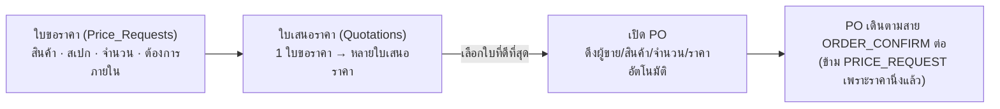

# 11 — ใบขอราคา → ใบเสนอราคา → PO และการปรับหน้าตาระบบ

แก้ 2 เรื่องที่แจ้งมา: **(1) ใบขอราคาดึงไปทำใบเสนอราคาไม่ได้ ต้องพิมพ์ซ้ำทุกรอบ
(2) หน้าตาระบบไม่เป็นระบบและไม่สวยงาม**

---

# ส่วนที่ 1 — ใบขอราคา → ใบเสนอราคา → PO

## 1.1 ปัญหาที่เจอ

โครงเดิมมี stage แรกชื่อ `PRICE_REQUEST` ("เช็คราคา") แต่**ไม่มีเอกสารผูกกับ stage นี้เลย** —
เป็นแค่ป้ายชื่อขั้นตอน ไม่มีที่เก็บว่าขอราคาอะไร จำนวนเท่าไหร่ และไม่มีที่เทียบราคาจากผู้ขายหลายราย
ผลคือ **SR ต้องพิมพ์ชื่อสินค้า สเปก จำนวนใหม่ทุกครั้ง** — ตอนขอราคา ตอนเทียบราคา และตอนเปิด PO
สามรอบสำหรับข้อมูลชุดเดียวกัน ซึ่งขัดกับหลักที่ยึดไว้ทั้งระบบ (เอกสาร 07 §2.1: "กรอกครั้งเดียว ไม่พิมพ์ซ้ำ")

## 1.2 โครงสร้างที่เพิ่ม

**กรอกข้อมูลสินค้าครั้งเดียวที่ใบขอราคา** จากนั้น:

- เปิดใบเสนอราคาใหม่แต่ละใบ — **ดึงชื่อสินค้า สเปก จำนวนมาเอง** กรอกแค่ผู้ขาย ราคา เงื่อนไข
- เปรียบเทียบใบเสนอราคาหลายรายในตารางเดียว เรียงจากราคาต่อหน่วยถูกไปแพง
- เลือกใบที่จะซื้อ แล้วกด **"เปิด PO จากใบที่เลือก"** — **ดึงผู้ขาย สินค้า จำนวน ราคารวมมาเอง**
  ไม่ต้องพิมพ์อะไรซ้ำอีกครั้ง

### ตารางข้อมูลใหม่ 2 ตาราง

**`Price_Requests`** — `request_id` · `request_no` (`PR-26-0004`) · `item_name` · `spec` · `qty` · `uom` ·
`need_by_date` · `requested_by` · `created_at` · `status` (`NEW/QUOTING/CONVERTED/CANCELLED`) · `note`

**`Quotations`** — `quote_id` · `quote_no` (`QT-26-0009`) · `price_request_id` (FK) · `supplier` ·
`unit_price` · `qty` (คัดลอกมาจาก `Price_Requests` ตอนสร้าง ไม่ใช่พิมพ์เอง) · `currency` · `lead_time` ·
`valid_until` · `selected` (bool) · `converted_po_no` · `created_by` · `created_at`

**รวมเป็น 17 ตาราง** (จาก 15 ในเอกสาร 07 §3.4) — สองตารางนี้เบามาก ไม่มีสายอนุมัติซับซ้อน
จึงไม่กระทบภาพรวม "โครงสร้างเล็กลงแม้เพิ่มความสามารถ" ที่ยึดมาตลอด

### ที่อยู่ในเมนู

อยู่ในหน้า **ใบคำร้อง** เป็นแท็บแรก **"ขอราคา / เสนอราคา"** — ตามหลักเดิมของหน้านี้คือ
"ใบขอที่มีสายอนุมัติของตัวเอง ไม่ใช่ PO" (เอกสาร 07 §1.3): เพิ่มประเภทใหม่ = เพิ่มแท็บ ไม่ใช่เพิ่มเมนู

### เมื่อเปิด PO แล้ว

PO ใหม่มีป้าย "เปิดจากใบเสนอราคา QT-26-0009" ที่หัวเอกสาร กดแล้วย้อนกลับไปดูใบเสนอราคาต้นทางได้
— **ตามรอยได้ทั้งสองทิศทาง** ไม่ใช่ดึงข้อมูลมาแล้วตัดขาดจากต้นทาง

PO ที่มาจากใบเสนอราคาจะข้ามขั้น `PRICE_REQUEST` ไปเริ่มที่ `ORDER_CONFIRM` โดยตรง เพราะราคานิ่งแล้ว
ไม่ต้องเช็คราคาซ้ำ — ประหยัดขั้นตอนจริง ไม่ใช่แค่ประหยัดการพิมพ์

## 1.3 ตัวอย่างในระบบ

`PR-26-0004` (ปลาแซลมอนแล่ 200 KG) มี 2 ใบเสนอราคาเทียบกันอยู่แล้ว (Ocean Best ฿295 / Siam Marine ฿305)
— ลองกด **ใบคำร้อง → ขอราคา/เสนอราคา → PR-26-0004** เพื่อดูตารางเทียบราคา เลือกใบที่ถูกกว่า
แล้วกด "เปิด PO จากใบที่เลือก" จะเห็น PO ใหม่เกิดขึ้นทันทีพร้อมข้อมูลครบโดยไม่ได้พิมพ์อะไรเพิ่ม

---

# ส่วนที่ 2 — ปรับหน้าตาระบบ

## 2.1 สิ่งที่แก้

หน้าตาเดิมไม่มีมุมโค้งเลยแม้แต่จุดเดียว (การ์ด ปุ่ม ป้ายสถานะ ทุกอย่างเหลี่ยมคม) และไม่มีเงาหรือมิติ
ทำให้ดูเหมือนตารางดิบมากกว่าระบบที่ออกแบบมา — แก้เป็นชุดต่อไปนี้ทั้งระบบ (ไม่ใช่บางหน้า):

| จุด | ก่อน | หลัง |
|---|---|---|
| การ์ด / ปุ่ม / ป้ายสถานะ / ช่องกรอก | เหลี่ยมคม 0px ทุกจุด | มุมโค้งเบา (4–11px ตามขนาดชิ้น) — ไม่ใช่ทรง "rounded-lg" เกินจริงที่ทำให้ดูเป็น template |
| การ์ดและแถบบนสุด | ไม่มีเงาเลย ดูแบนราบเป็นชั้นเดียว | เงาบางๆ ให้เห็นลำดับชั้น (การ์ดอยู่เหนือพื้น, ป๊อปอัปอยู่เหนือการ์ด) |
| เมนูด้านซ้าย | ตัวหนังสือล้วน ไม่มีจุดสังเกต | เพิ่มไอคอนเส้น (SVG ในไฟล์เดียวกัน ไม่โหลดจากที่อื่น) ต่อแต่ละเมนู |
| โลโก้ | ตัวหนังสือเปล่า | เพิ่มตรามุมโค้งเล็ก ๆ ให้จำได้ง่ายขึ้น |
| ตัวเลข KPI | สีข้อความอย่างเดียว | เส้นขอบบนสีตามหมวด (แดง/เขียว/ทอง/ฟ้า) + ตัวเลขคมชัดขึ้น |
| ปุ่ม | ไม่มีปฏิกิริยาตอนโฮเวอร์ | ขยับขึ้นเบาๆ พร้อมเงาตอนโฮเวอร์ (ปิดอัตโนมัติถ้าตั้ง "ลดการเคลื่อนไหว" ในเครื่อง) |
| สีพื้น | โทนเทาอมฟ้าเข้ม | ปรับเป็นโทนเขียวมะกอกอมเทาอ่อน ๆ ให้เข้ากับสี "เขียว/ทอง" ที่ใช้เป็นสถานะอยู่แล้ว |
| Dark mode | ทำแยกจาก light แบบขาดตอน | ปรับพร้อมกันทั้งชุด ให้คอนทราสต์และโทนสัมพันธ์กันเหมือนเดิม |

## 2.2 หลักที่ยึดไว้ไม่ให้ล้น

- **ไม่ใส่มุมโค้งใหญ่แบบการ์ด SaaS ทั่วไป** — ใช้ 4–7px เท่านั้น เพราะนี่คือเครื่องมือทำงานที่ต้อง
  อ่านตารางตัวเลขเยอะ มุมโค้งใหญ่เกินจะขัดกับความหนาแน่นของข้อมูล
- **เงาใช้เฉพาะจุดที่ "ลอย" จริง** — ป๊อปอัป แถบบนสุดตอนเลื่อน, การ์ดทั่วไปมีเงาบางมากแทบไม่รู้สึก
  ไม่ใช่ทุกกล่องลอยเท่ากันหมดซึ่งเป็นจุดที่ทำให้งานดูเหมือนสร้างจาก template
- **ไม่ใช้อิโมจิเป็นตัวนำทางเมนู** — เปลี่ยนจากอิโมจิ (🔔⚑) เป็นไอคอนเส้นแบบเดียวกับที่ใช้ในเมนู
  ให้เป็นภาษาภาพชุดเดียวกันทั้งหน้าจอ
- **สีสถานะ (เขียว/แดง/ทอง/ฟ้า) ยังคงเป็นความหมาย ไม่ใช่การตกแต่ง** — ไม่แตะระบบสีของแต่ละแผนก
  (`--sr` `--qc` `--ls` `--wh` `--ac` `--gm`) เพราะเป็นกลไกที่ช่วยแยกแผนกอยู่แล้ว ปรับแค่ให้เข้มขึ้นเล็กน้อย
  เพื่อความคมชัด

## 2.3 ที่ยังไม่แตะ

โครงหน้าจอ (กล่อง "งานนี้อยู่ที่คุณ" อยู่บนสุด, การพับเก็บ 17 ขั้นตอน/ประวัติ, การซ่อนช่องเงินสำหรับ
บทบาทที่ไม่มีสิทธิ์) จากรอบ [เอกสาร 09](09-usability-and-sap.md) **ยังเหมือนเดิมทั้งหมด** — รอบนี้แก้แค่
วัสดุ/พื้นผิว ไม่แตะโครงสร้างการใช้งานที่เพิ่งทดสอบและปรับมาแล้ว
